<p align="center"></p>

# Gemini AI Classroom Assistant

A next-generation classroom assistant designed to proactively support students during computer-based tests. Built entirely on Google Cloud and Firebase, this project uses the Gemini AI model not just to detect issues, but to prevent them by providing gentle, real-time guidance to students.

Instead of being a simple proctoring tool, the AI acts as a **Proactive Proctor**, a **Technical Support Assistant**, and a **Wellness Coach**, creating a more supportive and effective testing environment.

## Table of Contents

- [Powered by Google Technologies](#powered-by-google-technologies)
- [Architecture Overview](#architecture-overview)
- [Architecture Diagram](#architecture-diagram)
- [Backend Functionality](./docs/functions.md)
- [Frontend Components](./docs/frontend-components.md)
- [Getting Started (Local Development)](#getting-started-local-development)
- [Admin Scripts](#admin-scripts)
- [Deployment](#deployment)

## Powered by Google Technologies

This project is a showcase of modern, scalable, and intelligent application development using a suite of powerful Google technologies:

*   **[Vertex AI](https://cloud.google.com/vertex-ai):** The core AI capabilities are powered by the **Gemini Pro** model, enabling sophisticated analysis of student activity.
*   **[Firebase](https://firebase.google.com):** The entire backend and application infrastructure is built on Firebase.
    *   **[Firebase Authentication](https://firebase.google.com/docs/auth):** For secure and easy user sign-in.
    *   **[Firestore](https://firebase.google.com/docs/firestore):** A scalable NoSQL database for all application data.
    *   **[Cloud Storage for Firebase](https://firebase.google.com/docs/storage):** To store all student-generated media like screenshots and videos.
    *   **[Cloud Functions for Firebase](https://firebase.google.com/docs/functions):** For all serverless backend logic, from data processing to AI triggers.
    *   **[Firebase Hosting](https://firebase.google.com/docs/hosting):** To deploy and host the web application globally.
*   **[Genkit](https://firebase.google.com/docs/genkit):** The AI flows are developed using Genkit, an open-source framework from Google that helps developers build, deploy, and monitor production-ready AI-powered features.
*   **[Google Cloud Scheduler](https://cloud.google.com/scheduler):** To run scheduled tasks for maintenance and automated class management.

## Architecture Overview

The project is a monorepo composed of three main parts:

*   **`web-app/`**: A React single-page application (built with Vite) that serves as the user-facing frontend for students and teachers. It uses Firebase for authentication and all real-time communication.
*   **`functions/`**: A Node.js backend using Firebase Functions. This includes the core AI logic for analyzing student screen captures, powered by Google's Genkit and the Gemini model.
*   **`admin/`**: A collection of Node.js scripts for administrative tasks, such as granting teacher roles and managing AI prompts.

For a detailed breakdown of the Firestore data model, please see the [Firestore Schema Documentation](./docs/firestore-schema.md).

## Architecture Diagram

```mermaid
graph TD
    subgraph "Client"
        WebApp["Web App (React)"]
    end

    subgraph "Firebase"
        Auth["Firebase Authentication"]
        Firestore["Firestore Database"]
        Storage["Cloud Storage"]
        Scheduler["Cloud Scheduler"]
    end

    subgraph "Google Cloud"
        VertexAI["Vertex AI (Gemini)"]
    end

    subgraph "Cloud Functions"
        subgraph "AI Flows (`ai_flows`)"
            F_analyzeImage["analyzeImage (onCall)"]
            F_analyzeAllImages["analyzeAllImages (onCall)"]
            F_onAiJobCreated["onAiJobCreated (onWrite aiJobs)"]
            F_processVideoAnalysisJob["processVideoAnalysisJob (onCreate videoAnalysisJobs)"]
            F_triggerAutomaticAnalysis["triggerAutomaticAnalysis (onUpdate videoJobs)"]
        end

        subgraph "Auth Triggers (`auth_triggers`)"
            F_beforeUserCreated["beforeUserCreated (beforeUserCreated)"]
            F_checkIpAddress["checkipaddress (beforeUserSignedIn)"]
            F_onClassUpdate["onClassUpdate (onWrite classes)"]
        end

        subgraph "Media Processing (`media_processing`)"
            F_processVideoJob["processVideoJob (onCreate videoJobs)"]
            F_processZipJob["processZipJob (onCreate zipJobs)"]
            F_cleanupStuckJobs["cleanupStuckJobs (onSchedule)"]
        end

        subgraph "Scheduled Tasks (`scheduled_tasks`)"
            F_handleAutoCapture["handleAutomaticCapture (onSchedule)"]
            F_handleAutoVideoCombine["handleAutomaticVideoCombination (onSchedule)"]
        end

        subgraph "Storage Triggers (`storage_triggers`)"
            F_updateStorageUpload["updateStorageUsageOnUpload (onFinalize)"]
            F_updateStorageDelete["updateStorageUsageOnDelete (onDelete)"]
            F_deleteScreenshots["deleteScreenshotsByDateRange (onCall)"]
        end

        subgraph "Attendance (`attendance`)"
            F_getAttendanceData["getAttendanceData (onCall)"]
        end
    end

    %% Client to Firebase
    WebApp -- "HTTPS Calls" --> F_analyzeImage
    WebApp -- "HTTPS Calls" --> F_analyzeAllImages
    WebApp -- "HTTPS Calls" --> F_deleteScreenshots
    WebApp -- "HTTPS Calls" --> F_getAttendanceData
    WebApp -- "Reads/Writes" --> Firestore
    WebApp -- "Uploads" --> Storage
    WebApp -- "Authenticates with" --> Auth

    %% Auth Triggers
    Auth -- "Triggers" --> F_beforeUserCreated
    Auth -- "Triggers" --> F_checkIpAddress

    %% Firestore Triggers
    Firestore -- "classes write" --> F_onClassUpdate
    Firestore -- "videoJobs create" --> F_processVideoJob
    Firestore -- "videoJobs update" --> F_triggerAutomaticAnalysis
    Firestore -- "zipJobs create" --> F_processZipJob
    Firestore -- "videoAnalysisJobs create" --> F_processVideoAnalysisJob
    Firestore -- "aiJobs write" --> F_onAiJobCreated

    %% Storage Triggers
    Storage -- "onFinalize" --> F_updateStorageUpload
    Storage -- "onDelete" --> F_updateStorageDelete

    %% Scheduled Triggers
    Scheduler -- "Triggers" --> F_cleanupStuckJobs
    Scheduler -- "Triggers" --> F_handleAutoCapture
    Scheduler -- "Triggers" --> F_handleAutoVideoCombine

    %% Function to Firestore Interactions
    F_beforeUserCreated -- "Reads/Writes" --> Firestore
    F_checkIpAddress -- "Reads" --> Firestore
    F_onClassUpdate -- "Writes" --> Firestore
    F_processVideoJob -- "Reads/Writes" --> Firestore
    F_processVideoJob -- "Reads" --> Storage
    F_processVideoJob -- "Writes" --> Storage
    F_processZipJob -- "Reads/Writes" --> Firestore
    F_processZipJob -- "Reads" --> Storage
    F_processZipJob -- "Writes" --> Storage
    F_cleanupStuckJobs -- "Reads/Writes" --> Firestore
    F_handleAutoCapture -- "Reads/Writes" --> Firestore
    F_handleAutoVideoCombine -- "Reads/Writes" --> Firestore
    F_updateStorageUpload -- "Reads/Writes" --> Firestore
    F_updateStorageDelete -- "Reads/Writes" --> Firestore
    F_deleteScreenshots -- "Reads/Writes" --> Firestore
    F_deleteScreenshots -- "Deletes from" --> Storage
    F_getAttendanceData -- "Writes" --> Firestore
    F_analyzeImage -- "Calls" --> VertexAI
    F_analyzeImage -- "Writes" --> Firestore
    F_analyzeAllImages -- "Calls" --> VertexAI
    F_analyzeAllImages -- "Writes" --> Firestore
    F_processVideoAnalysisJob -- "Calls" --> F_analyzeImage
    F_processVideoAnalysisJob -- "Writes" --> Firestore
    F_onAiJobCreated -- "Writes" --> Firestore
    F_triggerAutomaticAnalysis -- "Writes" --> Firestore
```



## Backend Functionality

All backend logic is implemented as individual, single-purpose Cloud Functions located in the `functions/` directory. The functions are organized into modules based on their trigger type and domain.

For a detailed breakdown of all Cloud Functions, their triggers, and the data models they interact with, please see the [Cloud Functions Documentation](./docs/functions.md).

## Frontend Components

The user-facing web application is built with React and Vite. For a detailed breakdown of the main components, please see the [Frontend Components Documentation](./docs/frontend-components.md).

## Getting Started (Local Development)

Follow these instructions to set up the project for local development.

### Prerequisites

*   [Node.js](https://nodejs.org/) (v18 or higher recommended)
*   [Git](https://git-scm.com/)
*   [Firebase CLI](https://firebase.google.com/docs/cli#install_the_cli): `npm install -g firebase-tools`

### 1. Firebase Project Setup

1.  Create a new project in the [Firebase Console](https://console.firebase.google.com/).
2.  Enable the following services:
    *   **Authentication:** Email/Password sign-in.
    *   **Firestore:** Create a database.
    *   **Storage:** Create a storage bucket.
3.  In your Firebase project settings, add a new Web App.
4.  Copy the `firebaseConfig` object provided.
5.  In the `web-app/` directory, create a new file named `.env` and paste your `firebaseConfig` values into it (see `.env.example` for format).

### 2. Backend Setup

Install dependencies for the Firebase Functions.

```bash
cd functions
npm install
```

### 3. Frontend Setup

Install dependencies and run the local development server for the React app.

```bash
cd web-app
npm install
npm run dev
```

The application should now be running locally, typically at `http://localhost:5173`.

## Admin Scripts

The `/admin` directory contains scripts for managing user roles and AI prompts.

1.  **Setup:**
    *   Navigate to the directory: `cd admin`
    *   Install dependencies: `npm install`
    *   **Authentication:** You need to provide service account credentials to the Admin SDK.
        1.  In your Firebase project settings, go to **Service Accounts**.
        2.  Click **Generate new private key**.
        3.  Save the downloaded JSON file in the `admin/` directory as `sp.json`.

2.  **Usage:**
    *   **To grant a user teacher privileges:**
        ```bash
        node scripts/grantTeacherRole.js
        ```
    *   **To manually verify a user's email:**
        ```bash
        node scripts/verifyUser.js
        ```
    *   **To seed the database with default AI prompts:**
        ```bash
        node scripts/seed_prompts.js
        ```

## Deployment

To deploy the project to Firebase, simply run the deployment script from the project root:

```bash
./deploy.sh
```

This script handles all the necessary steps automatically:
1.  Builds the frontend application.
2.  Ensures the necessary IAM permissions are granted for Cloud Functions to create signed URLs.
3.  Deploys all services (Hosting, Functions, Firestore rules, etc.) to Firebase.

**Prerequisites:** Before running the script, make sure you have the [Firebase CLI](https://firebase.google.com/docs/cli) and the [Google Cloud CLI](https://cloud.google.com/sdk/docs/install) installed and authenticated with your project.

### Deployment Best Practices

To ensure stable and predictable deployments, please follow these important configuration practices.

#### 1. Explicitly Define Function Regions

The Firestore database for this project is located in `nam5` (a US multi-region). To prevent trigger failures and minimize latency, all Cloud Functions should be deployed to the `us-central1` region.

You should explicitly set this in the definition of every function.

**Example:**
```javascript
// In any function file, e.g., functions/media_processing/processVideoJob.js
import { onDocumentCreated } from "firebase-functions/v2/firestore";

export const processVideoJob = onDocumentCreated({
  document: 'videoJobs/{jobId}',
  region: 'us-central1', // <-- Add this line
  // ... other options
}, async (event) => {
  // ... function body
});
```
`