<p align="center"></p>

# Gemini AI Classroom Assistant

A next-generation classroom assistant designed to proactively support students during computer-based tests. This project uses the Gemini AI model not just to detect issues, but to prevent them by providing gentle, real-time guidance to students.

Instead of being a simple proctoring tool, the AI acts as a **Proactive Proctor**, a **Technical Support Assistant**, and a **Wellness Coach**, creating a more supportive and effective testing environment.

## Architecture Overview

The project is a monorepo composed of three main parts:

*   **`web-app/`**: A React single-page application (built with Vite) that serves as the user-facing frontend for students and teachers. It uses Firebase for authentication and all real-time communication.
*   **`functions/`**: A Node.js backend using Firebase Functions. This includes the core AI logic for analyzing student screen captures, powered by Google's Genkit and the Gemini model.
*   **`admin/`**: A collection of Node.js scripts for administrative tasks, such as granting teacher roles and managing AI prompts.

For a detailed breakdown of the Firestore data model, please see the [Firestore Schema Documentation](./docs/firestore-schema.md).

## Architecture Diagram

```mermaid
graph TD
    subgraph "Client"
        WebApp["Web App (React)"]
    end

    subgraph "Firebase"
        Auth["Firebase Authentication"]
        Firestore["Firestore Database"]
        Storage["Cloud Storage"]
        Scheduler["Cloud Scheduler"]
    end

    subgraph "Google Cloud"
        VertexAI["Vertex AI (Gemini)"]
    end

    subgraph "Cloud Functions"
        subgraph "AI Flows (`ai_flows`)"
            F_analyzeImage["analyzeImage (onCall)"]
            F_analyzeAllImages["analyzeAllImages (onCall)"]
            F_onAiJobCreated["onAiJobCreated (onWrite aiJobs)"]
            F_processVideoAnalysisJob["processVideoAnalysisJob (onCreate videoAnalysisJobs)"]
        end

        subgraph "Auth Triggers (`auth_triggers`)"
            F_checkIpAddress["checkipaddress (beforeUserSignedIn)"]
            F_updateUserClasses["updateUserClassesOnClassUpdate (onWrite classes)"]
        end

        subgraph "Media Processing (`media_processing`)"
            F_processVideoJob["processVideoJob (onCreate videoJobs)"]
            F_processZipJob["processZipJob (onCreate zipJobs)"]
            F_cleanupStuckJobs["cleanupStuckJobs (onSchedule)"]
        end

        subgraph "Scheduled Tasks (`scheduled_tasks`)"
            F_handleAutoCapture["handleAutomaticCapture (onSchedule)"]
            F_handleAutoVideoCombine["handleAutomaticVideoCombination (onSchedule)"]
        end

        subgraph "Storage Triggers (`storage_triggers`)"
            F_updateStorageUpload["updateStorageUsageOnUpload (onFinalize)"]
            F_updateStorageDelete["updateStorageUsageOnDelete (onDelete)"]
            F_deleteScreenshots["deleteScreenshotsByDateRange (onCall)"]
        end
    end

    %% Client to Firebase
    WebApp -- "HTTPS Calls" --> F_analyzeImage
    WebApp -- "HTTPS Calls" --> F_analyzeAllImages
    WebApp -- "HTTPS Calls" --> F_deleteScreenshots
    WebApp -- "Reads/Writes" --> Firestore
    WebApp -- "Uploads" --> Storage
    WebApp -- "Authenticates with" --> Auth

    %% Auth Triggers
    Auth -- "Triggers" --> F_checkIpAddress

    %% Firestore Triggers
    Firestore -- "classes write" --> F_updateUserClasses
    Firestore -- "videoJobs create" --> F_processVideoJob
    Firestore -- "zipJobs create" --> F_processZipJob
    Firestore -- "videoAnalysisJobs create" --> F_processVideoAnalysisJob
    Firestore -- "aiJobs write" --> F_onAiJobCreated

    %% Storage Triggers
    Storage -- "onFinalize" --> F_updateStorageUpload
    Storage -- "onDelete" --> F_updateStorageDelete

    %% Scheduled Triggers
    Scheduler -- "Triggers" --> F_cleanupStuckJobs
    Scheduler -- "Triggers" --> F_handleAutoCapture
    Scheduler -- "Triggers" --> F_handleAutoVideoCombine

    %% Function to Firestore Interactions
    F_checkIpAddress -- "Reads" --> Firestore
    F_updateUserClasses -- "Writes" --> Firestore
    F_processVideoJob -- "Reads/Writes" --> Firestore
    F_processVideoJob -- "Reads" --> Storage
    F_processVideoJob -- "Writes" --> Storage
    F_processZipJob -- "Reads/Writes" --> Firestore
    F_processZipJob -- "Reads" --> Storage
    F_processZipJob -- "Writes" --> Storage
    F_cleanupStuckJobs -- "Reads/Writes" --> Firestore
    F_handleAutoCapture -- "Reads/Writes" --> Firestore
    F_handleAutoVideoCombine -- "Reads/Writes" --> Firestore
    F_updateStorageUpload -- "Reads/Writes" --> Firestore
    F_updateStorageDelete -- "Reads/Writes" --> Firestore
    F_deleteScreenshots -- "Reads/Writes" --> Firestore
    F_deleteScreenshots -- "Deletes from" --> Storage
    F_analyzeImage -- "Calls" --> VertexAI
    F_analyzeImage -- "Writes" --> Firestore
    F_analyzeAllImages -- "Calls" --> VertexAI
    F_analyzeAllImages -- "Writes" --> Firestore
    F_processVideoAnalysisJob -- "Calls" --> F_analyzeImage
    F_processVideoAnalysisJob -- "Writes" --> Firestore
    F_onAiJobCreated -- "Writes" --> Firestore
```



## Backend Functionality

All backend logic is implemented as individual, single-purpose Cloud Functions located in the `functions/` directory. The functions are organized into modules based on their trigger type and domain.

### AI-Powered Analysis (`ai_flows`)

This module contains all the core AI logic, powered by Google's Genkit and the Gemini model.

*   **AI Flows**: Defines the logic for analyzing images and videos. 
    *   `analyzeImageFlow`: Analyzes a single image.
    *   `analyzeAllImagesFlow`: Analyzes a batch of images.
    *   `analyzeSingleVideoFlow`: Analyzes a single video.
*   **AI Tools**: A set of tools that the AI can use to interact with the system.
    *   `sendMessageToStudent`: Sends a direct message to a student.
    *   `recordIrregularity`: Records an irregularity activity.
    *   `recordStudentProgress`: Records a student's work progress.
    *   `sendMessageToTeacher`: Sends a message to the teacher.
*   **Cost & Quota Management**: Manages the cost and usage of the AI services.
    *   `cost.js`: Calculates the cost of AI jobs.
    *   `quotaManagement.js`: Checks and updates the AI quota for each class.
    *   `quotaTriggers.js`: A Firestore trigger that updates the AI quota when an AI job is created.

### Authentication Triggers (`auth_triggers`)

These functions are triggered by Firebase Authentication events.

*   `ipRestriction.js`: Checks the user's IP address upon login and restricts access based on the class schedule and IP whitelist.
*   `userManagement.js`: A Firestore trigger that automatically updates a student's profile when they are added to or removed from a class.

### Media Processing (`media_processing`)

This module handles the processing of media files.

*   `processVideoJob.js`: A Firestore trigger that creates a video from a series of screenshots when a `videoJobs` document is created.
*   `processZipJob.js`: A Firestore trigger that creates a zip archive of videos and sends a download link to the requester when a `zipJobs` document is created.
*   `cleanupStuckJobs.js`: A scheduled function that runs periodically to clean up any video processing jobs that have been stuck in a processing state for too long.

### Scheduled Tasks (`scheduled_tasks`)

These functions are triggered on a schedule.

*   `scheduledTasks.js`:
    *   `handleAutomaticCapture`: Starts and stops screen capture for classes with `automaticCapture` enabled.
    *   `handleAutomaticVideoCombination`: Automatically creates video jobs for classes with `automaticCombine` enabled.

### Storage Triggers (`storage_triggers`)

These functions are triggered by Cloud Storage events.

*   `storageQuota.js`:
    *   `updateStorageUsageOnUpload`: Updates the storage usage for a class when a file is uploaded and enforces the storage quota.
    *   `updateStorageUsageOnDelete`: Updates the storage usage for a class when a file is deleted.
*   `screenshotManagement.js`:
    *   `deleteScreenshotsByDateRange`: A callable function that allows teachers to delete screenshots within a specific date range.

## Getting Started (Local Development)

Follow these instructions to set up the project for local development.

### Prerequisites

*   [Node.js](https://nodejs.org/) (v18 or higher recommended)
*   [Git](https://git-scm.com/)
*   [Firebase CLI](https://firebase.google.com/docs/cli#install_the_cli): `npm install -g firebase-tools`

### 1. Firebase Project Setup

1.  Create a new project in the [Firebase Console](https://console.firebase.google.com/).
2.  Enable the following services:
    *   **Authentication:** Email/Password sign-in.
    *   **Firestore:** Create a database.
    *   **Storage:** Create a storage bucket.
3.  In your Firebase project settings, add a new Web App.
4.  Copy the `firebaseConfig` object provided.
5.  In the `web-app/` directory, create a new file named `.env` and paste your `firebaseConfig` values into it (see `.env.example` for format).

### 2. Backend Setup

Install dependencies for the Firebase Functions.

```bash
cd functions
npm install
```

### 3. Frontend Setup

Install dependencies and run the local development server for the React app.

```bash
cd web-app
npm install
npm run dev
```

The application should now be running locally, typically at `http://localhost:5173`.

## Admin Scripts

The `/admin` directory contains scripts for managing user roles and AI prompts.

1.  **Setup:**
    *   Navigate to the directory: `cd admin`
    *   Install dependencies: `npm install`
    *   **Authentication:** You need to provide service account credentials to the Admin SDK.
        1.  In your Firebase project settings, go to **Service Accounts**.
        2.  Click **Generate new private key**.
        3.  Save the downloaded JSON file in the `admin/` directory.
        4.  Rename the key file or update the path in each admin script.

2.  **Usage:**
    *   **To grant a user teacher privileges:**
        ```bash
        node grantTeacherRole.js teacher-email@example.com
        ```

## Deployment

To deploy the project to Firebase, simply run the deployment script from the project root:

```bash
./deploy.sh
```

This script handles all the necessary steps automatically:
1.  Builds the frontend application.
2.  Ensures the necessary IAM permissions are granted for Cloud Functions to create signed URLs.
3.  Deploys all services (Hosting, Functions, Firestore rules, etc.) to Firebase.

**Prerequisites:** Before running the script, make sure you have the [Firebase CLI](https://firebase.google.com/docs/cli) and the [Google Cloud CLI](https://cloud.google.com/sdk/docs/install) installed and authenticated with your project.
