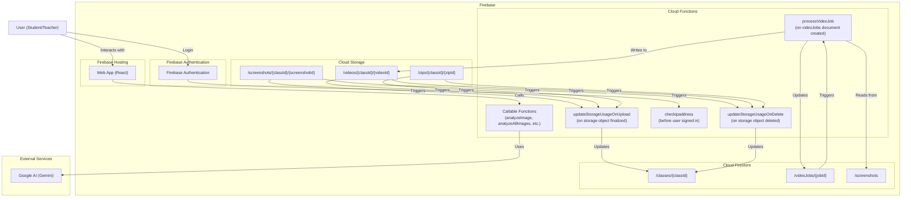

<p align="center"></p>

# Gemini AI Classroom Assistant

A next-generation classroom assistant designed to proactively support students during computer-based tests. This project uses the Gemini AI model not just to detect issues, but to prevent them by providing gentle, real-time guidance to students.

Instead of being a simple proctoring tool, the AI acts as a **Proactive Proctor**, a **Technical Support Assistant**, and a **Wellness Coach**, creating a more supportive and effective testing environment.

## Architecture Overview

The project is a monorepo composed of three main parts:

*   **`web-app/`**: A React single-page application (built with Vite) that serves as the user-facing frontend for students and teachers. It uses Firebase for authentication and all real-time communication.
*   **`functions/`**: A Node.js backend using Firebase Functions. This includes the core AI logic for analyzing student screen captures, powered by Google's Genkit and the Gemini model.
*   **`admin/`**: A collection of Node.js scripts for administrative tasks, such as granting teacher roles and managing AI prompts.

## Architecture Diagram



## Features

### Student Experience

*   **Simple & Secure Login:** Students can easily log in and select their active class. Login may be restricted by IP address based on class schedules.
*   **Real-time Guidance:** Receives gentle, helpful pop-up messages from the AI to prevent issues related to focus, technical problems, or frustration.
*   **OS-Level Notifications:** Gets important announcements and messages from the teacher via system notifications.

### Teacher Experience

*   **Unified Dashboard:** A central dashboard provides a high-level overview of all classes, including student count, storage usage, and AI budget consumption.
*   **Class Scheduling:** Define class schedules with specific dates, times, and timezones. This powers features like IP restrictions and event filtering.
*   **Class Management:** Create, view, and manage classes, student enrollment, and resource quotas.
*   **Live Student Monitoring:** View a gallery of all students who are actively sharing their screens.
*   **Proactive AI Assistant:** The AI analyzes student screens and provides teachers with real-time alerts for:
    *   **Potential Distractions:** Notifies the teacher when it has sent a student a gentle reminder to stay focused.
    *   **Technical Difficulties:** Flags students who may be experiencing technical issues (e.g., low battery, frozen apps).
    *   **Student Wellness:** Alerts the teacher when a student appears frustrated or burned out.
*   **Advanced Notification Center:**
    *   A dedicated "Notifications" tab displays all AI-generated alerts.
    *   Features OS-level notifications for new alerts so the teacher never misses an important event.
    *   **Lesson-Based Filtering:** A dropdown menu, generated from the class schedule, allows teachers to quickly filter events to a specific class session.
    *   A "Mute" button to temporarily disable OS-level notifications.
*   **Asynchronous Data Archiving & Mailbox:**
    *   Select multiple student recordings and request them as a single ZIP archive.
    *   The archiving process runs as a background job, tracked in the "Data Management" view.
    *   Receive a notification in a dedicated **Mailbox** with a secure download link when the archive is ready.
*   **Detailed Reporting:** Review filterable reports on student progress and any flagged irregularities.
*   **Customizable AI Behavior:** Teachers can edit the prompts that power the AI assistant, tailoring its personality and actions.

### Security & Resource Management

*   **IP-Based Access Control:** Restrict student logins to specific IP addresses or CIDR ranges (e.g., the school's network). This restriction is automatically enforced only during scheduled class times.
*   **AI & Storage Quotas:** Set and monitor budgets for AI analysis and cloud storage on a per-class basis. The system prevents resource over-usage and provides detailed breakdowns of consumption (e.g., storage used by screenshots vs. videos vs. ZIPs).

## Getting Started (Local Development)

Follow these instructions to set up the project for local development.

### Prerequisites

*   [Node.js](https://nodejs.org/) (v18 or higher recommended)
*   [Git](https://git-scm.com/)
*   [Firebase CLI](https://firebase.google.com/docs/cli#install_the_cli): `npm install -g firebase-tools`

### 1. Firebase Project Setup

1.  Create a new project in the [Firebase Console](https://console.firebase.google.com/).
2.  Enable the following services:
    *   **Authentication:** Email/Password sign-in.
    *   **Firestore:** Create a database.
    *   **Storage:** Create a storage bucket.
3.  In your Firebase project settings, add a new Web App.
4.  Copy the `firebaseConfig` object provided.
5.  In the `web-app/` directory, create a new file named `.env` and paste your `firebaseConfig` values into it (see `.env.example` for format).

### 2. Backend Setup

Install dependencies for the Firebase Functions.

```bash
cd functions
npm install
```

### 3. Frontend Setup

Install dependencies and run the local development server for the React app.

```bash
cd web-app
npm install
npm run dev
```

The application should now be running locally, typically at `http://localhost:5173`.

## Admin Scripts

The `/admin` directory contains scripts for managing user roles and AI prompts.

1.  **Setup:**
    *   Navigate to the directory: `cd admin`
    *   Install dependencies: `npm install`
    *   **Authentication:** You need to provide service account credentials to the Admin SDK.
        1.  In your Firebase project settings, go to **Service Accounts**.
        2.  Click **Generate new private key**.
        3.  Save the downloaded JSON file in the `admin/` directory.
        4.  Rename the key file or update the path in each admin script.

2.  **Usage:**
    *   **To grant a user teacher privileges:**
        ```bash
        node grantTeacherRole.js teacher-email@example.com
        ```

## Deployment

To deploy the project to Firebase, simply run the deployment script from the project root:

```bash
./deploy.sh
```

This script handles all the necessary steps automatically:
1.  Builds the frontend application.
2.  Ensures the necessary IAM permissions are granted for Cloud Functions to create signed URLs.
3.  Deploys all services (Hosting, Functions, Firestore rules, etc.) to Firebase.

**Prerequisites:** Before running the script, make sure you have the [Firebase CLI](https://firebase.google.com/docs/cli) and the [Google Cloud CLI](https://cloud.google.com/sdk/docs/install) installed and authenticated with your project.
