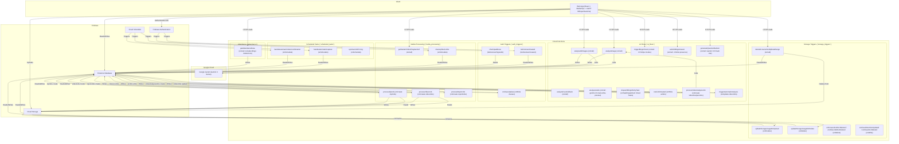

<p align="center"></p>

# Gemini AI Classroom Assistant

A next-generation classroom assistant designed to proactively support students during computer-based tests. Built entirely on Google Cloud and Firebase, this project uses the Gemini AI model not just to detect issues, but to prevent them by providing gentle, real-time guidance to students.

Instead of being a simple proctoring tool, the AI acts as a **Proactive Proctor**, a **Technical Support Assistant**, and a **Wellness Coach**, creating a more supportive and effective testing environment.

## Table of Contents

- [📚 Documentation Index](#-documentation-index)
- [📖 User Manuals & Role-Based Guides](#-user-manuals--role-based-guides)
- [Powered by Google Technologies](#powered-by-google-technologies)
- [Architecture Overview](#architecture-overview)
- [Architecture Diagram](#architecture-diagram)
- [Getting Started (Local Development)](#getting-started-local-development)
- [Demo Users & Pre-Seeded Class](#-demo-users--pre-seeded-class)
- [Testing & Quality Assurance](#-testing--quality-assurance)
- [Environment Reset & Admin Scripts](#-environment-reset--admin-scripts)
- [Deployment & Infrastructure](#deployment--infrastructure)

---

<a id="documentation-index"></a>
## 📚 Documentation Index

Every component, operational workflow, AI pipeline, security policy, and data schema is documented with architectural diagrams and step-by-step guides:

| Category | Document | Description |
| :--- | :--- | :--- |
| **User Manuals & UI Catalogs** | 👨‍🏫 **[Instructor & TA User Manual](./docs/user-manual-teacher.md)** | End-to-end operational manual covering live grid invigilation, WebRTC peek & talkback, Bingo checks, rubric studio, and incident dossiers. |
| | 🧑‍🎓 **[Student User Manual & Guide](./docs/user-manual-student.md)** | Pre-flight onboarding, 3-step readiness wizard, dual-channel capture, on-device AI HUD, and self-service records portal. |
| | 🛠️ **[System Admin & DevOps Manual](./docs/user-manual-admin.md)** | Cloud provisioning, Terraform IaC, GCIP blocking functions, zero-trust storage rules, and disaster recovery. |
| | 📘 **[Comprehensive UI Controls & Features Catalog](./docs/comprehensive-ui-controls-and-features-catalog.md)** | Exhaustive 19-domain UI inventory detailing every button, slider, modal, toggle, and data flow. |
| **Architecture & Data Models** | 🔑 **[Hybrid Role Resolution & Identity](./docs/hybrid-role-resolution-and-auth.md)** | 4-tier domain hierarchy, GCIP before-create triggers, role elevation, and zero-trust security. |
| | 🗄️ **[Firestore Schema & Database Design](./docs/firestore-schema.md)** | Complete collection schemas, field definitions, ER diagrams, composite indexes, and TTL policies. |
| | ⚡ **[Cloud Functions Gen 2 Architecture](./docs/functions.md)** | Micro-codebase topology across 6 runtimes, callable endpoints, task queues, and storage triggers. |
| | 🧭 **[Frontend React Components & State Flows](./docs/frontend-components.md)** | React component hierarchy, code-splitting router, custom hooks, and shared UI utilities. |
| | ⏱️ **[Student View Logic & Timetable Engine](./docs/student-view-logic.md)** | Schedule-driven class matching, multi-stream capture, edge Web Workers, and live exam mode. |
| **AI, Acoustic & Media Processing** | 🎙️ **[Audio Invigilation & Voice AI Architecture](./docs/audio-invigilation-and-transcription.md)** | Dual-mode acoustic processing: LiteRT edge Whisper/Gemma and rolling moving window cloud diarization. |
| | 🎥 **[Image-to-Video Compilation Pipeline](./docs/image-to-video-compilation.md)** | Discrete screenshot upload, FFmpeg H.264 MP4 encoding, SVG timestamp overlays, and exam tagging. |
| | 🎬 **[Video Analysis & Map-Reduce Prompt Synthesis](./docs/video-analysis-workflow.md)** | Gemini 3.7 vision discovery, Gemini 3.8 Flash rubric synthesis studio, and milestone matrix generation. |
| | 🔄 **[Data Retention & Media Lifecycle](./docs/data-retention-and-storage-lifecycle.md)** | Native Firestore TTL expiration, GCS event-driven cleanup triggers, and cascading class deletion. |
| **DevOps, Setup & Testing** | 🚀 **[Complete Setup & Customization Guide](./docs/setup-instructions.md)** | Step-by-step institutional deployment, automated 1-click script, and multi-school customization. |
| | 🏗️ **[Deployment & Infrastructure Guide](./docs/deployment-and-infrastructure.md)** | Dual-environment setup (`it114115-dev-2026` / `it114115-2627`), Terraform specs, and build guardrails. |
| | 🧪 **[Testing Strategy, Pyramid & Coverage](./docs/testing-strategy-and-coverage.md)** | 846+ tests across 4 tiers: Frontend React suites, Cloud Functions, real-token security rules, and smoke tests. |
| **Presentations & Tech Talks** | 📊 **[Google Cloud Presentation Deck (Marp)](./docs/presentation/google-cloud-slides.marp.md)** | 26-slide presentation deck covering edge AI, Genkit resilience, FinOps, and live demo flows. |
| | 🌐 **[Interactive HTML Presentation](./docs/presentation/google-cloud-slides.html)** | Bespoke interactive web presentation deck with transitions and presenter controls. |
| | 📄 **[Printable Vector PDF Presentation](./docs/presentation/google-cloud-slides.pdf)** | 16:9 high-resolution vector PDF slide export. |
| | 📽️ **[PowerPoint Presentation (.pptx)](./docs/presentation/google-cloud-slides.pptx)** | Microsoft PowerPoint presentation deck. |
| | 🎙️ **[Masterclass Speaker Notes & Delivery Script](./docs/presentation/speaker-notes-and-script.md)** | Minute-by-minute talking points, technical deep dives, and live demonstration script. |
| **Subsystem Modules** | 💻 **[`web-app/` Client README](./web-app/README.md)** | Frontend React + Vite SPA structure, scripts, and edge worker bundles. |
| | 🛠️ **[`admin/` Scripts README](./admin/README.md)** | Administrative automation scripts, role provisioning, and smoke test execution. |
| | 🌐 **[`terraform/` IaC README](./terraform/README.md)** | Terraform infrastructure definitions, IAM roles, and Google Cloud resource provisioning. |

---

## 📖 User Manuals & Role-Based Guides

Tailored, step-by-step user manuals and technical references are provided for every user persona:

*   👨‍🏫 **[Instructor & Teaching Assistant User Manual](./docs/user-manual-teacher.md):** Complete guide to classroom setup, schedule configuration, live invigilation, 2-way WebRTC talkback intercom, interactive Bingo presence challenges, task rubric synthesis, synchronized video review, and formal incident dossier exports.
*   🧑‍🎓 **[Student User Manual & Guide](./docs/user-manual-student.md):** Step-by-step onboarding covering Google Chrome requirements, the 3-step Exam Readiness Wizard (mic, neutral gaze calibration, and entire-screen verification), in-session HUD indicators, responding to Bingo challenges, and navigating the self-service records portal.
*   🛠️ **[System Administrator & DevOps User Manual](./docs/user-manual-admin.md):** Production operations manual covering automated 1-command cloud provisioning (`setup-new-project.sh`), Terraform IaC, multi-codebase Cloud Functions, Firestore & Storage zero-trust security rules, AI FinOps budgeting, and automated disaster recovery.
*   📘 **[Comprehensive UI Controls & Features Catalog](./docs/comprehensive-ui-controls-and-features-catalog.md):** Exhaustive source-code level inventory of all 19 functional domains, detailing every button, slider, toggle, modal dialog, and data flow across the platform.

---

## Powered by Google Technologies

This project is a showcase of modern, scalable, and intelligent application development using a suite of powerful Google technologies:

*   **[Vertex AI](https://cloud.google.com/vertex-ai):** The core AI capabilities are powered by the **Gemini Pro** model, enabling sophisticated analysis of student activity.
*   **[Firebase](https://firebase.google.com):** The entire backend and application infrastructure is built on Firebase.
    *   **[Firebase Authentication](https://firebase.google.com/docs/auth):** For secure and easy user sign-in.
    *   **[Firestore](https://firebase.google.com/docs/firestore):** A scalable NoSQL database for all application data.
    *   **[Cloud Storage for Firebase](https://firebase.google.com/docs/storage):** To store all student-generated media like screenshots and videos.
    *   **[Cloud Functions for Firebase](https://firebase.google.com/docs/functions):** For all serverless backend logic, from data processing to AI triggers.
    *   **[Firebase Hosting](https://firebase.google.com/docs/hosting):** To deploy and host the web application globally.
*   **[Genkit](https://firebase.google.com/docs/genkit):** The AI flows are developed using Genkit, an open-source framework from Google that helps developers build, deploy, and monitor production-ready AI-powered features.
*   **[Google Cloud Scheduler](https://cloud.google.com/scheduler):** To run scheduled tasks for maintenance and automated class management.

## Architecture Overview

The project is a monorepo composed of three main parts:

*   **`web-app/`**: A React single-page application (built with Vite) that serves as the user-facing frontend for students and teachers. It uses Firebase for authentication and all real-time communication. Key capabilities include:
    *   **Audio Invigilation & Gemini 3.5 Transcribe Preview:** Dual-mode acoustic monitoring featuring rolling 30s/15s moving window segmentation, client-side silence suppression (saving >80% bandwidth & quota), automatic sentence healing, multi-speaker diarization with word-level timestamps (`gemini-3.5-transcribe-preview`), direct transcript-to-reasoning cloud fallback path, independent audio pipeline execution (decoupled from Vision AI modes), and space-optimized individual inspection controls with inline playback and collapsible clip timeline drawers.
    *   **On-Device AI Invigilation (Desktop Worker Engine, Multi-Signal EAR/MAR & Persistent Cache Storage):** High-efficiency browser edge inference (~15–30 FPS, 0 cloud quota) powered by MediaPipe Face & Iris (`faceLandmarker.worker.js`), LiteRT Whisper STT (`litertWhisper.worker.js`), and LiteRT Gemma 4 E2B (`litertGemma.worker.js`) with zero UI thread jank, hardware frame synchronization (`requestVideoFrameCallback`), multi-signal geometric telemetry (Eye Aspect Ratio for sleeping/drowsiness detection and Mouth Aspect Ratio for talking/whispering detection), 1-click Neutral Baseline Calibration (`🎯 Calibrate View`), 4 flexible modes (`⚡ Client AI + Fallback`, `💻 Client AI Only`, `☁️ Cloud AI Only`, `🚫 AI Disabled`), browser Cache API persistence (`webai-models-v1`, `litert-gemma-cache-v1` with `navigator.storage.persist()`), student-side model preload button, teacher broadcast preload trigger (`⚡ Preload AI for All Students`), and live download progress telemetry.
    *   **Dual-Channel Split Streams & Streamlined Controls:** Independent live screen sharing and webcam capture with multi-camera selection, stream swapping, and responsive segmented button groups for fast channel switching (`🖥️+📷 Dual`, `🖥️ Screen`, `📷 Webcam`) and audio recording/muted toggling.
    *   **Background Capture Engine:** Resilient frame acquisition using `ImageCapture` hardware track grab, isolated Web Worker timers, and Screen Wake Lock to prevent throttling when browsers (Edge / Chrome) run behind other apps.
    *   **In-Flight Upload Guards:** Channel-level concurrency locks that prevent upload backlog accumulation and latency drift.
    *   **Live Teacher Monitor & High-Concurrency Resolution:** Streamlined ControlsPanel with zero-space problem student filtering (`👥 All Students`, `⚠️ Problems`, `📷 Missing Cam`, `🎙️ Missing Mic`, `🖥️ Not Sharing`, `🚨 AI Alerts`), targeted one-click broadcast nudge (`📢 Nudge (N)`), instant compliance audit CSV export (`📥 Export CSV`), 1-to-1 WebRTC Live Peek with 2-way talkback, high-detail student inspection modals, offline screen caching (`🖥️ Screen (Offline)` badge) displaying students' last-known frames post-session, bounded parallel image resolution pool (`CONCURRENCY = 10`), in-flight URL Promise deduplication, 60-second negative clock-drift tolerance, non-blocking asynchronous image decoding, and Smart Default Lesson Resolution (`useClassSchedule.js`) detecting active morning/afternoon slots automatically via completed video jobs and student status heartbeats.
    *   **Low-Bandwidth Classroom Frame Broadcaster (Teacher Screen Sharing):** Pure lightweight frame streaming architecture delivering real-time teacher screen broadcasts to 50+ students simultaneously without WebRTC encoder strain, high CPU usage, or browser lockups. Features offscreen 720p clamping, 32x18 thumbnail pixel delta diffing (skipping emissions if static unless 5s heartbeat expires), and adaptive JPEG quality compression published directly to Firestore.
    *   **Universal Data Export Engine & Prompt Inspector:** RFC 4180-compliant CSV exports equipped with UTF-8 BOM (`\uFEFF`) for direct Microsoft Excel compatibility, formatted JSON payloads, and plain-text reports across all teacher views (Video Analysis Jobs, Progress View, Audio Transcript Modal, Video Library, Session Review, AI Cost Report, and Job Result Modal). Full prompt visibility with Level 1 inline accordions, Level 2 expandable cards, and standalone "📜 View Prompt" modal with 1-click clipboard copying.
    *   **Two-Stage Lab Task Synthesis & Dynamic Re-run:** Automated 1-click **"✨ Generate Lab Task Prompt"** in Video Analysis Jobs. Automatically aggregates multi-student video observations across the entire cohort, invokes Gemini 3.8 Flash to synthesize lab-specific tasks, cloud platform tools, rubrics, and technical blockers, and launches targeted 2nd-stage batch re-analysis.
    *   **Student Self-Service Learning & Assessment Records Portal (`StudentRecordsView.jsx`):** Dedicated student portal providing transparent access to historical learning telemetry across 5 comprehensive tabs: **🎬 Screencasts** (itemized session recordings with inline playback and download), **📅 Attendance** (minute-by-minute visual presence heatmaps, screen share ratio, and AI working minutes), **📋 Tasks** (lab milestone completions and performance metrics), **⚠️ Irregularities** (detailed proctoring notices with severity ratings and evidence), and **🎙️ Audio** (transcription snippets and language tags). Features multi-tier lesson resolution (Firestore docs + schedule timetable engine + discovered sessions), absent lesson retention, and 6 dynamically scoped KPI summary cards.
    *   **Assessment Integrity & Confidential Exam Protection Suite (`examPeriods` & Live Exam Mode):** Comprehensive academic integrity system allowing instructors to configure scheduled exam windows in `ClassManagement.jsx` or toggle live exam protection on the fly (`🔒 Exam Mode: ACTIVE` in `ControlsPanel.jsx` / `MonitorView.jsx`). Provides zero-trust security across all layers:
        1. **Zero-Trust Cloud Storage Rules**: `storage.rules` unconditionally blocks students from reading video recordings tagged with `resource.metadata.isExam == 'true'`, while `StudentRecordsView.jsx` immediately aborts direct download fallbacks on access denial.
        2. **Video Encoder Exam Metadata Stamping**: `processVideoJob.js` evaluates `isExamTimeRange` against active `examPeriods` and stamps `isExam: 'true'` onto GCS custom metadata and Firestore `videoJobs` records.
        3. **Student Portal Confidentiality**: Screen recordings, Tab 5 speech transcripts, and Tab 4 raw irregularity evidence and media paths are automatically withheld behind assessment confidentiality banners during exams. Regular lessons feature an on-demand HTML5 `<audio controls>` player.
        4. **Live Student Enforcement**: `StudentView.jsx` enforces full-screen desktop sharing (`requireFullScreenOnly: true`) and mounts a persistent `🔒 Official Examination in Progress — Proctored Session` security banner whenever an exam is active.
    *   **"Bingo" Automated Active Presence & Attention Verification Engine:** An interactive presence-verification system designed to distinguish between active students, wrong answers, and absent/AFK users running automated loopers or static screens:
        *   **3 FinOps Cost Modes**: Flexible selection between **Predefined Question Bank** ($0.00 / 0 AI tokens), **Teacher Screen Broadcast** (1 shared Gemini call per lecture frame, ~$0.00015 total for entire class), and **Student Individual Screens** (targeted individual screenshot evaluation).
        *   **Class Question Bank Management (`BingoQuestionBankModal.jsx`)**: 3-in-1 manager featuring Gemini 3.5 Flash Lite automatic question drafting from lecture topics, batch plain-text Aiken / JSON array importing, and manual question CRUD.
        *   **Student Interactive Challenge (`BingoModal.jsx`)**: Synthesized dual-tone Web Audio chime (659Hz $\to$ 880Hz) + desktop notifications, 45-second animated countdown timer bar with urgent pulse below 10 seconds, and 4 shuffled multiple-choice options with cheat-resistant server-side verification.
        *   **Two-Strike Attendance Deduction Engine**: Distinguishes between wrong answers (`failed_incorrect` $\to$ physical presence verified, attendance NOT docked) and timeouts/AFK (`missed_timeout` $\to$ Strike 1 triggers configurable 1–15m grace retry via **Google Cloud Tasks** with zero idle polling cost; Strike 2 voiding elapsed unverified attendance minutes between checks with bitmask code `2`).
        *   **Transparent Reflection**: Itemized attendance deduction alert card in `StudentRecordsView.jsx` explaining policy reasons, orange-striped timeline grid cells (`🎯`), and 3-state teacher attendance heatmap in `AttendanceView.jsx`.
    *   **Formal Exam Incident Dossier Generator (`IncidentDossierExportModal.jsx`):** Asynchronous compiler generating signed academic misconduct reports as formatted Microsoft Word (`.docx`) documents and spreadsheets (`.csv`), complete with embedded high-resolution side-by-side screen and webcam evidence snapshots, diarized speech transcripts, and biometric gaze logs.
    *   **AI FinOps, Quota Governance & Cost Audit Dashboard (`AiCostReportView.jsx`):** Enterprise financial accounting displaying real-time class AI spend against budget limits ($10.00 default cap), token consumption (input vs output), execution volume, unit economics ($/job), model spend breakdowns, and per-student token consumption matrices with CSV export.
    *   **Student 3-Step Exam Readiness Wizard (`ExamReadinessWizard.jsx` & `MicSetupModal.jsx`):** Comprehensive pre-flight onboarding enforcing microphone hardware verification with spoken challenge & 3-second loopback playback, webcam alignment with 1-click neutral gaze pose calibration, and full desktop monitor sharing verification (`displaySurface === 'monitor'`).
    *   **Prompt Management Studio & AI Prompt Optimizer (`PromptManagement.jsx`):** Centralized studio for vision, video, and audio rubric templates featuring a split Markdown editor (`@uiw/react-md-editor`), application scope toggles, shared collaborative permissions, and one-click Vertex AI / Gemini prompt optimization with undo.
    *   **Granular Task Duration Analytics:** Automatic logging via the `recordTaskDuration` AI tool feeds the **Performance Analytics** dashboard with discrete task and lab milestone durations from video screencasts.
*   **`functions/`**: A Node.js backend using Firebase Functions Gen 2 across 7 isolated codebases. This includes the core AI logic powered by Google Genkit and the Gemini 3 series (`gemini-3.5-flash-lite`, `gemini-3.7-flash`, `gemini-3.8-flash`, `gemini-3.7-pro`, `gemini-3.5-transcribe-preview`), with callable endpoints for real-time multimodal analysis and presence verification (`triggerBingoCheck`, `submitBingoAnswer`, `generateQuestionBankAi`), formal dossier compilation (`processReportJob`), video and zip processing (`processVideoJob`, `processZipJob`), plus Google Cloud Tasks queue workers for automated serverless retry scheduling (`dispatchBingoRetryTask`).
*   **`admin/`**: A collection of Node.js scripts for administrative tasks, such as granting teacher roles, environment resets, and smoke test suites.

For a detailed breakdown of the Firestore data model, please see the [Firestore Schema Documentation](./docs/firestore-schema.md). For audio invigilation architecture, see [Audio Invigilation & Transcription Documentation](./docs/audio-invigilation-and-transcription.md). For identity lifecycle and domain resolution, see [Hybrid Role Resolution & Identity Architecture](./docs/hybrid-role-resolution-and-auth.md). For frontend architecture and schedule logic, see [Frontend Components](./docs/frontend-components.md) and [Student View Logic](./docs/student-view-logic.md). For full UI control specifications, see the [Comprehensive UI Controls & Features Catalog](./docs/comprehensive-ui-controls-and-features-catalog.md).

## Architecture Diagram


```mermaid
graph TD
    subgraph "Client"
        WebApp["Web App (React + MediaPipe + LiteRT Whisper/Gemma)"]
    end

    subgraph "Firebase"
        Auth["Firebase Authentication"]
        Firestore["Firestore Database"]
        Storage["Cloud Storage"]
        Scheduler["Cloud Scheduler"]
    end

    subgraph "Google Cloud"
        VertexAI["Google GenAI (Gemini 3 Series)"]
    end

    subgraph "Cloud Functions"
        subgraph "AI Flows (`ai_flows`)"
            F_analyzeImage["analyzeImage (onCall)"]
            F_analyzeAllImages["analyzeAllImages (onCall)"]
            F_analyzeFaceFallback["analyzeFaceFallback (onCall)"]
            F_analyzeAudio["analyzeAudio (onCall: gemini-3.5-transcribe-preview)"]
            F_triggerBingoCheck["triggerBingoCheck (onCall: 3 FinOps modes)"]
            F_submitBingoAnswer["submitBingoAnswer (onCall: 2-Strike presence)"]
            F_dispatchBingoRetryTask["dispatchBingoRetryTask (onTaskDispatched: Cloud Tasks)"]
            F_generateQuestionBankAi["generateQuestionBankAi (onCall: Gemini 3.5 Flash Lite)"]
            F_onAiJobCreated["onAiJobCreated (onWrite aiJobs)"]
            F_processVideoAnalysisJob["processVideoAnalysisJob (onCreate videoAnalysisJobs)"]
            F_triggerAutomaticAnalysis["triggerAutomaticAnalysis (onUpdate videoJobs)"]
        end

        subgraph "Auth Triggers (`auth_triggers`)"
            F_beforeUserCreated["beforeUserCreated (beforeUserCreated)"]
            F_checkIpAddress["checkipaddress (beforeUserSignedIn)"]
            F_onClassUpdate["onClassUpdate (onWrite classes)"]
        end

        subgraph "Media Processing (`media_processing`)"
            F_getStudentVideoPlaybackUrl["getStudentVideoPlaybackUrl (onCall)"]
            F_processVideoJob["processVideoJob (onCreate videoJobs)"]
            F_processZipJob["processZipJob (onCreate zipJobs)"]
            F_processReportJob["processReportJob (onCreate reportJobs)"]
            F_cleanupStuckJobs["cleanupStuckJobs (onSchedule)"]
        end

        subgraph "Scheduled Tasks (`scheduled_tasks`)"
            F_handleAutoCapture["handleAutomaticCapture (onSchedule)"]
            F_handleAutoVideoCombine["handleAutomaticVideoCombination (onSchedule)"]
            F_syncGeminiPricing["syncGeminiPricing (onSchedule)"]
        end

        subgraph "Storage Triggers (`storage_triggers`)"
            F_updateStorageUpload["updateStorageUsageOnUpload (onFinalize)"]
            F_updateStorageDelete["updateStorageUsageOnDelete (onDelete)"]
            F_deleteScreenshots["deleteScreenshotsByDateRange (onCall)"]
            F_cleanupDeletedTriggers["onScreenshotDocDeleted / onVideoJobDocDeleted (onDelete)"]
            F_onClassRetentionUpdated["onClassRetentionUpdated / onClassDocDeleted (onWrite)"]
        end

        subgraph "Attendance (`attendance`)"
            F_getAttendanceData["getAttendanceData (onCall: includes Bingo deductions)"]
        end
    end

    %% Client to Firebase
    WebApp -- "HTTPS Calls" --> F_analyzeImage
    WebApp -- "HTTPS Calls" --> F_analyzeAllImages
    WebApp -- "HTTPS Calls" --> F_triggerBingoCheck
    WebApp -- "HTTPS Calls" --> F_submitBingoAnswer
    WebApp -- "HTTPS Calls" --> F_generateQuestionBankAi
    WebApp -- "HTTPS Calls" --> F_deleteScreenshots
    WebApp -- "HTTPS Calls" --> F_getAttendanceData
    WebApp -- "HTTPS Calls" --> F_getStudentVideoPlaybackUrl
    WebApp -- "Reads/Writes" --> Firestore
    WebApp -- "Uploads" --> Storage
    WebApp -- "Authenticates with" --> Auth

    %% Auth Triggers
    Auth -- "Triggers" --> F_beforeUserCreated
    Auth -- "Triggers" --> F_checkIpAddress

    %% Firestore Triggers
    Firestore -- "classes write" --> F_onClassUpdate
    Firestore -- "videoJobs create" --> F_processVideoJob
    Firestore -- "videoJobs update" --> F_triggerAutomaticAnalysis
    Firestore -- "zipJobs create" --> F_processZipJob
    Firestore -- "reportJobs create" --> F_processReportJob
    Firestore -- "videoAnalysisJobs create" --> F_processVideoAnalysisJob
    Firestore -- "aiJobs write" --> F_onAiJobCreated

    %% Storage Triggers
    Storage -- "onFinalize" --> F_updateStorageUpload
    Storage -- "onDelete" --> F_updateStorageDelete

    %% Scheduled Triggers
    Scheduler -- "Triggers" --> F_cleanupStuckJobs
    Scheduler -- "Triggers" --> F_handleAutoCapture
    Scheduler -- "Triggers" --> F_handleAutoVideoCombine

    %% Function to Firestore Interactions
    F_beforeUserCreated -- "Reads/Writes" --> Firestore
    F_checkIpAddress -- "Reads" --> Firestore
    F_onClassUpdate -- "Writes" --> Firestore
    F_processVideoJob -- "Reads/Writes" --> Firestore
    F_processVideoJob -- "Reads" --> Storage
    F_processVideoJob -- "Writes" --> Storage
    F_processZipJob -- "Reads/Writes" --> Firestore
    F_processZipJob -- "Reads" --> Storage
    F_processZipJob -- "Writes" --> Storage
    F_cleanupStuckJobs -- "Reads/Writes" --> Firestore
    F_handleAutoCapture -- "Reads/Writes" --> Firestore
    F_handleAutoVideoCombine -- "Reads/Writes" --> Firestore
    F_updateStorageUpload -- "Reads/Writes" --> Firestore
    F_updateStorageDelete -- "Reads/Writes" --> Firestore
    F_deleteScreenshots -- "Reads/Writes" --> Firestore
    F_deleteScreenshots -- "Deletes from" --> Storage
    F_getAttendanceData -- "Writes" --> Firestore
    F_analyzeImage -- "Calls" --> VertexAI
    F_analyzeImage -- "Writes" --> Firestore
    F_analyzeAllImages -- "Calls" --> VertexAI
    F_analyzeAllImages -- "Writes" --> Firestore
    F_processVideoAnalysisJob -- "Calls" --> F_analyzeImage
    F_processVideoAnalysisJob -- "Writes" --> Firestore
    F_onAiJobCreated -- "Writes" --> Firestore
    F_triggerAutomaticAnalysis -- "Writes" --> Firestore
```

## Backend Functionality

All backend logic is implemented as individual, single-purpose Cloud Functions located in the `functions/` directory. The functions are organized into modules based on their trigger type and domain.

For a detailed breakdown of all Cloud Functions, their triggers, and the data models they interact with, please see the [Cloud Functions Documentation](./docs/functions.md).

## Frontend Components

The user-facing web application is built with React and Vite. For a detailed breakdown of the main components, please see the [Frontend Components Documentation](./docs/frontend-components.md).

## Getting Started (Local Development)

Follow these instructions to set up the project for local development or deploy a brand-new instance for your educational institution. For the complete, detailed deployment guide, see the **[Complete Setup & Customization Guide](./docs/setup-instructions.md)**.

### Prerequisites

*   [Node.js](https://nodejs.org/) (v20 or higher recommended)
*   [Git](https://git-scm.com/)
*   [Firebase CLI](https://firebase.google.com/docs/cli#install_the_cli): `npm install -g firebase-tools`
*   [Terraform](https://developer.hashicorp.com/terraform/install) (v1.5+ for automated cloud provisioning)

### 🚀 1-Command Automated Cloud Setup (Zero UI Clicks)

To provision all Google Cloud & Firebase resources from scratch (APIs, Firestore, Storage, GCIP Auth, and Functions):

```bash
./setup-new-project.sh <PROJECT_ID> [BILLING_ACCOUNT_ID]
```

### 💻 Local Development Setup

1.  **Clone the Repository**:
    ```bash
    git clone https://github.com/wongcyrus/Gemini-AI-Classroom-Assistant.git
    cd Gemini-AI-Classroom-Assistant
    ```

2.  **Environment Configuration**:
    Copy the template to `web-app/.env` and update with your Firebase credentials:
    ```bash
    cp web-app/.env.example web-app/.env
    ```

3.  **🏫 Configure Institutional Email Domains**:
    In `web-app/.env`, customize the email domains for your school:
    ```env
    # Instructors & Teachers
    VITE_TEACHER_DOMAINS="vtc.edu.hk"
    # Students
    VITE_STUDENT_DOMAINS="stu.vtc.edu.hk"
    # Institution Display Name
    VITE_INSTITUTION_NAME="VTC"
    ```

4.  **Synchronize Cloud Functions Config**:
    ```bash
    ./switch-env.sh dev
    ```

5.  **Start Frontend Dev Server**:
    ```bash
    cd web-app
    npm install
    npm run dev
    ```

    The application runs locally at `http://localhost:5173`. Students must open the application in **Google Chrome** on desktop.

### 👥 Demo Users & Pre-Seeded Class

The development environment (`it114115-dev-2026`) comes pre-seeded with an active 24/7 demo class (`IT114115-Demo`) and pre-configured accounts.

> [!TIP]
> **1-Click Copy**: Hover over the email boxes below and click the **📋 Copy** button in the top-right corner to copy the demo account emails directly into your clipboard.

#### 📋 Quick 1-Click Copy Account Emails

**👨‍🏫 Demo Teacher Email:**
```text
teacher1@vtc.edu.hk
```

**🧑‍🎓 Demo Student Email:**
```text
student1@stu.vtc.edu.hk
```

**🔑 Demo Account Password:**
> Demo account passwords are set during environment seeding and can be customized via the `DEMO_PASSWORD` environment variable in your `.env` (configured in [`admin/scripts/seed_initial_data.mjs`](./admin/scripts/seed_initial_data.mjs)). For security best practices and compliance, shared default passwords are not openly published in public documentation.

---

#### 📑 Complete Demo Accounts Directory

| Role | Email Address | Password Configuration | Enrolled / Assigned Class |
| :--- | :--- | :--- | :--- |
| **👨‍🏫 Lead Teacher** | `teacher1@vtc.edu.hk` | Set via seeding (`DEMO_PASSWORD`) | `IT114115-Demo` (Instructor) |
| **👨‍🏫 Co-Teacher** | `teacher2@vtc.edu.hk` | Set via seeding (`DEMO_PASSWORD`) | `IT114115-Demo` (Co-Instructor) |
| **👨‍🏫 Co-Teacher** | `cywong@vtc.edu.hk` | *(Personal account)* | `IT114115-Demo` (Co-Instructor) |
| **🧑‍🎓 Student 1** | `student1@stu.vtc.edu.hk` | Set via seeding (`DEMO_PASSWORD`) | `IT114115-Demo` (Student) |
| **🧑‍🎓 Student 2** | `student2@stu.vtc.edu.hk` | Set via seeding (`DEMO_PASSWORD`) | `IT114115-Demo` (Student) |
| **🧑‍🎓 Student 3** | `student3@stu.vtc.edu.hk` | Set via seeding (`DEMO_PASSWORD`) | `IT114115-Demo` (Student) |
| **🧑‍🎓 Student 4** | `student4@stu.vtc.edu.hk` | Set via seeding (`DEMO_PASSWORD`) | `IT114115-Demo` (Student) |
| **🧑‍🎓 Student 5** | `student5@stu.vtc.edu.hk` | Set via seeding (`DEMO_PASSWORD`) | `IT114115-Demo` (Student) |

> [!NOTE]
> **Environment Isolation & Security**: These demo credentials are intended **strictly for the development sandbox environment** ([`https://it114115-dev-2026.web.app`](https://it114115-dev-2026.web.app)) and local testing. Demo accounts are sandboxed to the `IT114115-Demo` class with strict AI quotas (`aiQuota: 50`) and automated lifecycle resets. Production environments should never use default passwords or public demo teacher accounts.

---

## 🧪 Testing & Quality Assurance

The repository includes a comprehensive multi-tier testing framework spanning React component tests, Cloud Function logic tests, and live cloud smoke tests (**844 tests and assertions**, exceeding the **80% line and function coverage benchmark**):

```bash
# Run all test suites (Frontend + Functions + System Smoke Tests)
npm test

# Run all test suites with V8 code coverage report (Lines: >80%, Funcs: >80%)
npm run test:coverage

# Run specific sub-suites
npm run test:frontend   # React component & utility unit tests (Vitest: 636 tests across 90 suites)
npm run test:functions  # Cloud Functions AI & media logic tests (Vitest: 138 tests across 6 codebases)
npm run test:smoke      # Live end-to-end smoke tests (Node.js + Firebase Admin: 28 assertions)
npm run test:security   # Real-token security rules verification (42 assertions)
```

For complete architectural details, test matrices, and coverage reports, see the **[Testing Strategy & Coverage Guide](./docs/testing-strategy-and-coverage.md)**.

## 🧹 Environment Reset & Admin Scripts

The `/admin/scripts` directory provides administrative management tools supporting Google Cloud Application Default Credentials (ADC):

### 1. Complete Environment Reset & Re-seeding
To wipe all Firestore collections/subcollections and Storage media files, then automatically restore default AI prompts and demo accounts:

```bash
# Reset active environment and restore default demo seed data
npm run reset:env

# Reset a specific Firebase project
node admin/scripts/reset_environment.mjs it114115-dev-2026

# Reset including wiping all Firebase Authentication user accounts
node admin/scripts/reset_environment.mjs it114115-dev-2026 --delete-users
```

### 2. User & Prompt Management
* **Grant Teacher Role**: `node admin/scripts/grantTeacherRole.js <email>`
* **Verify User Email**: `node admin/scripts/verifyUser.js <email>`
* **Seed AI Prompts**: `node admin/scripts/seed_prompts.cjs`
* **Seed Demo Class**: `node admin/scripts/seed_demo_class.js`

## Deployment & Infrastructure

The project uses a fully automated **Infrastructure-as-Code (Terraform) + Firebase CLI** pipeline with **Zero UI clicks** required.

For complete details on infrastructure, environments, and multi-codebase architecture, see the **[Deployment & Infrastructure Guide](./docs/deployment-and-infrastructure.md)** and the **[Complete Setup & Customization Guide](./docs/setup-instructions.md)**.

### Quick Start: Provisioning a New Environment

To create and deploy a brand-new project from scratch in a single command:

```bash
./setup-new-project.sh <PROJECT_ID> [BILLING_ACCOUNT_ID]
```

**Example:**
```bash
./setup-new-project.sh it114115-dev-2026 01C74C-667DFE-538DBC
```

### Switching Environments & Build-Time Guardrails

Switching between Development (`it114115-dev-2026`) and Production (`it114115-2627`) is instantaneous:

```bash
# Switch to Production
./switch-env.sh prod

# Switch to Development
./switch-env.sh dev
```

* **Vite Production Safety Assertion (`vite.config.js`):** Production builds (`--mode production`) strictly validate that `VITE_PROJECT_ID === 'it114115-2627'`. If an environment mismatch is detected, the build **aborts immediately** with a fatal error, preventing development credentials from leaking into production hosting.
* **Targeted Build Scripts:**
  - `npm run build:prod`: Builds production assets with hard project ID validation.
  - `npm run build:dev`: Builds development assets targeting `it114115-dev-2026`.
* **Deploying Changes:**
  ```bash
  # Deploy full stack to active environment
  ./deploy.sh prod
  
  # Deploy only hosting
  ./deploy.sh prod --only hosting

  # Deploy Firestore composite indexes
  npx -y firebase-tools@latest deploy --only firestore:indexes --project it114115-2627
  ```

### Multi-Codebase Architecture

All Cloud Functions run as Gen 2 serverless functions distributed across **7 isolated codebases** (`ai_flows`, `media_processing`, `auth_triggers`, `storage_triggers`, `scheduled_tasks`, `property_processing`, `attendance`) to ensure high availability, fast builds, and dependency isolation.
`