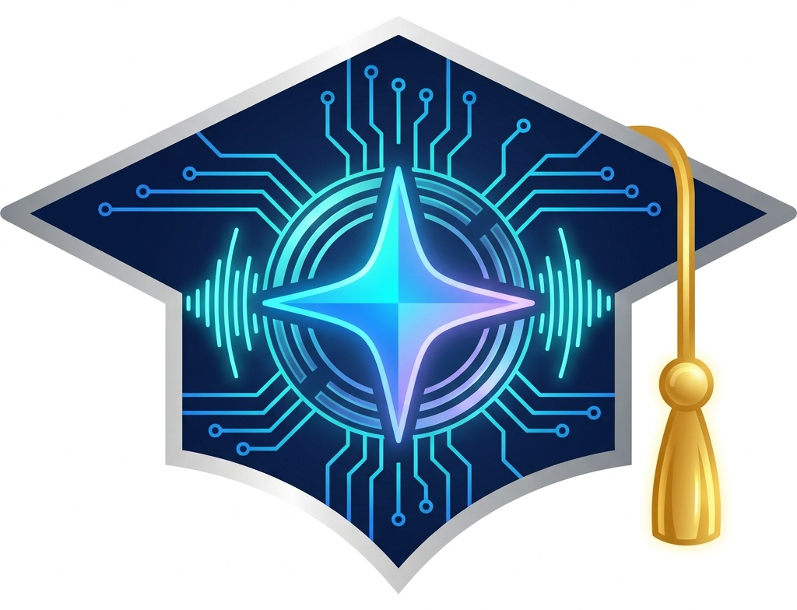

<p align="center"></p>

# Gemini AI Classroom Assistant

A next-generation classroom assistant designed to proactively support students during computer-based tests. Built entirely on Google Cloud and Firebase, this project uses the Gemini AI model not just to detect issues, but to prevent them by providing gentle, real-time guidance to students.

Instead of being a simple proctoring tool, the AI acts as a **Proactive Proctor**, a **Technical Support Assistant**, and a **Wellness Coach**, creating a more supportive and effective testing environment.

## Table of Contents

- [Powered by Google Technologies](#powered-by-google-technologies)
- [Architecture Overview](#architecture-overview)
- [Architecture Diagram](#architecture-diagram)
- [Backend Functionality](./docs/functions.md)
- [Frontend Components](./docs/frontend-components.md)
- [Getting Started (Local Development)](#getting-started-local-development)
- [Demo Users & Pre-Seeded Class](#-demo-users--pre-seeded-class)
- [Testing & Quality Assurance](#-testing--quality-assurance)
- [Environment Reset & Admin Scripts](#-environment-reset--admin-scripts)
- [Deployment & Infrastructure](#deployment--infrastructure)

## Powered by Google Technologies

This project is a showcase of modern, scalable, and intelligent application development using a suite of powerful Google technologies:

*   **[Vertex AI](https://cloud.google.com/vertex-ai):** The core AI capabilities are powered by the **Gemini Pro** model, enabling sophisticated analysis of student activity.
*   **[Firebase](https://firebase.google.com):** The entire backend and application infrastructure is built on Firebase.
    *   **[Firebase Authentication](https://firebase.google.com/docs/auth):** For secure and easy user sign-in.
    *   **[Firestore](https://firebase.google.com/docs/firestore):** A scalable NoSQL database for all application data.
    *   **[Cloud Storage for Firebase](https://firebase.google.com/docs/storage):** To store all student-generated media like screenshots and videos.
    *   **[Cloud Functions for Firebase](https://firebase.google.com/docs/functions):** For all serverless backend logic, from data processing to AI triggers.
    *   **[Firebase Hosting](https://firebase.google.com/docs/hosting):** To deploy and host the web application globally.
*   **[Genkit](https://firebase.google.com/docs/genkit):** The AI flows are developed using Genkit, an open-source framework from Google that helps developers build, deploy, and monitor production-ready AI-powered features.
*   **[Google Cloud Scheduler](https://cloud.google.com/scheduler):** To run scheduled tasks for maintenance and automated class management.

## Architecture Overview

The project is a monorepo composed of three main parts:

*   **`web-app/`**: A React single-page application (built with Vite) that serves as the user-facing frontend for students and teachers. It uses Firebase for authentication and all real-time communication. Key capabilities include:
    *   **Audio Invigilation & Gemini 3.5 Transcribe:** Dual-mode acoustic monitoring featuring rolling 30s/15s moving window segmentation, client-side silence suppression (saving >80% bandwidth & quota), automatic sentence healing, multi-speaker diarization, and interactive audio timeline playback with clickable timestamp seekers.
    *   **On-Device AI Invigilation (Desktop Worker Engine, Multi-Signal EAR/MAR & Cache Storage):** High-efficiency browser edge inference (~15–30 FPS, 0 cloud quota) powered by MediaPipe Face & Iris in a background Web Worker (`faceLandmarker.worker.js`) with zero UI thread jank, hardware frame synchronization (`requestVideoFrameCallback`), multi-signal geometric telemetry (Eye Aspect Ratio for sleeping/drowsiness detection and Mouth Aspect Ratio for talking/whispering detection), 1-click Neutral Baseline Calibration (`🎯 Calibrate View`), 4 flexible modes (`⚡ Client AI + Fallback`, `💻 Client AI Only`, `☁️ Cloud AI Only`, `🚫 AI Disabled`), browser Cache API persistence (`webai-models-v1`), student-side model preload button (`📥 Preload AI (~3.8 MB)`), teacher broadcast preload trigger (`⚡ Preload AI for All Students`), and live download progress telemetry.
    *   **Dual-Channel Split Streams:** Independent live screen sharing and webcam capture with multi-camera selection and stream swapping.
    *   **Background Capture Engine:** Resilient frame acquisition using `ImageCapture` hardware track grab, isolated Web Worker timers, and Screen Wake Lock to prevent throttling when browsers (Edge / Chrome) run behind other apps.
    *   **In-Flight Upload Guards:** Channel-level concurrency locks that prevent upload backlog accumulation and latency drift.
    *   **Live Teacher Monitor & Compliance Audit:** Streamlined ControlsPanel with zero-space problem student filtering (`👥 All Students`, `⚠️ Problems`, `📷 Missing Cam`, `🎙️ Missing Mic`, `🖥️ Not Sharing`, `🚨 AI Alerts`), targeted one-click broadcast nudge (`📢 Nudge (N)`), instant compliance audit CSV export (`📥 Export CSV`), 1-to-1 WebRTC Live Peek with 2-way talkback, and high-detail student inspection modals.
*   **`functions/`**: A Node.js backend using Firebase Functions Gen 2 across 7 isolated codebases. This includes the core AI logic powered by Google Genkit and the Gemini 3 series (`gemini-3.5-flash-lite`, `gemini-3.7-flash`, `gemini-3.7-pro`, `gemini-3.5-transcribe`).
*   **`admin/`**: A collection of Node.js scripts for administrative tasks, such as granting teacher roles, environment resets, and smoke test suites.

For a detailed breakdown of the Firestore data model, please see the [Firestore Schema Documentation](./docs/firestore-schema.md). For audio invigilation architecture, see [Audio Invigilation & Transcription Documentation](./docs/audio-invigilation-and-transcription.md). For frontend architecture and schedule logic, see [Frontend Components](./docs/frontend-components.md) and [Student View Logic](./docs/student-view-logic.md).

## Architecture Diagram


```mermaid
graph TD
    subgraph "Client"
        WebApp["Web App (React + MediaPipe FaceLandmarker)"]
    end

    subgraph "Firebase"
        Auth["Firebase Authentication"]
        Firestore["Firestore Database"]
        Storage["Cloud Storage"]
        Scheduler["Cloud Scheduler"]
    end

    subgraph "Google Cloud"
        VertexAI["Google GenAI (Gemini 3 Series)"]
    end

    subgraph "Cloud Functions"
        subgraph "AI Flows (`ai_flows`)"
            F_analyzeImage["analyzeImage (onCall)"]
            F_analyzeAllImages["analyzeAllImages (onCall)"]
            F_analyzeFaceFallback["analyzeFaceFallback (onCall)"]
            F_analyzeAudio["analyzeAudio (onCall: gemini-3.5-transcribe)"]
            F_onAiJobCreated["onAiJobCreated (onWrite aiJobs)"]
            F_processVideoAnalysisJob["processVideoAnalysisJob (onCreate videoAnalysisJobs)"]
            F_triggerAutomaticAnalysis["triggerAutomaticAnalysis (onUpdate videoJobs)"]
        end

        subgraph "Auth Triggers (`auth_triggers`)"
            F_beforeUserCreated["beforeUserCreated (beforeUserCreated)"]
            F_checkIpAddress["checkipaddress (beforeUserSignedIn)"]
            F_onClassUpdate["onClassUpdate (onWrite classes)"]
        end

        subgraph "Media Processing (`media_processing`)"
            F_processVideoJob["processVideoJob (onCreate videoJobs)"]
            F_processZipJob["processZipJob (onCreate zipJobs)"]
            F_cleanupStuckJobs["cleanupStuckJobs (onSchedule)"]
        end

        subgraph "Scheduled Tasks (`scheduled_tasks`)"
            F_handleAutoCapture["handleAutomaticCapture (onSchedule)"]
            F_handleAutoVideoCombine["handleAutomaticVideoCombination (onSchedule)"]
            F_syncGeminiPricing["syncGeminiPricing (onSchedule)"]
        end

        subgraph "Storage Triggers (`storage_triggers`)"
            F_updateStorageUpload["updateStorageUsageOnUpload (onFinalize)"]
            F_updateStorageDelete["updateStorageUsageOnDelete (onDelete)"]
            F_deleteScreenshots["deleteScreenshotsByDateRange (onCall)"]
            F_cleanupDeletedTriggers["onScreenshotDocDeleted / onVideoJobDocDeleted (onDelete)"]
            F_onClassRetentionUpdated["onClassRetentionUpdated / onClassDocDeleted (onWrite)"]
        end

        subgraph "Attendance (`attendance`)"
            F_getAttendanceData["getAttendanceData (onCall)"]
        end
    end

    %% Client to Firebase
    WebApp -- "HTTPS Calls" --> F_analyzeImage
    WebApp -- "HTTPS Calls" --> F_analyzeAllImages
    WebApp -- "HTTPS Calls" --> F_deleteScreenshots
    WebApp -- "HTTPS Calls" --> F_getAttendanceData
    WebApp -- "Reads/Writes" --> Firestore
    WebApp -- "Uploads" --> Storage
    WebApp -- "Authenticates with" --> Auth

    %% Auth Triggers
    Auth -- "Triggers" --> F_beforeUserCreated
    Auth -- "Triggers" --> F_checkIpAddress

    %% Firestore Triggers
    Firestore -- "classes write" --> F_onClassUpdate
    Firestore -- "videoJobs create" --> F_processVideoJob
    Firestore -- "videoJobs update" --> F_triggerAutomaticAnalysis
    Firestore -- "zipJobs create" --> F_processZipJob
    Firestore -- "videoAnalysisJobs create" --> F_processVideoAnalysisJob
    Firestore -- "aiJobs write" --> F_onAiJobCreated

    %% Storage Triggers
    Storage -- "onFinalize" --> F_updateStorageUpload
    Storage -- "onDelete" --> F_updateStorageDelete

    %% Scheduled Triggers
    Scheduler -- "Triggers" --> F_cleanupStuckJobs
    Scheduler -- "Triggers" --> F_handleAutoCapture
    Scheduler -- "Triggers" --> F_handleAutoVideoCombine

    %% Function to Firestore Interactions
    F_beforeUserCreated -- "Reads/Writes" --> Firestore
    F_checkIpAddress -- "Reads" --> Firestore
    F_onClassUpdate -- "Writes" --> Firestore
    F_processVideoJob -- "Reads/Writes" --> Firestore
    F_processVideoJob -- "Reads" --> Storage
    F_processVideoJob -- "Writes" --> Storage
    F_processZipJob -- "Reads/Writes" --> Firestore
    F_processZipJob -- "Reads" --> Storage
    F_processZipJob -- "Writes" --> Storage
    F_cleanupStuckJobs -- "Reads/Writes" --> Firestore
    F_handleAutoCapture -- "Reads/Writes" --> Firestore
    F_handleAutoVideoCombine -- "Reads/Writes" --> Firestore
    F_updateStorageUpload -- "Reads/Writes" --> Firestore
    F_updateStorageDelete -- "Reads/Writes" --> Firestore
    F_deleteScreenshots -- "Reads/Writes" --> Firestore
    F_deleteScreenshots -- "Deletes from" --> Storage
    F_getAttendanceData -- "Writes" --> Firestore
    F_analyzeImage -- "Calls" --> VertexAI
    F_analyzeImage -- "Writes" --> Firestore
    F_analyzeAllImages -- "Calls" --> VertexAI
    F_analyzeAllImages -- "Writes" --> Firestore
    F_processVideoAnalysisJob -- "Calls" --> F_analyzeImage
    F_processVideoAnalysisJob -- "Writes" --> Firestore
    F_onAiJobCreated -- "Writes" --> Firestore
    F_triggerAutomaticAnalysis -- "Writes" --> Firestore
```

## Backend Functionality

All backend logic is implemented as individual, single-purpose Cloud Functions located in the `functions/` directory. The functions are organized into modules based on their trigger type and domain.

For a detailed breakdown of all Cloud Functions, their triggers, and the data models they interact with, please see the [Cloud Functions Documentation](./docs/functions.md).

## Frontend Components

The user-facing web application is built with React and Vite. For a detailed breakdown of the main components, please see the [Frontend Components Documentation](./docs/frontend-components.md).

## Getting Started (Local Development)

Follow these instructions to set up the project for local development.

### Prerequisites

*   [Node.js](https://nodejs.org/) (v18 or higher recommended)
*   [Git](https://git-scm.com/)
*   [Firebase CLI](https://firebase.google.com/docs/cli#install_the_cli): `npm install -g firebase-tools`

### 1. Firebase Project Setup

1.  Create a new project in the [Firebase Console](https://console.firebase.google.com/).
2.  Enable the following services:
    *   **Authentication:** Email/Password sign-in.
    *   **Firestore:** Create a database.
    *   **Storage:** Create a storage bucket.
3.  In your Firebase project settings, add a new Web App.
4.  Copy the `firebaseConfig` object provided.
5.  In the `web-app/` directory, create a new file named `.env` and paste your `firebaseConfig` values into it (see `.env.example` for format).

### 2. Backend Setup

Install dependencies for the Firebase Functions.

```bash
cd functions
npm install
```

### 3. Frontend Setup

Install dependencies and run the local development server for the React app.

```bash
cd web-app
npm install
npm run dev
```

The application should now be running locally, typically at `http://localhost:5173`.

### 👥 Demo Users & Pre-Seeded Class

The default development environment (`it114115-dev-2026`) comes pre-seeded with an active 24/7 demo class (`IT114115-Demo`) and pre-configured user accounts:

| Role | Email Address | Password | Enrolled / Assigned Class |
| :--- | :--- | :--- | :--- |
| **👨‍🏫 Lead Teacher** | `teacher1@vtc.edu.hk` | `Password123!` | `IT114115-Demo` (Instructor) |
| **👨‍🏫 Co-Teacher** | `teacher2@vtc.edu.hk` | `Password123!` | `IT114115-Demo` (Co-Instructor) |
| **🧑‍🎓 Student 1** | `student1@stu.vtc.edu.hk` | `Password123!` | `IT114115-Demo` (Student) |
| **🧑‍🎓 Student 2** | `student2@stu.vtc.edu.hk` | `Password123!` | `IT114115-Demo` (Student) |
| **🧑‍🎓 Student 3** | `student3@stu.vtc.edu.hk` | `Password123!` | `IT114115-Demo` (Student) |

---

## 🧪 Testing & Quality Assurance

The repository includes a comprehensive multi-tier testing framework spanning React component tests, Cloud Function logic tests, and live cloud smoke tests:

```bash
# Run all test suites (Frontend + Functions + System Smoke Tests)
npm test

# Run all test suites with V8 code coverage report
npm run test:coverage

# Run specific sub-suites
npm run test:frontend   # React component & utility unit tests (Vitest)
npm run test:functions  # Cloud Functions AI & media logic tests (Vitest)
npm run test:smoke      # Live end-to-end smoke tests (Node.js + Firebase Admin)
```

For complete architectural details, test matrices, and coverage reports, see the **[Testing Strategy & Coverage Guide](./docs/testing-strategy-and-coverage.md)**.

## 🧹 Environment Reset & Admin Scripts

The `/admin/scripts` directory provides administrative management tools supporting Google Cloud Application Default Credentials (ADC):

### 1. Complete Environment Reset & Re-seeding
To wipe all Firestore collections/subcollections and Storage media files, then automatically restore default AI prompts and demo accounts:

```bash
# Reset active environment and restore default demo seed data
npm run reset:env

# Reset a specific Firebase project
node admin/scripts/reset_environment.mjs it114115-dev-2026

# Reset including wiping all Firebase Authentication user accounts
node admin/scripts/reset_environment.mjs it114115-dev-2026 --delete-users
```

### 2. User & Prompt Management
* **Grant Teacher Role**: `node admin/scripts/grantTeacherRole.js <email>`
* **Verify User Email**: `node admin/scripts/verifyUser.js <email>`
* **Seed AI Prompts**: `node admin/scripts/seed_prompts.cjs`
* **Seed Demo Class**: `node admin/scripts/seed_demo_class.js`

## Deployment & Infrastructure

The project uses a fully automated **Infrastructure-as-Code (Terraform) + Firebase CLI** pipeline with **Zero UI clicks** required.

For complete details on infrastructure, environments, and multi-codebase architecture, see the **[Deployment & Infrastructure Guide](./docs/deployment-and-infrastructure.md)**.

### Quick Start: Provisioning a New Environment

To create and deploy a brand-new project from scratch in a single command:

```bash
./setup-new-project.sh <PROJECT_ID> [BILLING_ACCOUNT_ID]
```

**Example:**
```bash
./setup-new-project.sh it114115-dev-2026 01C74C-667DFE-538DBC
```

### Switching & Deploying Routine Updates

- **Deploying to Production (`it114115-2627`):**
  ```bash
  firebase use it114115-2627
  ./deploy.sh
  ```

- **Deploying to Development (`it114115-dev-2026`):**
  ```bash
  firebase use it114115-dev-2026
  ./deploy.sh
  ```

### Multi-Codebase Architecture

All Cloud Functions run as Gen 2 serverless functions distributed across **7 isolated codebases** (`ai_flows`, `media_processing`, `auth_triggers`, `storage_triggers`, `scheduled_tasks`, `property_processing`, `attendance`) to ensure high availability, fast builds, and dependency isolation.
`