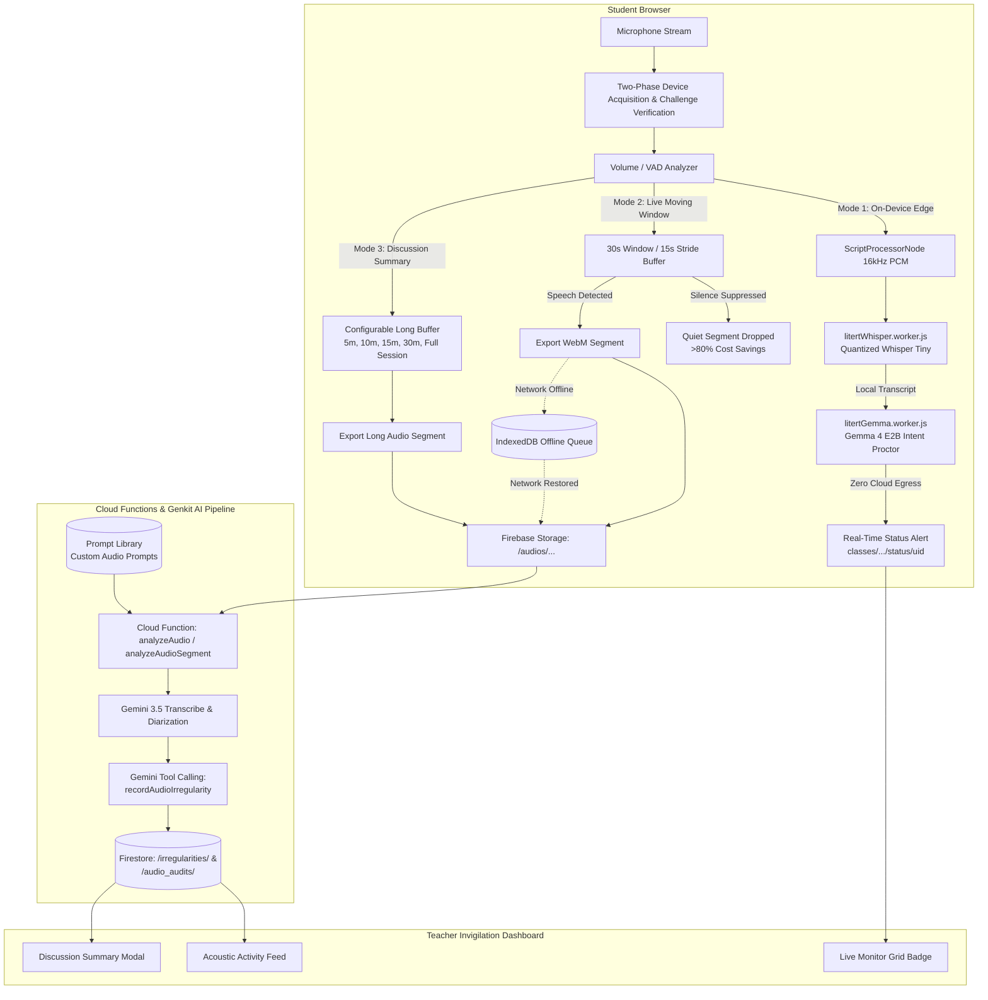
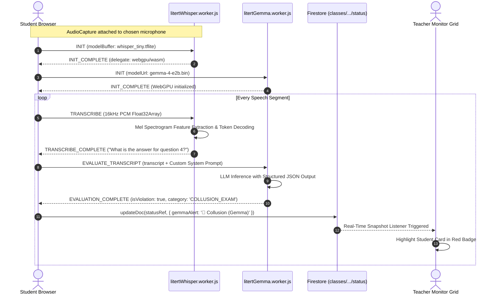
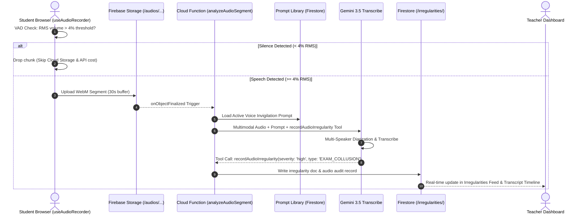
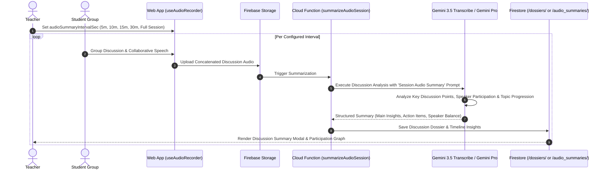
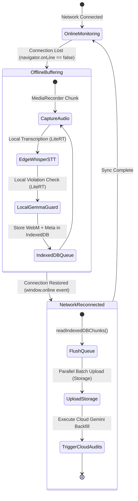

# Audio Invigilation & Voice AI Architecture

This document provides a comprehensive technical guide to the complete Audio Invigilation, Moving Window Audio Segmentation, Edge LiteRT Whisper & Gemma Intent Proctoring, and Session Summarization systems powered by Google LiteRT and Gemini AI.

---

## 1. High-Level Architecture Overview

The acoustic pipeline operates across client-side edge inference (WebGPU / WASM) and server-side cloud orchestration (Firebase Cloud Functions + Gemini 3.5 Transcribe), supporting four distinct operational modes.



---

## 2. Multi-Mode Voice Processing Matrix

| Specification | Mode 1: On-Device LiteRT Whisper + Gemma | Mode 2: Real-Time Rolling Moving Window | Mode 3: Discussion / Session Summarization | Mode 4: Offline Hybrid Queue |
| :--- | :--- | :--- | :--- | :--- |
| **Primary Model** | Local LiteRT Whisper + Gemma 4 E2B | Cloud `gemini-3.5-transcribe` | Cloud `gemini-3.5-transcribe` & Gemini Pro | Local IndexedDB + Post-Sync Cloud |
| **Execution Tier** | 100% Client Browser (WebGPU / WASM) | Cloud Function + Vertex AI / Genkit | Cloud Function + Vertex AI / Genkit | Client-side buffered queue |
| **Network Egress** | Zero audio upload (transcripts/alerts only) | WebM chunks uploaded via HTTPS | WebM chunks uploaded per interval | Zero until connection restored |
| **Timing Cadence** | Continuous stream (~1-2s latency) | 15s stride / 30s sliding window | 5 min, 10 min, 15 min, 30 min, or Full Session | Automatic re-flush on reconnection |
| **Prompt Customization** | Configurable Gemma Proctor Prompt | Configurable Live Invigilation Prompt | Configurable Discussion Summary Prompt | Inherited from selected cloud mode |
| **Cost Profile** | **$0.00 / Zero API Cost** | Optimized by silence suppression | Single or batch macro-call | Buffered, executed upon sync |

---

## 3. Mode 1: On-Device LiteRT Whisper + Gemma Intent Proctoring (Zero Cloud Egress)

Mode 1 runs entirely in client-side Web Workers using Google LiteRT (`@litertjs/core` and `@litert-lm/core`).

### Mode 1 Sequence Flow



---

## 4. Mode 2: Real-Time Rolling Moving Window Audio Invigilation

Mode 2 resolves the classic **boundary truncation problem** using a 50% overlapping sliding window (30s window, 15s stride) with silence suppression.

### Boundary Healing & Deduplication

```mermaid
flowchart LR
    subgraph Stride1 [Window 1: 0s - 30s]
        W1A["...What is the ans- [CUT]"]
    end
    subgraph Stride2 [Window 2: 15s - 45s (50% Overlap)]
        W2A["[HEALED] What is the answer for question four?"]
    end
    subgraph Merger [transcriptMerger.js]
        W1A --> Matcher[Timestamp Alignment & Overlap Matcher]
        W2A --> Matcher
        Matcher --> FinalTranscript["'What is the answer for question four?' (Deduplicated)"]
    end
```

### Mode 2 Sequence Flow



---

## 5. Mode 3: Classroom Discussion & Long Session Audio Summarization

For collaborative classroom discussions or post-session reviews, short 30s chunks are replaced by **configurable long audio intervals**.

### Discussion Summarization Flow



---

## 6. Mode 4: Offline Queue & Cloud Hybrid Fallback

When a student loses internet connectivity during an examination:



---

## 7. Dynamic Voice Prompt Library & Teacher Configuration Modal

All voice prompts are managed dynamically in the unified Prompt Library and integrated directly into the Teacher Monitor's Live Configuration modal:

1. **Category `audios`**: First-class prompt category alongside `images` and `videos`.
2. **Tag Targets (`applyTo`)**:
   - `Live Audio Invigilation`: Cloud-side rolling moving window prompt for `analyzeAudioFlow` / `analyzeAudioSegment`.
   - `Session Audio Summary`: Cloud-side discussion summarization prompt for `summarizeAudioSession`.
   - `On-Device Gemma Voice Intent`: Client-side prompt for `litertGemma.worker.js`.
3. **Teacher AI Configuration Modal (`ControlsPanel.jsx` - Tab 2: Voice & Speech)**:
   - Category filter tabs (`All`, `Public`, `Private`, `Shared`).
   - Voice prompt selector dropdown populating from `useAudioPrompts`.
   - One-click placeholder insertion buttons (`+ {{transcript}}`, `+ {{classId}}`, `+ {{studentUid}}`, `+ {{studentEmail}}`).
   - Live editable prompt textarea saved to `classes/{classId}` in Firestore.
4. **Mustache Template Substitution Engine**:
   - Both client-side Gemma worker and server-side Genkit flow support dynamic interpolation:
     - `{{transcript}}`: Injected real-time microphone transcript.
     - `{{classId}}`: Active classroom ID.
     - `{{studentUid}}`: Student Firebase UID.
     - `{{studentEmail}}`: Student email address.
   - Fallback: If `{{transcript}}` is omitted from a custom template, the system automatically appends the audio transcript context block.

---

## 8. Client-Side Gemma vs. Server-Side Genkit: Irregularity & Tool Handling

| Dimension | Client-Side LiteRT Gemma (`hybrid` / `client_only`) | Server-Side Cloud Genkit (`cloud_only`) |
| :--- | :--- | :--- |
| **Model** | Gemma 4 E2B (`@litert-lm/core`) via WebGPU/WASM | Gemini 3.5 Flash-Lite via Vertex AI / Cloud Functions |
| **Tool Calling Support** | **No native tool calling** (model generates constrained JSON) | **Native Genkit tool calling** (`ai.defineTool`) |
| **Output Contract** | Structured JSON schema: `{"isViolation": bool, "category": string, "severity": string, "confidence": number, "evidence": string, "rationale": string}` | Autonomous Tool Invocations: `recordAudioIrregularity()`, `recordAudioAudit()` |
| **Irregularity Logging** | **Client Hook Execution (`useClientLiteRTGemma.js`)**: Hook detects `isViolation === true` and executes direct Firestore writes to `/irregularities` and `/classes/{classId}/irregularities` | **Cloud Function Execution (`aiTools.js`)**: Cloud Genkit agent invokes `recordAudioIrregularity` tool during generation |
| **Telemetry Updates** | Merges `gemmaAlert`, `gemmaSeverity`, `gemmaConfidence`, `lastGemmaTimestamp` directly into `/classes/{classId}/status/{studentUid}` | Cloud Function writes to class subcollections and logs audits |
| **Cloud Quota & Latency** | **$0.00 / 0 Cloud API tokens**, ~1-2s local inference | Standard Vertex AI token billing, ~3-5s network + generation roundtrip |


