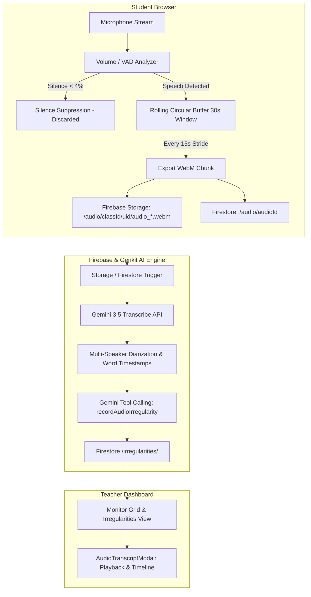
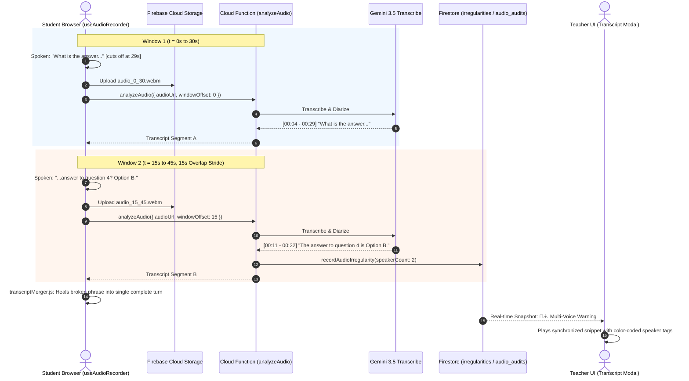

# Audio Invigilation & Gemini 3.5 Transcribe Architecture

This document provides a comprehensive technical guide to the Audio Invigilation, Moving Window Audio Segmentation, and Multi-Speaker Diarization system powered by **`gemini-3.5-transcribe`**.

---

## 1. High-Level Architecture

The system decouples the **Visual Pipeline** (Screen/Webcam JPEG frames + on-device MediaPipe Face & Gaze Tracking) from the **Acoustic Pipeline** (Microphone WebM chunks + Gemini 3.5 Transcribe).



---

## 2. Multi-Tiered Acoustic Architecture: LiteRT Whisper (Edge) & Gemini 3.5 (Cloud)

The acoustic pipeline operates in a flexible 3-tier hierarchy:

1. **Tier 1 (Instant Mic Verification & Device Selection):**
   - Students can select any connected audio device (USB headset, external microphone, webcam mic, 3.5mm jack).
   - Instant phrase-matching challenge verification via Web Speech API and loopback playback test.
   - Dynamic device switching restarts the media stream and seamlessly redirects the real-time audio pipeline.
2. **Tier 2 (On-Device LiteRT Whisper Edge STT):** Background Web Worker (`litertWhisper.worker.js`) running `@litertjs/core` (Google LiteRT) on WebGPU / XNNPACK CPU WASM:
   - **Direct Microphone Stream Attachment:** `useClientLiteRTWhisper` attaches a Web Audio `ScriptProcessorNode` directly to the `audioStream` from the chosen microphone, resamples incoming frames to 16kHz PCM Float32Array, and executes VAD-driven chunking for instant on-device Whisper STT on whichever microphone the student selected.
   - **Cantonese, Mandarin & English Code-Switching:** Uses decoder prompt biasing anchors (`唔該`, `點解`, `呢個`, `明白`, `assignment`, `exam`) to prevent translation bias.
   - **Zero Cloud API Cost & Offline-First:** Saves transcription records directly to Firestore.
   - **Persistent Cache Storage:** Quantized `.tflite` model (~39 MB) cached under `webai-litert-whisper-v1`.
3. **On-Device Gemma LLM Intent Guard (`litertGemma.worker.js` & `useClientLiteRTGemma.js`):**
   - Evaluates spoken transcripts locally via Google LiteRT runtime with zero network egress.
   - Detects academic collusion (`COLLUSION_EXAM`), voice assistant dictation (`EXTERNAL_AI_ASSIST`), and unauthorized side-talk (`UNAUTHORIZED_TALK`).
   - Accurately discriminates legitimate procedural inquiries (*"teacher my screen is blank"*, *"唔該阿Sir我睇唔到題"*) to avoid false positives.
   - Updates `classes/{classId}/status/{studentUid}` with `gemmaAlert` and renders live proctoring alerts (`🚨 Collusion (Gemma)`) on the teacher's monitor grid.
   - Quantized model (~120 MB) pre-cached in `webai-litert-gemma-v1`.

---

## 3. Dual-Mode Audio Processing

Both modes are independently configurable per class in the Class Management settings and controls panel:

| Feature | Mode 1: Moving Window Real-Time Transcription | Mode 2: Full-Session Combined Long Audio Diarization |
| :--- | :--- | :--- |
| **Model** | `gemini-3.5-transcribe` | `gemini-3.5-transcribe` |
| **Target Use Case** | Near-real-time feedback & multi-speaker alerts during ongoing exam | Holistic post-exam forensic audit and whole-session integrity report |
| **Cadence** | Sliding window (30s window, 15s stride - 50% overlap) | Stitched master audio file at exam conclusion |
| **Overlapping Resolution** | Client/backend transcript deduplication (`transcriptMerger.js`) | Native single-pass multi-speaker attribution |
| **Storage & Cost** | Silence suppression skips quiet segments (>80% savings) | Single concatenated file processed once per student |
| **Independent Toggle** | `enableSegmentTranscription` | `enableCombinedLongAudio` |

---

## 3. Moving Window Audio Segmentation & Boundary Healing

### The Sharp Cut Problem
Traditional fixed audio slicing (e.g., cutting every 30s) risks cutting sentences or words directly in half at second 29.9, causing speech-to-text models to hallucinate broken phonemes and fail to attribute speakers correctly.

### The Sliding Rolling Buffer Solution
1. **Rolling Chunks**: The client `MediaRecorder` generates 1-second audio slices into a circular memory buffer `rollingChunksRef`.
2. **50% Overlap Stride**: Every 15 seconds (stride), the client slices the last 30 seconds of audio buffer and uploads it.
3. **Overlapping Context**: Every spoken sentence is captured completely in at least one window without boundary truncation.
4. **Sentence Stitching & Deduplication (`transcriptMerger.js`)**:
   - Compares relative dialogue turn start times against `strideIndex * strideSeconds`.
   - Normalizes text strings (stripping punctuation and lowercase).
   - Replaces partial sentences from the prior window with complete boundary-healed utterances from the current window.



---

## 4. Silence Suppression (VAD & Cost Optimization)

To protect Firebase Storage quotas and minimize Gemini AI token consumption:
- The client `AudioContext` initializes an `AnalyserNode` (`fftSize = 256`) computing RMS volume 10 times per second.
- If average volume is `< 4%` and peak volume is `< 8%` throughout the window:
  - The chunk is deemed silent.
  - No file is uploaded to Cloud Storage.
  - No Firestore document is created.
  - Zero AI tokens are consumed.

---

## 5. Security & Access Permissions

### Cloud Storage Security Rules (`storage.rules`)

```rules
rules_version = '2';

service firebase.storage {
  match /b/{bucket}/o {
    // 1. Audio Recording Segments
    match /audio/{classId}/{userId}/{fileName} {
      // Allow authenticated students to upload audio segments to their own folder within a class.
      allow write: if request.auth != null &&
                      request.auth.uid == userId &&
                      request.resource.size < 5242880 && // 5 MB
                      request.resource.contentType.matches('audio/.*');

      // Allow all authenticated users (teachers and students) to read audio recordings
      allow read: if request.auth != null;

      // Allow authenticated teachers to delete.
      allow delete: if request.auth != null && (request.auth.token.role == 'teacher' || request.auth.token.email.matches('.*@vtc\\.edu\\.hk') || request.auth.token.email.matches('.*@ive\\.edu\\.hk'));
    }

    // 2. Irregularity Evidence (Images + Audio Snippets)
    match /irregularities/{classId}/{userId}/{fileName} {
      allow write: if request.auth != null &&
                      request.auth.uid == userId &&
                      request.resource.size < 5242880 && // 5 MB
                      (request.resource.contentType.matches('image/.*') || request.resource.contentType.matches('audio/.*'));

      allow read: if request.auth != null;
      allow delete: if request.auth != null && (request.auth.token.role == 'teacher' || request.auth.token.email.matches('.*@vtc\\.edu\\.hk') || request.auth.token.email.matches('.*@ive\\.edu\\.hk'));
    }
  }
}
```

### Cloud Firestore Security Rules (`firestore.rules`)

```rules
    // Audio Metadata Collection
    match /audio/{audioId} {
        allow read: if isTeacher() || (request.auth != null && request.auth.uid == resource.data.studentUid);
        allow create: if request.auth.uid == request.resource.data.studentUid && 
                         isStudentInClass(request.resource.data.classId);
        allow delete: if isTeacher();
    }

    // Irregularities Collection
    match /irregularities/{irregularityId} {
      allow read: if isTeacher() || (request.auth != null && request.auth.uid == resource.data.studentUid);
      allow create: if isTeacher() || (request.auth != null && request.auth.uid == request.resource.data.studentUid && isStudentInClass(request.resource.data.classId));
      allow update: if isTeacher() || (request.auth != null && request.auth.uid == resource.data.studentUid && isStudentInClass(resource.data.classId));
      allow delete: if isTeacher();
    }
```

---

## 6. Gemini Tool Calling for Audio Incidents

When analyzing audio segments, Gemini is supplied with the Genkit tool `recordAudioIrregularity`:

```javascript
export const recordAudioIrregularity = ai.defineTool(
  {
    name: 'recordAudioIrregularity',
    description: 'Records an audio irregularity (e.g. unauthorized collaboration, secondary speaker present, whispering answers).',
    inputSchema: z.object({
      studentUid: z.string().describe('The UID of the student.'),
      studentEmail: z.string().optional().describe('The email of the student.'),
      title: z.string().describe('The title of the audio irregularity.'),
      message: z.string().describe('Detailed explanation of conversation or acoustic evidence.'),
      transcriptSnippet: z.string().optional().describe('Spoken transcript snippet with speaker tags.'),
      audioPath: z.string().optional().describe('Cloud storage path of the audio snippet.'),
      imageUrl: z.string().optional().describe('URL or path to student webcam snapshot.'),
      speakerCount: z.number().optional().describe('Number of distinct speakers identified.'),
      riskLevel: z.enum(['none', 'low', 'medium', 'high']).optional().describe('Risk severity level.'),
      classId: z.string().optional().describe('The ID of the class.'),
    }),
    outputSchema: z.string(),
  },
  async (input) => { ... }
);
```

---

## 7. Teacher UI, Space-Optimized Audio Bar & Dialogue Playback

- **Live Grid Multi-Voice Warning**: [`StudentScreen.jsx`](file:///home/developer/Documents/Gemini-AI-Classroom-Assistant/web-app/src/components/StudentScreen.jsx) displays `👥⚠️ Multi-Voice Warning` when secondary speakers or high-risk speech patterns are detected.
- **Space-Efficient Audio Bar**: [`IndividualStudentView.jsx`](file:///home/developer/Documents/Gemini-AI-Classroom-Assistant/web-app/src/components/IndividualStudentView.jsx) features a streamlined, single-row audio control bar (~38px height):
  - **Inline Player & Telemetry**: Renders an inline HTML5 `<audio>` player keyed to the active track URL with dynamic live telemetry (`🟢 Live` or `🗣️ Speaking %`).
  - **Decoupled URL Resolution**: Resolves Firebase Storage download URLs automatically via `urlMap[item.id]` and `urlMap[item.audioPath]` for seamless playback across all browser clients.
  - **Collapsible Timeline Drawer (`📋 Clips (N) ▾`)**: Keeps the playlist collapsed by default to maximize vertical screen area for high-resolution dual-channel video feeds (Screen + Webcam). Teachers can expand the drawer with 1 click to inspect all past 30-second segments.
  - **Subtitle Transcript Strip**: Displays a 1-line speech preview when an AI transcript is available, with a direct shortcut to full diarization analysis.
- **Audio Transcript Modal**: [`AudioTranscriptModal.jsx`](file:///home/developer/Documents/Gemini-AI-Classroom-Assistant/web-app/src/components/AudioTranscriptModal.jsx) provides:
  - Color-coded speaker turns (🔵 Student, 🔴 Unauthorized Collaborator, 🟡 Whisper).
  - Clickable `[▶ MM:SS]` timestamp seek buttons to jump to exact moments in the audio recording.
  - Linked webcam snapshot captured at the exact timestamp of speech.
- **Irregularities Evidence Viewer**: [`IrregularitiesView.jsx`](file:///home/developer/Documents/Gemini-AI-Classroom-Assistant/web-app/src/components/IrregularitiesView.jsx) renders the incident audio player, spoken quote, and synchronized screen/webcam frames in a unified modal.

---

## 8. Student Voice Input Device Selection & Verification

The student client provides a dedicated audio configuration and calibration interface via [`MicSetupModal.jsx`](file:///home/developer/Documents/Gemini-AI-Classroom-Assistant/web-app/src/components/MicSetupModal.jsx) and the [`useAudioSetup.js`](file:///home/developer/Documents/Gemini-AI-Classroom-Assistant/web-app/src/hooks/useAudioSetup.js) hook.

### Hardware Device Selection Flow

```mermaid
sequenceDiagram
    autonumber
    actor Student
    participant UI as StudentView.jsx
    participant Modal as MicSetupModal.jsx
    participant Hook as useAudioSetup.js
    participant Browser as navigator.mediaDevices
    participant Rec as useAudioRecorder.js

    Student->>UI: Clicks "⚙️ Mic Test" (or Auto-opened if Audio is Mandatory)
    UI->>Modal: Opens with isOpen={true}
    Modal->>Hook: useAudioSetup({ studentUid, studentName })
    Hook->>Browser: enumerateDevices() -> filters kind === 'audioinput'
    Browser-->>Hook: Audio input devices (Built-in, USB Headset, Bluetooth)
    Hook-->>Modal: Populates <select id="mic-select">

    alt Student changes input device
        Student->>Modal: Selects specific microphone from dropdown
        Modal->>Hook: startStream(newDeviceId)
        Hook->>Browser: getUserMedia({ audio: { deviceId: { exact: id } } })
        Hook->>Hook: Persists selection to localStorage ('preferred_mic_device_id')
        Hook->>Hook: Attaches Web Audio AnalyserNode for volume metering
        Modal-->>Student: Displays live 0-100% green/yellow/red volume bar
    end

    alt Voice Verification Challenge
        Student->>Modal: Clicks "▶ Start Voice Test"
        Student->>Student: Reads challenge phrase: "My student ID is [UID] and my mic is working"
        Modal->>Modal: Evaluates Web Speech Recognition match
        Modal-->>Student: ✅ Voice Verified Badge
    end

    Student->>Modal: Clicks "Confirm & Save"
    Modal->>UI: onConfirm({ deviceId })
    UI->>Rec: useAudioRecorder({ deviceId, isAudioUserEnabled: true })
    Rec->>Browser: Streams audio from chosen microphone in 30s sliding windows
```



### Key Technical Capabilities

1. **Dynamic Hardware Enumeration & Hot-Plugging**:
   * Uses `navigator.mediaDevices.enumerateDevices()` to list all connected input devices with human-readable labels.
   * Listens to the browser `devicechange` event so newly plugged USB headsets or Bluetooth mics immediately appear in the dropdown without page refresh.

2. **Persistent Device Memory**:
   * The chosen microphone `deviceId` is saved to `localStorage` under `preferred_mic_device_id`, ensuring the student's setup is remembered across sessions and browser refreshes.

3. **Real-time Web Audio VU Meter**:
   * Initializes a Web Audio `AudioContext` and `AnalyserNode` (`fftSize = 256`) calculating root-mean-square (RMS) energy to drive an interactive $0\%$ to $100\%$ volume visualizer with color thresholds (Green: 5–65%, Yellow: 65–85%, Red: >85%).

4. **Speech-to-Text Challenge Verification**:
   * Prompts the student with a personalized challenge phrase (e.g. *"My student ID is [UID] and my microphone is working"*).
   * Runs client-side `webkitSpeechRecognition` / `SpeechRecognition` to verify acoustic clarity and microphone responsiveness before proctored recording begins.

5. **Acoustic Pipeline Handoff**:
   * When confirmed, the selected `deviceId` is passed directly as an exact constraint into `useAudioRecorder.js`, ensuring all subsequent 30-second rolling audio segments are captured exclusively from the student's chosen hardware device.

---

## On-Device Speech AI & Intent Classification (Google LiteRT.js)

### 1. LiteRT Whisper STT Engine (`useClientLiteRTWhisper.js` & `litertWhisper.worker.js`)
* **Local Web Worker Execution**: Transcribes incoming 16kHz PCM audio buffers in a background Web Worker without UI thread blocking.
* **Multilingual Speech Recognition**: Supports Cantonese (`zh-HK`), Mandarin (`zh-CN`), and English (`en-US`) configured unobtrusively by teachers.
* **Automatic Cache & Fallback**: Stores Whisper Tiny weights in `window.caches` for instant subsequent loads.
* **Real-Time Telemetry**: Automatically updates `classes/{classId}/status/{studentUid}` with `liveTranscript`, `speechLanguage`, and acoustic status.

### 2. LiteRT Gemma LLM Intent Evaluation (`useClientLiteRTGemma.js` & `litertGemma.worker.js`)
* **On-Device Zero-Shot Evaluation**: Classifies student spoken transcripts in real time against strict academic integrity standards:
  - `COLLUSION_EXAM`: Seeking or sharing exam answers / question numbers.
  - `COLLUSION_DISCUSS`: General discussion of test material or strategies.
  - `EXTERNAL_ASSISTANCE`: Communicating with someone off-camera.
  - `EXAM_CONTENT_LEAK`: Dictating exam questions aloud.
  - `LEGITIMATE_INQUIRY`: Asking teacher for clarification / technical help.
  - `NON_EXAM_TALK`: Casual background chatter.
* **Dual-Target Logging**: Dispatches detected violations to both top-level `/irregularities` (for real-time dashboard notifications) and `/classes/{classId}/irregularities` (for audit reports).
* **Tamper-Resistant Security**: Guaranteed by Firestore Security Rules—students cannot delete or alter incident records.
