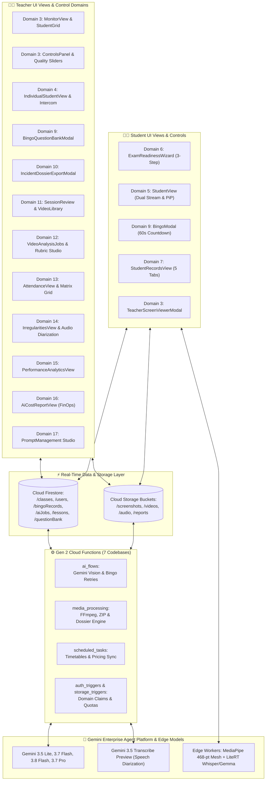

# 📘 Gemini AI Classroom Assistant: Comprehensive UI Controls & Feature Catalog

[🏠 Documentation Index](../README.md#documentation-index) | [👨‍🏫 Teacher Manual](./user-manual-teacher.md) | [🧑‍🎓 Student Manual](./user-manual-student.md) | [🛠️ Admin Manual](./user-manual-admin.md)

---

This document provides an exhaustive, granular inventory of every User Interface (UI) control, interactive element, configuration toggle, analytics view, and operational capability across the entire Gemini AI Classroom Assistant platform.

---

## 📑 Table of Contents
1. [Application Shell, Navigation & System Gating](#1-application-shell-navigation--system-gating)
2. [Teacher Dashboard & Command Center](#2-teacher-dashboard--command-center)
3. [Teacher Live Invigilation Workspace](#3-teacher-live-invigilation-workspace)
4. [Individual Student 1-on-1 Inspection & Intercom](#4-individual-student-1-on-1-inspection--intercom)
5. [Student Client Experience & On-Device AI](#5-student-client-experience--on-device-ai)
6. [Student Pre-Flight Setup & Readiness Wizard](#6-student-pre-flight-setup--readiness-wizard)
7. [Student Self-Service Records & Assessment Portal](#7-student-self-service-records--assessment-portal)
8. [Class Configuration, Schedule & Security Administration](#8-class-configuration-schedule--security-administration)
9. [Interactive Bingo & Presence Verification](#9-interactive-bingo--presence-verification)
10. [Formal Incident Dossier & Evidence Export](#10-formal-incident-dossier--evidence-export)
11. [Session Review, Video Library & Synchronized Playback](#11-session-review-video-library--synchronized-playback)
12. [AI Video Analysis Jobs & Automated Rubric Synthesis](#12-ai-video-analysis-jobs--automated-rubric-synthesis)
13. [Attendance, Bitmask Verification & AI Working Estimation](#13-attendance-bitmask-verification--ai-working-estimation)
14. [Irregularities, Biometric Alerts & Audio Diarization](#14-irregularities-biometric-alerts--audio-diarization)
15. [Performance Analytics, Milestone Charts & Progress](#15-performance-analytics-milestone-charts--progress)
16. [AI FinOps, Quota Governance & Cost Audit](#16-ai-finops-quota-governance--cost-audit)
17. [Prompt Management Studio & AI Prompt Optimizer](#17-prompt-management-studio--ai-prompt-optimizer)
18. [Data Management, Bulk ZIP Archives & Retention Deletion](#18-data-management-bulk-zip-archives--retention-deletion)
19. [System Mailbox & Asynchronous Job Notifications](#19-system-mailbox--asynchronous-job-notifications)

---

## 🏛️ Comprehensive Platform Control & Data Flow Architecture

The diagram below maps all 19 UI control domains to client edge runtimes, Firebase serverless data stores, and Gemini Enterprise Agent Platform multimodal intelligence:

---

## 1. Application Shell, Navigation & System Gating
**Primary Source:** [`App.jsx`](file:///home/developer/Documents/Gemini-AI-Classroom-Assistant/web-app/src/App.jsx)

### Navigation Bar Controls
- **Brand Logo & Title Link (`navbar-brand`):** Returns authenticated user to their role-appropriate home (`/` for teachers, `/student` for students).
- **Active Class Selector Dropdown:** In-header quick navigation dropdown that lists all classes taught by the teacher; switching immediately routes to the target class workspace.
- **Top-Level Navigation Links:**
  - `Classes`: Navigates to `/` (Teacher Class Overview).
  - `Prompts`: Navigates to `/prompts` (AI Prompt Studio).
  - `Mailbox`: Navigates to `/mailbox` (Displays badge with unread system notification count).
- **Role Simulation Switcher (`role-switcher`):** Allows administrative accounts to toggle between `Teacher` and `Student` modes for end-to-end verification.
- **User Profile Pill & Logout Button:** Shows active Google Account avatar and email with a one-click `Sign Out` button.

### System Gatekeeping & Hardware Policies
- **Google Chrome Enforcer (`UnsupportedBrowserNotice.jsx`):** Strictly verifies Chromium architecture (`isGoogleChrome()`). If a student accesses the platform on Safari, Firefox, or Edge, interactive streaming is blocked, and an instructional card explaining WebRTC/MediaPipe hardware requirements is presented.
- **Desktop Notification Requester:** Requests browser notification privileges on initial load to allow background OS notifications when incidents occur or students ask questions.

---

## 2. Teacher Dashboard & Command Center
**Primary Source:** [`TeacherView.jsx`](file:///home/developer/Documents/Gemini-AI-Classroom-Assistant/web-app/src/components/TeacherView.jsx)

### Class Overview Cards
- **Create Class Button (`+ Create Class`):** Launches modal to initialize a new classroom instance with custom ID, display name, schedule, and AI quota.
- **Class Card Grid:**
  - **Live Status Indicator:** Real-time green pulsating badge (`🟢 Active Now`) if the current timestamp falls within a scheduled lesson window.
  - **Enrolled Student Counter:** Displays active roster size (`N Students enrolled`).
  - **Quick Action Buttons:**
    - `Launch Live Monitor`: Immediate route to the class invigilation workspace (`/class/:id?tab=monitor`).
    - `Class Settings`: Quick route to administrative settings (`/class/:id?tab=settings`).
    - `Analytics`: Quick route to session review and incident dossiers.

---

## 3. Teacher Live Invigilation Workspace
**Primary Sources:** [`ClassView.jsx`](file:///home/developer/Documents/Gemini-AI-Classroom-Assistant/web-app/src/components/ClassView.jsx), [`MonitorView.jsx`](file:///home/developer/Documents/Gemini-AI-Classroom-Assistant/web-app/src/components/MonitorView.jsx), [`ControlsPanel.jsx`](file:///home/developer/Documents/Gemini-AI-Classroom-Assistant/web-app/src/components/ControlsPanel.jsx), [`StudentsGrid.jsx`](file:///home/developer/Documents/Gemini-AI-Classroom-Assistant/web-app/src/components/StudentsGrid.jsx)

### Header & Schedule Filter Bar
- **Class Switcher Dropdown:** Fast contextual switching across assigned classes without returning to dashboard.
- **Lesson Schedule Selector:** Dropdown listing past, current, and upcoming scheduled lesson blocks; selecting a block filters all timestamps across all tabs.
- **Date & Time Range Picker:** Allows custom `From` and `To` datetime filtering with instant filter reset.
- **Timezone Badge:** Shows canonical class timezone (e.g., `Asia/Hong_Kong`).
- **Main View Tabs:**
  - `🖥️ Monitor`: Real-time student video/screen grid and broadcast controls (persistently mounted).
  - `🎥 Videos`: Subtabs for Video Library, Session Review, and Video Analysis Jobs.
  - `📊 Analytics`: Subtabs for Irregularities, Student Progress, Attendance Matrix, Performance Milestones, and AI Cost Report.
  - `💬 Messages`: Notification audit stream.
  - `💾 Data Management`: Bulk archive generation and retention deletion.
  - `⚙️ Settings`: Class configuration, roster, AI parameters, and exam periods.

### Live Controls Panel (`ControlsPanel.jsx`)
- **Teacher Screen Broadcast Switch (`🖥️ Broadcast Screen`):** Captures the teacher's desktop via `getDisplayMedia` and broadcasts low-latency WebRTC frames across Firestore signaling to all 50+ students.
  - **Broadcast Quality Selector:** Dropdown with `720p (Fast)`, `1080p (Standard)`, and `1440p (High-Res)`.
  - **Broadcast Frame Rate (FPS) Selector:** Dropdown with `5 FPS` (low bandwidth), `10 FPS`, or `15 FPS`.
- **Global Bingo Challenge Trigger (`🎯 Call Class Bingo`):** Dispatches an immediate presence challenge to all active students with a 60-second response window.
- **Question Bank Launcher Button (`📚 Bingo Question Bank`):** Opens the Question Bank Management modal.
- **Snapshot Cadence Slider (`Capture Cadence: 5s - 60s`):** Controls the interval at which student clients upload screen and camera snapshots.
- **Grid Layout Density Selector:** Buttons for `2x2`, `3x3`, `4x4`, or `Dynamic Auto-Fit` student grid display.
- **Audio Master Mute / Listen Toggle:** Globally enables or mutes classroom ambient audio feeds.
- **Cloud Fallback AI Toggle:** Enables cloud-based Gemini vision monitoring for students whose client devices lack WebGL/GPU support for MediaPipe.

### Students Grid & Student Card (`StudentScreen.jsx`)
- **Dual Stream Container:** Displays picture-in-picture student webcam and desktop feeds.
- **Focus Swap Button (`🔄 Swap View`):** Toggles main viewport between student screen capture and webcam video.
- **Full Screen Expand Button (`⛶ Fullscreen`):** Expands an individual student card to full display width.
- **Live Biometric Telemetry Badges:**
  - `🟢 Centered` / `🔴 Looking Away (Yaw: +32°, Pitch: -14°)`
  - `🔴 Multiple Faces Detected`
  - `🔴 Face Absent / No Person`
  - `⚠️ Non-Fullscreen Window`
- **Audio Activity Meter (VU Bar):** Real-time green/yellow/red volume level meter reflecting speech intensity.
- **Bingo Status Pill:** Displays `🎯 Bingo Pending (42s)` or `✅ Verified` badge during active challenges.
- **Single-Click Card Inspection:** Clicking any student card opens the 1-on-1 inspection modal.

---

## 4. Individual Student 1-on-1 Inspection & Intercom
**Primary Source:** [`IndividualStudentView.jsx`](file:///home/developer/Documents/Gemini-AI-Classroom-Assistant/web-app/src/components/IndividualStudentView.jsx)

### Channel Selectors
- **`Dual View` Tab:** Side-by-side or stacked view of the student's screen and webcam.
- **`Screen Only` Tab:** High-resolution zoom of student's desktop with anti-aliasing.
- **`Webcam Only` Tab:** High-resolution camera feed with MediaPipe 468-point face mesh tracking.
- **`Live Peek (P2P)` Tab:** Direct WebRTC peer-to-peer 30 FPS stream connecting teacher and student directly.

### Intercom & Remote Talkback
- **Microphone Device Dropdown (`selectedMicId`):** Allows teacher to pick which microphone hardware transmits intercom audio.
- **Talkback Intercom Toggle Button:**
  - Default: `🗣️ Talk to Student` (Inactive).
  - Active: `🎙️ Intercom Active (Speaking...)` (Streams low-latency teacher voice directly into student headset).

### Direct Messaging & Quick Nudge Pills
- **Direct Message Input & Send Button:** Transmits immediate visual banner to student screen.
- **One-Click Intervention Pills:**
  - `🖥️ Screen Share Reminder`: Prompts student to restore entire screen sharing.
  - `📷 Cam Turn On`: Nudges student to activate webcam.
  - `🎙️ Mic Enable`: Prompts student to enable microphone.
  - `👁️ Face Screen Centering`: Reminds student to look toward the screen.

### Single-Student Bingo Challenge
- **`🎯 Call Bingo` Button:** Triggers an isolated presence verification check targeting this specific student, capturing an unannounced screen snapshot (`student_screen`) to defeat decoy video loops.

### Audio Invigilation Player & Transcript Drawer
- **Microphone Status Pill:** Displays speaking state (`🗣️ Speaking N%` / `🟢 Live` / `⚪ Inactive`).
- **HTML5 Compact Audio Player:** Plays the latest rolling audio segment recorded by the student.
- **Clip Timestamp & Duration Badge:** Shows precise recording window (e.g., `🕒 14:22:10 (30s)`).
- **`📜 View Transcript & Diarization` Button:** Opens [`AudioTranscriptModal.jsx`](file:///home/developer/Documents/Gemini-AI-Classroom-Assistant/web-app/src/components/AudioTranscriptModal.jsx) displaying multi-speaker transcript segments, classification, risk level (`low`, `medium`, `high`), and Gemini rationale.
- **Collapsible Clips Drawer (`📋 Clips (N) ▲/▼`):** Expands historical playlist of audio segments tagged with badges:
  - `🗣️ Speech`
  - `🤫 Quiet`
  - `👥 Multi-Speaker`
  - `🚨 Incident Alert`

---

## 5. Student Client Experience & On-Device AI
**Primary Source:** [`StudentView.jsx`](file:///home/developer/Documents/Gemini-AI-Classroom-Assistant/web-app/src/components/StudentView.jsx)

### System Pre-Flight & Banners
- **Notification Request Banner (`🔔 Allow Notifications`):** Prompts for OS-level notification privileges.
- **Single-Session Displacement Wall:** Detects concurrent logins in another browser tab and halts capture, displaying a modal with a `Resume Session Here` override button.
- **Proctored Session Banner (`🔒 Exam Mode Active`):** Displays when the current lesson falls within an exam window, warning student of strict anti-cheating protocols.

### Setup Hero Card & Readiness Indicators
- **`🚀 Start Setup & Readiness Test` Button:** Opens the 3-step Exam Readiness Wizard.
- **`🖥️ Quick Start (Screen Only)` Button:** Bypasses webcam checks for screen-only classrooms.
- **`📋 My Records` Button:** Direct route to student self-service records.
- **Hardware Telemetry Badges:**
  - Desktop capture readiness indicator.
  - Camera detection indicator.
  - Microphone sensitivity indicator.
  - MediaPipe on-device model loaded badge.
  - Gemma on-device Intent LLM status badge (`Preload` / `🤖 Gemma Ready`).

### Active In-Session Header Bar
- **Live Stream Pill (`🟢 Streaming Active`):** Confirms snapshots and WebRTC signals are transmitting.
- **Capture Cadence Tag (`📸 15s capture`):** Displays active sampling frequency.
- **Microphone Mute / Unmute Button (`🔇 Unmute` / `🔊 Speaking` / `🎙️ Mic Active`):** Controls audio capture state.
- **Webcam Switcher Dropdown (`📷 Camera 1 / Camera 2`):** Hot-swaps active camera input.
- **Re-Test Calibration Button (`⚙️ Setup & Re-Test`):** Re-launches the readiness wizard to recalibrate neutral gaze.
- **Session Termination Button (`⏹️ Stop Session`):** Closes media streams, releases screen wake lock, and returns to setup stage.

### Video Stage & MediaPipe Gaze HUD
- **Picture-in-Picture Viewport:** Student webcam overlaid in corner of desktop capture stream.
- **Viewport Focus Swap Button (`🔄 Swap Focus`):** Flips primary and PiP viewports.
- **AI Mesh Overlay Toggle (`🕸️ AI Mesh: ON/OFF`):** Renders 468-point facial landmark mesh and 3D head pose vector directly over webcam feed.
- **Real-Time Biometric Gaze HUD:**
  - `🟢 Face Centered (~65 cm, Yaw: +2°, Pitch: -4°)`
  - `🔴 No Face Detected`
  - `🟡 Please Face Screen (Yaw exceeded ±35°)`
  - `🔴 Multiple People in Frame`
  - `☁️ Cloud Fallback Active`

### Voice AI & Speech Invigilation HUD
- **Speech Activity Indicator:** Displays `Speaking` vs `Listening`.
- **Whisper On-Device STT Badge:** Shows status (`⏳ Loading`, `🧠 Transcribing`, `🟢 Whisper Ready (WASM/GPU)`, `☁️ Cloud STT Mode`).
- **Gemma On-Device Intent LLM Badge & Preload Button:** Preloads client-side LLM for instant cheat detection (`📥 Preload Gemma AI` / `🤖 Gemma Ready` / `⏳ Loading N%`).
- **Dynamic VU Level Meter:** 0–100% volume bar with color transitions.
- **Live Rolling Transcript Box:** Displays real-time spoken phrases captured by Whisper.
- **Gemma Intent Verification Tag:** Highlights classified intent (`🚨 FLAGGED` / `✅ CLEAN`, category, confidence score, and rationale).

### Teacher Broadcast Receiver (`TeacherScreenViewerModal.jsx`)
- **Docked / Floating / Fullscreen Switchers:** Allows student to position teacher's screen stream as a floating PiP, docked side drawer, or maximized presentation view.
- **Minimize to Pill Button (`➖ Min`):** Collapses broadcast into a compact floating pill (`🖥️ Teacher Screen Sharing (Click to Expand)`).

### Background Execution & Offline Resilience
- **Screen Wake Lock API (`navigator.wakeLock`):** Prevents student display and background tabs from sleeping.
- **Inline Web Worker Capture Timer:** Executes capture loops in a background Web Worker thread, immune to Chrome's background tab timer throttling (which typically slows `setInterval` to 1,000ms+).
- **Offline IndexedDB Snapshot Queue:** Caches captured frames locally during transient WiFi interruptions and replays them upon network reconnection.

---

## 6. Student Pre-Flight Setup & Readiness Wizard
**Primary Sources:** [`ExamReadinessWizard.jsx`](file:///home/developer/Documents/Gemini-AI-Classroom-Assistant/web-app/src/components/ExamReadinessWizard.jsx), [`MicSetupModal.jsx`](file:///home/developer/Documents/Gemini-AI-Classroom-Assistant/web-app/src/components/MicSetupModal.jsx)

### Step 1: Microphone Test & Voice Verification
- **Microphone Device Dropdown:** Enumerate all connected audio input devices.
- **Live Volume Sensitivity Bar (0–100%):** Visual VU meter showing current speech input.
- **Spoken Phrase Verification Challenge:**
  - Random challenge phrase box (e.g., *"The quick brown fox jumps over the lazy dog"*).
  - `▶ Start Voice Test` / `⏹ Stop Listening` button.
  - Real-time Speech-to-Text transcript confirmation badge (`✅ Voice Verified (98%)`).
- **Loopback Playback Check (`🎧 Hear My Voice (3s Test)`):** Records a 3-second audio sample and plays it back through headphones to confirm clarity.
- **No-Mic Fallback Card:** Detects lack of audio hardware and offers `Skip / Proceed Without Mic`.

### Step 2: Camera & Neutral Gaze Pose Calibration
- **Camera Device Dropdown:** Selects primary webcam.
- **Live Video Preview Box:** Camera view with oval alignment target overlay.
- **Center Pose Calibration Button (`🎯 Set Center Pose` / `✓ Pose Calibrated`):** Records baseline roll, pitch, and yaw angles tailored to student's natural seated posture.
- **No-Webcam Fallback Card:** Offers `Proceed with Screen-Only Proctored Session` if no camera exists.

### Step 3: Full Desktop Screen Verification
- **Screen Share Selector Button (`🖥️ Select & Share Entire Screen`):** Invokes `getDisplayMedia`.
- **Display Surface Integrity Checker:** Validates `displaySurface === 'monitor'`. Rejects single browser tabs or individual windows with an error badge instructing student to choose **Entire Screen**.
- **Resolution & Aspect Telemetry:** Displays detected resolution (e.g., `1920 × 1080`).
- **Complete Setup Button (`🚀 Complete Calibration & Enter Session`):** Persists calibration offsets to Firestore and unlocks the active session.

---

## 7. Student Self-Service Records & Assessment Portal
**Primary Source:** [`StudentRecordsView.jsx`](file:///home/developer/Documents/Gemini-AI-Classroom-Assistant/web-app/src/components/StudentRecordsView.jsx)

### Scope & Selector Bar
- **Class Dropdown Selector:** Switch between enrolled classes.
- **Lesson Dropdown Selector:** Choose specific past lesson.
- **`View All Class Screencasts` Checkbox:** Toggles between single-lesson filter and full course history.
- **Cumulative KPI Bar:**
  - `Cumulative Attendance %`
  - `Screen Share %`
  - `AI Working %`
  - `Total Sessions Attended`

### Tab 1: Video Screencasts (`videos`)
- **Assessment Confidentiality Guard:** Automatically withholds video recordings of exam sessions (`isExamRecord()`), displaying a lock banner explaining delayed release policies.
- **Recordings Table:** Date, Duration, File Size, Status, `▶ Watch` (opens `VideoPlayerModal`), and `⬇ Download MP4`.

### Tab 2: Attendance & AI Estimation (`attendance`)
- **Sub-View Toggle:** `📅 Per Lesson Breakdown` vs `📊 All Lessons Summary`.
- **3 Core Ratios:**
  1. Attendance Presence %
  2. Screen Sharing Compliance %
  3. AI Estimated Working Focus %
- **Minute-by-Minute Attendance Timeline Grid:** Color-coded bitmask visualization:
  - 🟩 **Green (1):** Present & screen verified.
  - 🟥 **Red (0):** Absent / no stream.
  - 🟧 **Orange Striped (2):** Voided / deducted due to consecutive missed Bingo challenges.
- **Bingo Attendance Deduction Notice:** Explains exact count of forfeited minutes resulting from unacknowledged presence checks.
- **Session Summaries Card:** Class feedback, overall lesson topic, and personalized AI recommendations.

### Tab 3: Tasks & AI Progress (`tasks`)
- **Milestone Timeline Table:** Task name, completion duration, status pill (`Completed`, `In Progress`), and Gemini rubric evaluation feedback.

### Tab 4: Invigilation & Biometric Logs (`irregularities`)
- **Incident History Table:** Timestamp, deviation category (`looking_away`, `no_face`, `multiple_faces`), duration, and evidence thumbnails (shielded during exam periods).

### Tab 5: Audio Transcripts (`audio`)
- **Speech History Table:** Monitored speech timestamps, language tags, transcription snippets, and inline `▶ Play Clip` / `⏹ Stop` audio player.

---

## 8. Class Configuration, Schedule & Security Administration
**Primary Sources:** [`ClassManagement.jsx`](file:///home/developer/Documents/Gemini-AI-Classroom-Assistant/web-app/src/components/ClassManagement.jsx), [`CustomPropertiesManager.jsx`](file:///home/developer/Documents/Gemini-AI-Classroom-Assistant/web-app/src/components/CustomPropertiesManager.jsx), [`ScheduleManager.jsx`](file:///home/developer/Documents/Gemini-AI-Classroom-Assistant/web-app/src/components/ScheduleManager.jsx)

### Section 1: Basic Information & Storage Quotas
- **Class ID Input:** Unique course identifier.
- **Display Name Input:** Human-readable course title.
- **Storage Quota Limit Dropdown:** `5 GB`, `10 GB`, `20 GB`, or `Unlimited`.
- **Screenshot Retention Days Dropdown:** `7`, `14`, `30`, `60`, `90`, `180`, or `365` days.
- **Video Retention Days Dropdown:** `14`, `30`, `60`, `90`, `180`, `365`, or `730` days.

### Section 2: Timetable & Schedule Builder
- **Course Start & End Dates:** Date pickers defining active semester window.
- **Timezone Selector:** Dropdown of standard IANA timezones.
- **Weekly Recurrence Slot Builder:**
  - Day of week selector (Mon–Sun).
  - Start time & End time pickers (30-minute intervals).
  - Collision Detection: Prevents overlapping or adjacent conflicting slots.
  - `+ Add Schedule` and `✕ Remove` buttons.

### Section 3: Student Roster & Custom Properties
- **Student Email Textarea:** Comma/newline separated roster input.
- **`📥 Import (CSV/TXT)` Button:** Bulk uploads emails from file.
- **`📤 Export CSV` Button:** Downloads active roster.
- **Class-wide Custom Properties Table:** Key-value pairs injected into all AI prompts (e.g., `CourseCode: CS101`).
- **Student-Specific Custom Properties CSV Tool:**
  - `📥 Download Student Template`: Generates CSV with `StudentEmail` and existing custom headers.
  - `📤 Upload Properties CSV`: Dispatches background job (`propertyUploadJobs`) mapping student metadata (e.g., accommodation needs, seat numbers).

### Section 4: Teaching Team
- **Co-Teacher Email Textarea:** Shared access permissions for teaching assistants and co-instructors.
- **Import / Export Buttons:** CSV/TXT roster management.

### Section 5: AI & Automation Parameters
- **Capture Mode Selector:** `Dual (Screen + Webcam)`, `Screen Only`, or `Webcam Only`.
- **Gemini Vision Model Dropdown:**
  - `gemini-3.5-flash-lite` (Fastest / Lowest Cost)
  - `gemini-3.7-flash`
  - `gemini-3.8-flash` (Balanced)
  - `gemini-3.7-pro` (Deep Reasoning)
- **Require Entire Screen Toggle:** Enforces full desktop capture; rejects single tabs.
- **MediaPipe Monitoring Mode:** `Hybrid (Client MediaPipe + Cloud Fallback)`, `Client Only`, `Cloud Only`, or `Disabled`.
- **Gaze Sensitivity Presets:** `Relaxed`, `Standard`, `Strict`, or `Custom`.
- **Custom Angular Sliders (Custom Mode):**
  - **Yaw Tolerance Slider:** ±10° to ±50° (lateral look-away threshold).
  - **Pitch Down Tolerance Slider:** -45° to -10° (downward desk look threshold).
  - **Pitch Up Tolerance Slider:** +10° to +45° (ceiling look threshold).
- **Biometric Debounce Gate Slider:** 2 to 10 seconds (suppresses momentary glance false positives).
- **Bingo Retry Grace Delay Selector:** `1m`, `2m`, `3m`, `5m`, or `10m` delay before retrying unacknowledged presence checks.
- **Cloud Fallback Cadence:** Sampling cadence (1–10 rounds) for cloud vision verification.
- **Automated Capture & Video Compilation Toggles:**
  - `Automatically start live capture during scheduled lesson hours`.
  - `Automatically compile lesson screencasts into MP4 videos after class`.
- **AI Prompt Selectors:**
  - After-class video inspection prompt picker.
  - On-device Gemma voice intent prompt picker.

### Section 6: Exam & Assessment Windows
- **Exam Period Builder:**
  - Exam Name input (e.g., `Midterm Exam 2026`).
  - Start Datetime picker (`datetime-local`).
  - End Datetime picker (`datetime-local`).
  - `+ Add Exam Period` and `✕ Remove` buttons.
- *Impact:* Triggers student assessment shielding (locks recording viewing and transcript inspection until exam conclusion).

### Section 7: Audio Monitoring & Diarization
- **Audio Recording Toggle:** Enable/disable microphone audio streaming.
- **Microphone Requirement Policy:** `Mandatory (Students must enable mic)` vs `Optional`.
- **Silence Suppression (VAD) Toggle:** Discards silent audio chunks to reduce cloud storage.
- **Mode 1: Moving Window Rolling Transcription:**
  - Toggle enable/disable.
  - Window Duration Dropdown (`20s`, `30s`, `45s`).
  - Stride Dropdown (`10s`, `15s`, `20s`).
  - Live Audio Invigilation Prompt picker.
- **Mode 2: Full Session Combined Diarization:**
  - Toggle enable/disable.
  - Interval Dropdown (`Full Session`, `5m`, `10m`, `15m`, `30m`).
  - Session Audio Summary Prompt picker.

### Section 8: Security & Danger Zone
- **Authorized IP Subnets Textarea:** Restricts student session access to campus lab IP ranges (CIDR notation).
- **`💾 Save Class Settings` Button:** Persists configuration to Firestore.
- **`🗑️ Delete This Class` Button (Danger Zone):** Permanently deletes class configuration and rosters with confirmation dialog.

---

## 9. Interactive Bingo & Presence Verification
**Primary Sources:** [`BingoModal.jsx`](file:///home/developer/Documents/Gemini-AI-Classroom-Assistant/web-app/src/components/BingoModal.jsx), [`BingoQuestionBankModal.jsx`](file:///home/developer/Documents/Gemini-AI-Classroom-Assistant/web-app/src/components/BingoQuestionBankModal.jsx)

### Student Active Challenge Modal (`BingoModal.jsx`)
- **60-Second Circular Countdown Timer:** Visual urgency indicator.
- **Randomized Multiple Choice Question Box:** Renders active question from bank.
- **Answer Selection Radio Buttons (A, B, C, D):** Option selectors.
- **Submit Answer Button (`✓ Submit Answer`):** Validates response, captures an unannounced screen snapshot (`student_screen`), and submits record.
- **Auto-Forfeit Handler:** Deducts attendance minutes if countdown expires without acknowledgment.

### Teacher Bingo Question Bank Studio (`BingoQuestionBankModal.jsx`)
- **Tab 1: Question List:**
  - Search filter input.
  - Question cards with correct answer tags and `Delete` action.
- **Tab 2: Manual Creator:**
  - Question text input.
  - Options A, B, C, D inputs.
  - Correct Answer radio selector.
  - `+ Add Question to Bank` button.
- **Tab 3: AI Question Generator:**
  - Topic / Subject prompt input.
  - Question Count selector (3 to 10 questions).
  - `✨ Generate Questions with Gemini` button (`generateQuestionBankAi`).
  - Selectable preview cards with `Import Selected` button.
- **Tab 4: Bulk Text / JSON Import:**
  - Textarea supporting Aiken format (`ANSWER: X`) or raw JSON arrays.
  - Syntax parser and import validation button.

---

## 10. Formal Incident Dossier & Evidence Export
**Primary Source:** [`IncidentDossierExportModal.jsx`](file:///home/developer/Documents/Gemini-AI-Classroom-Assistant/web-app/src/components/IncidentDossierExportModal.jsx)

### Export Controls & Scope
- **Time Range Presets:** `Current Active Session`, `Past 1 Hour`, `Past 3 Hours`, or `Custom Range`.
- **Format Selectors:** Checkboxes for `Microsoft Word (.docx)` and `Data Spreadsheet (.csv)`.
- **Evidence Inclusions:**
  - Checkbox: `High-Resolution Screenshots (Screen & Webcam)`
  - Checkbox: `Audio Incident Recordings & Transcripts`
  - Checkbox: `Biometric Gaze & Head Pose Deviation Logs`
- **Student Filter:** Radio for `All Students in Class` vs `Select Specific Students` (checklist).
- **Asynchronous Processing Options:**
  - `Send completion notification to email` toggle + email input.
  - `🚀 Generate Incident Dossier` button (submits job to `reportJobs`).
- **Live Cloud Progress Tracker:** Real-time job status pill (`pending`, `processing`, `completed`) with direct `⬇ Download Dossier` link.

---

## 11. Session Review, Video Library & Synchronized Playback
**Primary Sources:** [`VideoLibrary.jsx`](file:///home/developer/Documents/Gemini-AI-Classroom-Assistant/web-app/src/components/VideoLibrary.jsx), [`SessionReviewView.jsx`](file:///home/developer/Documents/Gemini-AI-Classroom-Assistant/web-app/src/components/SessionReviewView.jsx), [`PlaybackView.jsx`](file:///home/developer/Documents/Gemini-AI-Classroom-Assistant/web-app/src/components/PlaybackView.jsx), [`VideoPlayerModal.jsx`](file:///home/developer/Documents/Gemini-AI-Classroom-Assistant/web-app/src/components/VideoPlayerModal.jsx)

### Video Library Controls (`VideoLibrary.jsx`)
- **Video Selection Checkboxes:** Select individual videos or `Select All on Page`.
- **`📦 Request Selected as ZIP` Button:** Submits background archive job for selected recordings.
- **`📦 Request All as ZIP` Button:** Submits background archive job for all class videos in range.
- **`🤖 Select Video Prompt` Button:** Opens modal to choose prompt, pick Gemini model (`gemini-3.5-flash-lite`, `gemini-3.7-flash`, `gemini-3.8-flash`, `gemini-3.7-pro`), and trigger analysis for selected videos or the whole class.
- **`📥 Export Video Manifest (CSV)` Button:** Exports video metadata (IDs, student emails, timestamps, storage paths).
- **Video Table Actions:**
  - `▶ Play`: Launches `VideoPlayerModal` with custom controls and speed toggles (0.5x, 1x, 1.5x, 2x).
  - `⬇ Download`: Direct browser download of MP4 file.
- **Pagination Buttons:** `Previous` and `Next` page navigation.

### Synchronized Dual Playback (`SessionReviewView.jsx` & `PlaybackView.jsx`)
- **Student Filter Search Input & Dropdown:** Filter by student email.
- **Synchronized Video Player:** Plays compiled student screen and webcam streams side-by-side with locked time scrubbing.
- **Scrubber Timeline:** Jump to any minute of the lesson.
- **Video Compilation Jobs Management Table:**
  - Status filter pills (`pending`, `processing`, `completed`, `failed`).
  - Bulk select checkboxes & `Delete Selected Jobs` button (deletes Firestore record and Cloud Storage video).
  - `🔄 Retry Failed Job` button.
  - `Inspect Error` modal button displaying Cloud Functions FFmpeg stack traces.

---

## 12. AI Video Analysis Jobs & Automated Rubric Synthesis
**Primary Source:** [`VideoAnalysisJobs.jsx`](file:///home/developer/Documents/Gemini-AI-Classroom-Assistant/web-app/src/components/VideoAnalysisJobs.jsx)

### Jobs Management
- **Jobs Table:** Displays Job ID, Requester, Creation Time, Target Videos count, and Status (`pending`, `processing`, `completed`, `failed`).
- **Level 2 Detail Navigation (View Transitions API):** Clicking a job smoothly animates into a granular analysis matrix.
- **`🔄 Retry Failed Video Analyses` Button:** Calls Cloud Function to re-queue timed-out jobs.
- **`📥 Export Analysis Results` Buttons:** Export full rubric evaluations as `CSV` or `JSON`.
- **`👁️ View Prompt` Modal:** Displays exact system prompt applied during evaluation.

### Task Prompt Synthesis Studio
- **`✨ Synthesize Task Prompt` Button:** Launches multi-stage prompt generation wizard.
- **Synthesis Model Picker:** `Gemini 3.8 Flash` or `Gemini 3.7 Pro`.
- **Prompt Title & Markdown Editor:** Review and fine-tune AI-synthesized rubric criteria.
- **`Save to Prompt Library` Checkbox:** Automatically adds synthesized prompt to the global prompt library.
- **Re-Run Scope Selector:** `Analyze only videos in this job` vs `Analyze all class videos`.
- **`🚀 Launch Analysis Job` Button:** Submits immediate evaluation job with synthesized prompt.

---

## 13. Attendance, Bitmask Verification & AI Working Estimation
**Primary Source:** [`AttendanceView.jsx`](file:///home/developer/Documents/Gemini-AI-Classroom-Assistant/web-app/src/components/AttendanceView.jsx)

### Calculation & Export
- **`Calculate Live Attendance` Button:** Triggers `getAttendanceData` Cloud Function to compute attendance bitmasks across screen-sharing and Bingo verification records.
- **`Export to CSV` Button:** Downloads comprehensive CSV containing:
  - Student Email
  - Screen Share Total Minutes & Percentage
  - AI Estimated Working Minutes & Percentage
  - Lesson General Summary & General Feedback
  - Student-Specific Feedback
  - Minute-by-Minute Attendance Columns (`Min 1` through `Min N`)

### Visual Timeline Matrix
- **Header:** Sticky student names and minute indices.
- **Legend:**
  - 🟩 **Present (Verified):** Student shared screen and was verified.
  - 🟧 **Deducted (Failed Bingo Checks):** Striped orange cells indicating attendance voided due to unacknowledged presence checks.
  - 🟥 **Absent (No Screen Share):** Pink/red cells indicating absence.
- **Student AI Analysis Modal:** Clicking any student row opens a detailed modal with:
  - Class-wide lesson summary.
  - Student-specific performance summary.
  - Actionable feedback points generated by Gemini.

---

## 14. Irregularities, Biometric Alerts & Audio Diarization
**Primary Sources:** [`IrregularitiesView.jsx`](file:///home/developer/Documents/Gemini-AI-Classroom-Assistant/web-app/src/components/IrregularitiesView.jsx), [`AudioTranscriptModal.jsx`](file:///home/developer/Documents/Gemini-AI-Classroom-Assistant/web-app/src/components/AudioTranscriptModal.jsx)

### Incident Monitoring & Filters
- **Period Filter Buttons:** `All Sessions`, `Today`, `Past 24h`, `Past 7 Days`, and `Custom Range...` (with `datetime-local` pickers and `Apply Filter` button).
- **`🔄 Refresh` Button:** Reloads Firestore collection snapshot.
- **`📄 Export Formal Dossier (.docx / .csv)` Button:** Opens formal export modal.
- **`Quick CSV Page` Button:** Exports current paginated view to CSV.

### Irregularities Table & Evidence Modals
- **Type Badges:**
  - 🔴 `non_fullscreen_screen_share_attempt`
  - 🔴 `no_face` / `multiple_faces`
  - 🟡 `looking_away` / `gaze_deviation`
- **Duration / Status:** Displays `🔴 Active` or `✅ Resolved (Ns)`.
- **Evidence Snapshots Column:**
  - Side-by-side Screen and Webcam thumbnails.
  - Video play thumbnail.
  - Audio incident playback card.
- **Dual Evidence Player Modal (`DualMediaPlayer`):**
  - High-res screen and webcam inspection.
  - Incident audio player.
  - Spoken transcript quote banner.
  - `🎙️ Diarization Timeline & Seek` button.
- **Audio Diarization Transcript Modal (`AudioTranscriptModal.jsx`):**
  - Interactive multi-speaker diarization timeline with clickable segment seek buttons.
  - Risk Level Badge (`Low`, `Medium`, `High`).
  - Classification Tag & AI Rationale box.

---

## 15. Performance Analytics, Milestone Charts & Progress
**Primary Sources:** [`PerformanceAnalyticsView.jsx`](file:///home/developer/Documents/Gemini-AI-Classroom-Assistant/web-app/src/components/PerformanceAnalyticsView.jsx), [`ProgressView.jsx`](file:///home/developer/Documents/Gemini-AI-Classroom-Assistant/web-app/src/components/ProgressView.jsx)

### KPI Overview Cards
- **Class Completion Rate:** Percentage of students completing all milestone tasks.
- **Class Average Time:** Average minutes taken to finish exercises.
- **Primary Bottleneck Milestone:** Identifies the task requiring the highest average duration.
- **Students Needing Attention:** Counter of students taking ≥1.5× the class average duration.

### Milestone Duration Bar Chart (`recharts`)
- Responsive visual bar chart comparing average student duration across canonical milestone tasks (e.g., Task 1: MFA Setup, Task 2: CloudShell, Task 3: DevOps Pipeline).

### Student Performance Roster Table
- **Student Search Filter Input:** Fast email search.
- **Status Filter Dropdown:** `All Students`, `Completed All`, `In Progress`, or `Needs Help`.
- **Sortable Columns:** Student Email, Completed Tasks, Total Time Spent, Status.
- **Bottleneck Highlights:** Red warning badges highlight individual tasks where a student struggled significantly above class average.
- **`📥 Export Performance (CSV)` Button:** Downloads full milestone metric matrix.

### Student Progress View (`ProgressView.jsx`)
- Paginated table showing latest task checkpoint for each student.
- `Export Summary CSV` button.
- Clickable student rows to expand complete chronological task history.

---

## 16. AI FinOps, Quota Governance & Cost Audit
**Primary Source:** [`AiCostReportView.jsx`](file:///home/developer/Documents/Gemini-AI-Classroom-Assistant/web-app/src/components/AiCostReportView.jsx)

### Real-Time Financial Accounting KPIs
- **Total AI Spend:** Formatted USD cost with percentage against allocated class budget quota (e.g., `84.2% of $10.00 budget limit`).
- **Token Consumption:** Formatted token counts (Input Tokens, Output Tokens, Total Millions/Thousands).
- **Job Volume:** Total executions, completed count, and success rate %.
- **Unit Economics:** Average cost per analyzed job.

### Filter Toolbar
- **Student Dropdown:** Filter by individual student or `All Students`.
- **Job Type Dropdown:** Single Screenshot Analysis, Multi-Student Grid Analysis, Video Screencast Inspection, Cloud Gaze Fallback, Audio STT & Diarization.
- **Model Dropdown:** Filter by specific Gemini model (`gemini-3.5-flash-lite`, `gemini-3.7-flash`, `gemini-3.8-flash`, `gemini-3.7-pro`).
- **Date Range Pickers:** `From Date` and `To Date`.
- **`Reset Filters` Button:** Clears all active filters.
- **`📥 Export CSV Report` Button:** Downloads comprehensive FinOps audit spreadsheet.

### Visual Cost Distribution Breakdowns
- **Spend by Gemini Model:** Percentage progress bars with distinct color themes for each Gemini model variant.
- **Spend by Job Category:** Visual bar breakdowns showing expenditure across vision, video, and audio workloads.
- **Student Consumption Matrix Table:** Columns for Student Email, Job Count, Input Tokens, Output Tokens, Total Tokens, Total Cost ($), and Percentage of Class Spend (%).

---

## 17. Prompt Management Studio & AI Prompt Optimizer
**Primary Sources:** [`PromptManagement.jsx`](file:///home/developer/Documents/Gemini-AI-Classroom-Assistant/web-app/src/components/PromptManagement.jsx), [`PromptForm.jsx`](file:///home/developer/Documents/Gemini-AI-Classroom-Assistant/web-app/src/components/prompt/PromptForm.jsx), [`PromptList.jsx`](file:///home/developer/Documents/Gemini-AI-Classroom-Assistant/web-app/src/components/prompt/PromptList.jsx)

### Category Navigation & Search
- **Category Tabs:** `🖼️ Images`, `🎬 Videos`, `🎙️ Audio / Voice AI`.
- **Prompt Search Bar:** Filters prompts by keyword or title.
- **Prompt List:** Displays access tags (`Public`, `Private`, `Shared`) and application scope badges (`Per Image`, `All Images`, `Per Video`, `Live Audio Invigilation`, `Session Audio Summary`, `On-Device Gemma Voice Intent`).

### Markdown Prompt Editor & Controls
- **Prompt Name Input:** Title of prompt template.
- **Split Markdown Editor (`@uiw/react-md-editor`):** Syntax-highlighted Markdown editor with live preview toggle.
- **Application Scope Checkboxes:** Configures where the prompt appears in dropdowns across the application.
- **Access Level Radio Buttons:** `Private` vs `Shared`.
  - **Shared With User Group:** Add co-teacher emails to grant collaborative prompt access.
- **AI Prompt Optimizer (`✨ Optimize` Button):** Calls Gemini Enterprise Agent Platform/Gemini to enhance prompt clarity, specify explicit JSON output schemas, and reduce hallucination.
- **`Undo` Button:** Reverts AI optimization back to original text.
- **Action Buttons:** `Save Prompt` / `Save Changes`, `Duplicate Prompt`, `Delete Prompt`, and `Clear Form`.

---

## 18. Data Management, Bulk ZIP Archives & Retention Deletion
**Primary Source:** [`DataManagementView.jsx`](file:///home/developer/Documents/Gemini-AI-Classroom-Assistant/web-app/src/components/DataManagementView.jsx)

### Selective Retention Deletion
- **Date Range Deletion Action (`Delete Screenshots in Range`):** Calls `deleteScreenshotsByDateRange` Cloud Function to purge raw screenshot assets within selected dates while preserving compiled attendance and milestone records.

### Video Archives (ZIP Export Jobs)
- **Select All Checkbox:** Toggles selection of all archive jobs on page.
- **Bulk Delete Action (`Delete Selected (N)`):** Removes zip job records and deletes large ZIP binaries from Cloud Storage.
- **Archives Table:**
  - Checkbox selector.
  - Requested At timestamp.
  - Job Status (`pending`, `processing`, `completed`, `failed`).
  - Download Button: Directly initiates browser download of the consolidated ZIP package.

---

## 19. System Mailbox & Asynchronous Job Notifications
**Primary Sources:** [`MailboxView.jsx`](file:///home/developer/Documents/Gemini-AI-Classroom-Assistant/web-app/src/components/MailboxView.jsx), [`EmailDetailView.jsx`](file:///home/developer/Documents/Gemini-AI-Classroom-Assistant/web-app/src/components/EmailDetailView.jsx)

### Notifications Inbox
- **Unread Status Indicator:** Filled dot (`●`) for unread messages, hollow circle (`○`) for read messages.
- **Email Subject & Timestamp Preview:** Summary cards listing incoming system notices.
- **Email Detail View:**
  - Back to Mailbox link.
  - Header metadata (Recipient, Date, Subject).
  - Rich HTML Message Body: Formatted cloud job completion summaries, dossier delivery alerts, and system health warnings.
  - Downloadable File Attachments: Secure Cloud Storage links to generated PDF/DOCX reports and exported spreadsheets.

---
*Catalog Version: 2026.3.0 &bull; Platform: Gemini AI Classroom Assistant &bull; Audited from Source Code*

---

[← Back to Documentation Index](../README.md#documentation-index)
