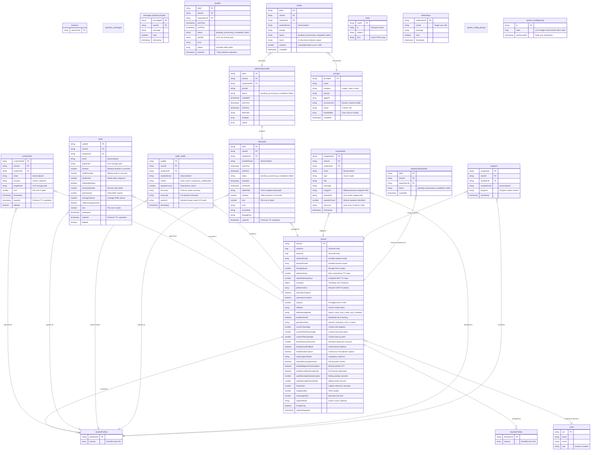

# Firestore Schema

This document outlines the Firestore database schema for the AI Invigilator application.

## Schema Diagram

```mermaid
erDiagram
    users {
        string uid PK
        string email
        string name
        string role "teacher | student"
    }

    classes {
        string classId PK
        map students "uid:email map"
        map teachers "uid:email map"
        array studentEmails "enrolled student emails"
        array teacherEmails "enrolled teacher emails"
        number storageQuota "Storage limit in bytes"
        number retentionDays "Raw screenshots TTL days"
        number videoRetentionDays "Compiled MP4 TTL days"
        object schedule "TimeSlots and TimeZone"
        array ipRestrictions "Allowed CIDR IP subnets"
        boolean automaticCapture
        boolean automaticCombine
        number aiQuota "AI budget limit in USD"
        string aiModel "Gemini model name"
        string aiMonitoringMode "hybrid | cloud_only | client_only | disabled"
        boolean enableClientAi "MediaPipe face tracking"
        string gazeSensitivity "relaxed | standard | strict | custom"
        number customYawAngle "Custom yaw degrees"
        number customPitchDownAngle "Custom look-down pitch"
        number customPitchUpAngle "Custom look-up pitch"
        number faceDebounceSeconds "Deviation debounce seconds"
        boolean enableCloudFallback "Cloud Gemini fallback"
        boolean enableAudioCapture "Continuous microphone capture"
        string audioCaptureMode "mandatory | optional"
        boolean audioSilenceSuppression "Discard quiet chunks"
        boolean enableSegmentTranscription "Moving window STT"
        boolean enableCombinedLongAudio "Full-session diarization"
        number audioMovingWindowDuration "Rolling window seconds"
        number audioMovingWindowStride "Sliding stride seconds"
        number frameRate "Capture interval in seconds"
        number imageQuality "JPEG quality"
        number maxImageSize "Max byte size limit"
        string captureMode "screen | dual | webcam"
        boolean isCapturing
        timestamp captureStartedAt
    }

    teacherProfiles {
        string teacherUid PK
        array classes "Enrolled class IDs"
    }

    studentProfiles {
        string studentUid PK
        array classes "Enrolled class IDs"
    }

    teachers {
        string teacherUid PK
    }

    teachers_messages "messages (teacher private)" {
        string messageId PK
        string classId FK
        string message
        boolean read
        timestamp timestamp
    }

    screenshots {
        string screenshotId PK
        string classId FK
        string studentUid FK
        string email "denormalized"
        string channel "screen | webcam"
        string imagePath "GCS storage path"
        number size "File size in bytes"
        timestamp timestamp
        timestamp expireAt "Firestore TTL expiration"
        boolean deleted
    }

    audio {
        string audioId PK
        string classId FK
        string studentUid FK
        string email "denormalized"
        string audioPath "GCS storage path"
        number duration "Window duration in seconds"
        number strideDuration "Sliding stride in seconds"
        number strideIndex "Stride index sequence"
        boolean isSlidingWindow
        number windowStartSec "Session start offset"
        number peakVolume "Peak RMS volume"
        number averageVolume "Average RMS volume"
        boolean isSilenceSuppressed
        number size "File size in bytes"
        timestamp timestamp
        timestamp expireAt "Firestore TTL expiration"
        boolean deleted
    }

    audio_audits {
        string auditId PK
        string classId FK
        string studentUid FK
        string studentEmail "denormalized"
        string verdict "clean_exam | suspicious_collaboration"
        number speakerCount "Total distinct voices"
        string summary "Forensic audio summary"
        string transcript "Full session transcript"
        string audioUrl "Stitched master audio GCS path"
        timestamp timestamp
    }

    videoJobs {
        string jobId PK
        string classId FK
        string studentUid FK
        string studentEmail "denormalized"
        timestamp startTime
        timestamp endTime
        string status "pending | processing | completed | failed"
        timestamp startedAt
        timestamp finishedAt
        string videoPath "GCS compiled video path"
        number duration "Video duration in seconds"
        number size "File size in bytes"
        string error
        string errorStack
        string ffmpegError
        timestamp expireAt "Firestore TTL expiration"
    }

    zipJobs {
        string jobId PK
        string classId FK
        string requesterUid FK
        timestamp startTime
        timestamp endTime
        string status "pending | processing | completed | failed"
        string zipPath "GCS zip archive path"
        string error
        array videos "Included video paths"
        timestamp expireAt "7-day retention expiration"
    }

    videoAnalysisJobs {
        string jobId PK
        string classId FK
        string requesterUid FK
        string prompt
        string status "pending | processing | completed | failed"
        timestamp createdAt
        timestamp startTime
        timestamp endTime
        string filterField
        array aiJobIds
        array videos
    }

    aiJobs {
        string jobId PK
        string classId FK
        string studentUid FK
        string studentEmail "denormalized"
        string prompt
        string status "pending | processing | completed | failed"
        string result "AI structured analysis output"
        number costUsd "Calculated token cost in USD"
        timestamp createdAt
    }

    irregularities {
        string irregularityId PK
        string classId FK
        string studentUid FK
        string email "denormalized"
        string type "visual | audio"
        string title
        string message
        string imageUrl "Webcam/screen snapshot URL"
        string audioPath "GCS audio snippet path"
        number speakerCount "Distinct speakers identified"
        string riskLevel "none | low | medium | high"
        timestamp timestamp
    }

    mails {
        string mailId PK
        string to "Recipient email"
        string subject
        string html "Email HTML body"
    }

    notifications {
        string notificationId PK
        string userId "Target user UID"
        string message
        boolean read
        timestamp timestamp
    }

    progress {
        string progressId PK
        string classId FK
        string studentUid FK
        string studentEmail "denormalized"
        string progress "Progress report content"
        timestamp timestamp
    }

    prompts {
        string promptId PK
        string name
        string category "image | video | audio"
        string prompt
        array applyTo
        string accessLevel "private | shared | public"
        string owner "Creator UID"
        array sharedWith "User UIDs or Emails"
        timestamp createdAt
    }

    propertyUploadJobs {
        string jobId PK
        string classId FK
        string requesterUid FK
        string status "pending | processing | completed | failed"
        timestamp createdAt
    }

    system_config_pricing "system_config/pricing" {
        string id PK
        map rates "Live Google Cloud Gemini SKU rates"
        timestamp lastSyncedAt "Daily sync timestamp"
    }

    classes ||--o{ studentProfiles : "enrolled in"
    classes ||--o{ teacherProfiles : "managed by"
    classes }o--|| users : "created by teachers"
    screenshots }o--|| classes : "captured in"
    screenshots }o--|| studentProfiles : "captured for"
    audio }o--|| classes : "recorded in"
    audio }o--|| studentProfiles : "spoken by"
    audio_audits }o--|| classes : "audited in"
    audio_audits }o--|| studentProfiles : "audits student"
    videoJobs }o--|| classes : "compiled for"
    videoJobs }o--|| studentProfiles : "belongs to"
    videoAnalysisJobs ||--|| videoJobs : "analyzes"
    aiJobs }o--|| videoAnalysisJobs : "generates"
    aiJobs }o--|| prompts : "uses prompt"
    irregularities }o--|| classes : "flagged in"
    irregularities }o--|| studentProfiles : "attributed to"
    progress }o--|| classes : "tracks student in"
    progress }o--|| studentProfiles : "evaluates"
    propertyUploadJobs }o--|| classes : "imports properties for"
```

## Collections

### `aiJobs`

Stores information about AI processing jobs.

*   **Document ID**: Auto-generated.
*   **Fields**:
    *   `classId`: (string) The ID of the class.
    *   `studentUid`: (string) The UID of the student.
    *   `studentEmail`: (string) The student's email, denormalized for easier querying/display.
    *   `prompt`: (string) The prompt used for the AI job.
    *   `status`: (string) The status of the job (e.g., `pending`, `processing`, `completed`, `failed`).
    *   `result`: (string) The result of the AI job.
    *   `createdAt`: (timestamp) A timestamp of when the job was created.

### `audio`

Stores metadata for recorded audio segments and sliding moving windows.

*   **Document ID**: Auto-generated (`audioId`).
*   **Fields**:
    *   `audioId`: (string) Document ID.
    *   `classId`: (string) The ID of the class the audio segment belongs to.
    *   `studentUid`: (string) The UID of the student who recorded the segment.
    *   `studentEmail`: (string) The student's email, denormalized for easier querying.
    *   `audioPath`: (string) The path to the audio file in Firebase Storage (`audio/{classId}/{studentUid}/{fileName}`).
    *   `duration`: (number) The duration of the recorded window in seconds (e.g., `30`).
    *   `strideDuration`: (number) The sliding stride interval in seconds (e.g., `15`).
    *   `strideIndex`: (number) Sequential index of the stride window.
    *   `isSlidingWindow`: (boolean) Indicates if the segment is an overlapping sliding window.
    *   `windowStartSec`: (number) Absolute session second offset when this window began.
    *   `peakVolume`: (number) Peak audio volume level (0-100%).
    *   `averageVolume`: (number) Average audio volume level (0-100%).
    *   `isSilenceSuppressed`: (boolean) Whether silence suppression is enabled.
    *   `timestamp`: (timestamp) Server timestamp when the segment was uploaded.
    *   `expireAt`: (timestamp) Expiration timestamp based on class `retentionDays`, purged by automated TTL/cleanup triggers.
    *   `deleted`: (boolean) Soft delete flag.

### `classes`

Stores information about each class.

*   **Document ID**: `classId` (string)
*   **Fields**:
    *   `studentEmails`: (array) An array of student emails used for enrollment.
    *   `teacherEmails`: (array) An array of teacher emails used for enrollment.
    *   `students`: (map) A map of student UIDs to their email addresses (`{ <studentUid>: <studentEmail> }`).
    *   `teachers`: (map) A map of teacher UIDs to their email addresses (`{ <teacherUid>: <teacherEmail> }`).
    *   `storageQuota`: (number) The storage limit for the class in bytes.
    *   `retentionDays`: (number) The screenshot data retention period in days (e.g., 7, 14, 30, 90). Screenshots older than this duration are automatically purged.
    *   `videoRetentionDays`: (number) The video retention period in days (e.g., 30, 90, 180, 365). Compiled lesson videos older than this duration are automatically purged.
    *   `schedule`: (object) An object containing the class schedule.
        *   `startDate`: (string) The start date of the class.
        *   `endDate`: (string) The end date of the class.
        *   `timeZone`: (string) The time zone for the class.
        *   `timeSlots`: (array) An array of time slots, each with `startTime`, `endTime`, and an array of `days`.
    *   `ipRestrictions`: (array) An array of allowed IP addresses.
    *   `automaticCapture`: (boolean) A boolean indicating if automatic screen capture is enabled.
    *   `automaticCombine`: (boolean) A boolean indicating if automatic video combination is enabled.
    *   `aiQuota`: (number) The AI processing quota for the class in USD (e.g. `50` for demo class).
    *   `aiModel`: (string) Gemini model for multimodal analysis (`gemini-3.5-flash-lite`, `gemini-3.7-flash`, `gemini-3.7-pro`).
    *   `aiMonitoringMode`: (string) Face and gaze invigilation mode (`hybrid`, `cloud_only`, `client_only`, `disabled`).
    *   `enableClientAi`: (boolean) Whether client-side on-device MediaPipe monitoring is active.
    *   `gazeSensitivity`: (string) Sensitivity preset (`relaxed`, `standard`, `strict`, `custom`).
    *   `customYawAngle`: (number) Custom left/right yaw deviation threshold in degrees.
    *   `customPitchDownAngle`: (number) Custom look-down pitch threshold in degrees (e.g. `-22`).
    *   `customPitchUpAngle`: (number) Custom look-up pitch threshold in degrees (e.g. `26`).
    *   `faceDebounceSeconds`: (number) Sustained seconds of deviation before registering looking away irregularity (e.g. `3`).
    *   `enableCloudFallback`: (boolean) Whether to trigger Cloud Gemini Vision inspections on client detection anomalies or failure.
    *   `enableAudioCapture`: (boolean) Whether continuous microphone audio capture is enabled for the class.
    *   `audioCaptureMode`: (string) Microphone requirement (`mandatory`, `optional`).
    *   `audioSilenceSuppression`: (boolean) Automatically discards silent audio chunks (saves >80% bandwidth & quota).
    *   `enableSegmentTranscription`: (boolean) Mode 1: Moving Window Real-Time AI Transcription (`gemini-3.5-transcribe`).
    *   `enableCombinedLongAudio`: (boolean) Mode 2: Full Session Combined Long Audio Diarization & Chat Audit (`gemini-3.5-transcribe`).
    *   `audioMovingWindowDuration`: (number) Rolling audio window duration in seconds (default `30`s).
    *   `audioMovingWindowStride`: (number) Sliding stride overlap in seconds (default `15`s, 50% overlap).
    *   `frameRate`: (number) The frame rate for screen capture (in seconds per frame).
    *   `imageQuality`: (number) The image quality for screen capture.
    *   `maxImageSize`: (number) The maximum image size for screen capture in bytes.
    *   `captureMode`: (string) Default stream capture mode (`dual`, `screen`, `webcam`).
    *   `isCapturing`: (boolean) A boolean indicating if screen capture is currently active.
    *   `captureStartedAt`: (timestamp) A timestamp indicating when the capture started.
*   **Subcollections**:
    *   **`lessons`**: Stores aggregated data and AI analysis results for each lesson.
        *   **Document ID**: A hash of the lesson's start and end times.
        *   **Fields**:
            *   `startTime`: (timestamp) The start time of the lesson.
            *   `endTime`: (timestamp) The end time of the lesson.
            *   `generalFeedback`: (array) An array of strings containing AI-generated feedback for the whole class.
            *   `generalSummary`: (string) An AI-generated summary for the whole class.
            *   `students`: (map) A map where each key is a `studentUid`.
                *   `workingMinutes`: (number) AI-estimated working minutes.
                *   `sharedScreenMinutes`: (number) Minutes calculated from screen sharing.
                *   `attendance`: (array) A per-minute array of 0s and 1s representing attendance.
                *   `feedback`: (array) An array of strings containing student-specific AI feedback.
                *   `summary`: (string) A student-specific AI-generated summary.
    *   **`classProperties`**: Stores class-wide custom properties.
        *   **Document ID**: `config`
        *   **Fields**: A map of custom key-value pairs.
    *   **`metadata`**: Stores metadata for the class, like usage information.
        *   **Document ID**: Can be `storage` or `ai`.
        *   **If Document ID is `storage`**:
            *   `storageUsage`: (number) The total storage used by the class in bytes.
            *   `storageUsageScreenShots`: (number) Storage used by screenshots.
            *   `storageUsageVideos`: (number) Storage used by videos.
            *   `storageUsageZips`: (number) Storage used by zips.
        *   **If Document ID is `ai`**:
            *   `aiUsedQuota`: (number) The used AI processing quota.
    *   **`status`**: Stores the real-time status and live preview metadata of students in the class.
        *   **Document ID**: `studentUid` (string)
        *   **Fields**:
            *   `isSharing`: (boolean) A boolean indicating if the student is actively sharing any stream (screen or webcam).
            *   `isScreenSharing`: (boolean) A boolean indicating if the student is actively sharing screen.
            *   `isWebcamSharing`: (boolean) A boolean indicating if the student is actively sharing webcam.
            *   `email`: (string) The student's email.
            *   `name`: (string) The student's name.
            *   `latestImagePath`: (string) Primary screenshot path for backward compatibility.
            *   `latestScreenPath`: (string) Cloud Storage path of student's latest screen capture (`screenshots/{classId}/{studentUid}/screen_{timestamp}.jpg`).
            *   `latestWebcamPath`: (string) Cloud Storage path of student's latest webcam capture (`screenshots/{classId}/{studentUid}/webcam_{timestamp}.jpg`).
            *   `faceStatus`: (string) Real-time AI face tracking status (`normal`, `looking_away`, `no_face`, `multiple_faces`, `loading`, `error`, `disabled`).
            *   `faceStatusReason`: (string) Human-readable explanation of the face tracking state.
            *   `gazeYaw`: (number) Head yaw angle in degrees.
            *   `gazePitch`: (number) Head pitch angle in degrees.
            *   `gazeDirection`: (string) Primary gaze orientation (`forward`, `left`, `right`, `down`, `up`).
            *   `metricDistance`: (number) Estimated metric distance in cm via depth-from-iris calculation.
            *   `irisGazeAway`: (boolean) Boolean indicating pupil deviation away from screen center.
            *   `isAudioSharing`: (boolean) Whether microphone stream is active and transmitting.
            *   `audioStatus`: (string) Acoustic activity state (`speaking`, `quiet`, `muted`).
            *   `audioLevel`: (number) Current RMS volume percentage (0-100%).
            *   `isMultiSpeaker`: (boolean) Flag when multiple simultaneous speakers are detected by Gemini.
            *   `speakerCount`: (number) Number of distinct speakers identified in recent window.
            *   `audioRiskLevel`: (string) Audio integrity classification severity (`none`, `low`, `medium`, `high`).
            *   `timestamp`: (timestamp) A timestamp of the last heartbeat / screenshot update.
            *   `lastUploadTimestamp`: (timestamp) A timestamp of the last screenshot upload.
            *   `sessionId`: (string) A unique ID for the student's session.
            *   `ipAddress`: (string) The student's IP address.
    *   **`messages`**: Stores real-time class-wide broadcast messages from teachers to all enrolled students in the class.
        *   **Document ID**: Auto-generated.
        *   **Fields**:
            *   `message`: (string) The broadcast message content.
            *   `timestamp`: (timestamp) A timestamp of when the message was sent.
            *   `senderUid`: (string) The UID of the teacher who broadcasted the message.
            *   `senderEmail`: (string) The email of the teacher who broadcasted the message.
            *   `classId`: (string) The ID of the class.

### `irregularities`

Stores information about any irregularities detected across visual and acoustic monitoring streams.

*   **Document ID**: Auto-generated.
*   **Fields**:
    *   `classId`: (string) The ID of the class where the irregularity occurred.
    *   `studentUid`: (string) The UID of the student involved.
    *   `email`: (string) The student's email, denormalized for display.
    *   `title`: (string) A title for the irregularity (e.g. `Unauthorized Collaboration`, `Looking Away`, `Phone In Hand`).
    *   `message`: (string) A description or explanation of the irregularity.
    *   `type`: (string) Incident stream type (`image`, `video`, `audio`, `looking_away`, `no_face`, `multiple_faces`).
    *   `imageUrl`: (string) Cloud Storage path or URL of the image associated with the irregularity.
    *   `audioPath`: (string) Cloud Storage path of the audio snippet associated with the incident.
    *   `transcriptSnippet`: (string) Spoken dialogue quote with speaker attribution labels.
    *   `speakerCount`: (number) Number of distinct speakers detected.
    *   `riskLevel`: (string) Risk classification severity (`none`, `low`, `medium`, `high`).
    *   `status`: (string) Incident status (`active`, `resolved`).
    *   `durationSeconds`: (number) Sustained seconds of the irregularity before resolution.
    *   `timestamp`: (timestamp) A timestamp of when the irregularity occurred.

### `mails`

Stores emails that are sent from the system.

*   **Document ID**: Auto-generated.
*   **Fields**:
    *   `to`: (string) The recipient's email address.
    *   `subject`: (string) The subject of the email.
    *   `html`: (string) The HTML content of the email.

### `notifications`

Stores notifications for users.

*   **Document ID**: Auto-generated.
*   **Fields**:
    *   `userId`: (string) The UID of the user the notification is for.
    *   `message`: (string) The notification message.
    *   `read`: (boolean) A boolean indicating if the notification has been read.
    *   `timestamp`: (timestamp) A timestamp of when the notification was created.

### `progress`

Stores student progress reports.

*   **Document ID**: Auto-generated.
*   **Fields**:
    *   `classId`: (string) The ID of the class.
    *   `studentUid`: (string) The UID of the student.
    *   `studentEmail`: (string) The student's email, denormalized for display.
    *   `progress`: (string) A description of the student's progress.
    *   `timestamp`: (timestamp) A timestamp of when the progress was recorded.

### `prompts`

Stores the AI prompts.

*   **Document ID**: Auto-generated.
*   **Fields**:
    *   `name`: (string) The name of the prompt.
    *   `category`: (string) The category of the prompt (e.g., `images`, `videos`).
    *   `prompt`: (string) The prompt text.
    *   `applyTo`: (array) An array of strings indicating where the prompt can be applied (e.g., `Per Image`, `All Images`, `Per Video`).
    *   `createdAt`: (timestamp) A timestamp of when the prompt was created.
    *   `accessLevel`: (string) The access level of the prompt (`private`, `shared`, `public`).
    *   `owner`: (string) The UID of the user who created the prompt.
    *   `sharedWith`: (array) An array of UIDs with whom the prompt is shared.

### `propertyUploadJobs`

Stores jobs for processing student-specific properties from a CSV upload.

*   **Document ID**: Auto-generated.
*   **Fields**:
    *   `classId`: (string) The ID of the class the properties belong to.
    *   `requesterUid`: (string) The UID of the user who requested the upload.
    *   `csvData`: (string) The raw CSV content to be processed.
    *   `status`: (string) The status of the job (e.g., `pending`, `processing`, `completed`, `completed_with_errors`, `failed`).
    *   `createdAt`: (timestamp) A timestamp of when the job was created.
    *   `totalRows`: (number) The total number of data rows in the CSV.
    *   `processedCount`: (number) The number of rows successfully processed.
    *   `notFoundCount`: (number) The number of students in the CSV not found in the class.
    *   `error`: (string) An error message if the job failed.

### `screenshots`

Stores metadata for each screenshot.

*   **Document ID**: Auto-generated.
*   **Fields**:
    *   `classId`: (string) The ID of the class the screenshot belongs to.
    *   `studentUid`: (string) The UID of the student who took the screenshot.
    *   `email`: (string) The student's email, denormalized for easier querying.
    *   `channel`: (string) The capture channel: `'screen'` or `'webcam'`.
    *   `imagePath`: (string) The path to the screenshot image in Firebase Storage.
    *   `size`: (number) The size of the screenshot in bytes.
    *   `timestamp`: (timestamp) A timestamp of when the screenshot was taken.
    *   `expireAt`: (timestamp) The exact expiration date calculated from class `retentionDays`, used by Firestore TTL and delete triggers.
    *   `deleted`: (boolean) A boolean indicating if the screenshot has been deleted.

### `studentProfiles`

Stores the class enrollments for each student. This is a core part of the authorization system.

*   **Document ID**: `studentUid` (string)
*   **Fields**:
    *   `classes`: (array) An array of `classId`s that the student is enrolled in.

### `students`

Used for sending messages to students.

*   **Document ID**: `studentUid` (string)
*   **Subcollections**:
    *   **`messages`**: Stores direct messages sent to the student.
        *   **Document ID**: Auto-generated.
        *   **Fields**:
            *   `message`: (string) The message content.
            *   `timestamp`: (timestamp) A timestamp of when the message was sent.

### `teacherProfiles`

Stores the class enrollments for each teacher. This is a core part of the authorization system.

*   **Document ID**: `teacherUid` (string)
*   **Fields**:
    *   `classes`: (array) An array of `classId`s that the teacher is enrolled in.

### `teachers`

Used for sending messages to teachers.

*   **Document ID**: `teacherUid` (string)
*   **Subcollections**:
    *   **`messages`**: Stores direct messages sent to the teacher.
        *   **Document ID**: Auto-generated.
        *   **Fields**:
            *   `message`: (string) The message content.
            *   `timestamp`: (timestamp) A timestamp of when the message was sent.

### `users`

Stores a directory of users for discovery and lookup purposes (e.g., finding a user's UID by their email address when sharing prompts). It is not the primary source for authorization.

*   **Document ID**: `uid` (string) - The Firebase Auth User ID.
*   **Fields**:
    *   `email`: (string) The user's email address.
    *   `name`: (string) The user's display name.
    *   `role`: (string) The user's role (e.g., `student`, `teacher`).

### `videoAnalysisJobs`

Stores information about video analysis jobs.

*   **Document ID**: `jobId` (string)
*   **Fields**:
    *   `classId`: (string) The ID of the class.
    *   `requester`: (string) The UID of the user who requested the analysis.
    *   `videos`: (array) An array of objects, each containing details about a video to be analyzed. This is for jobs on selected videos.
        *   `studentUid`: (string) The UID of the student.
        *   `studentEmail`: (string) The student's email.
        *   `videoPath`: (string) The path to the video in Cloud Storage.
    *   `prompt`: (string) The AI prompt to be used for the analysis.
    *   `status`: (string) The status of the job (e.g., `pending`, `processing`, `completed`, `failed`).
    *   `createdAt`: (timestamp) When the job was created.
    *   `startTime`: (timestamp) The start time for the range of videos to be analyzed (for "all videos" jobs).
    *   `endTime`: (timestamp) The end time for the range of videos to be analyzed (for "all videos" jobs).
    *   `filterField`: (string) The field to filter by (`startTime` or `createdAt`).
    *   `aiJobIds`: (array) An array of `aiJob` IDs associated with this analysis.
    *   `completedAt`: (timestamp) When the job was completed.
    *   `error`: (string) An error message if the job failed.
    *   `deleted`: (boolean) A flag to mark the job as deleted.

### `videoJobs`

Stores information about video processing jobs.

*   **Document ID**: `jobId` (string)
*   **Fields**:
    *   `classId`: (string) The ID of the class the video belongs to.
    *   `studentUid`: (string) The UID of the student.
    *   `studentEmail`: (string) The student's email, denormalized for easier querying.
    *   `startTime`: (timestamp) The start time of the video.
    *   `endTime`: (timestamp) The end time of the video.
    *   `status`: (string) The status of the job (e.g., `pending`, `processing`, `completed`, `failed`).
    *   `startedAt`: (timestamp) A timestamp of when the job started.
    *   `finishedAt`: (timestamp) A timestamp of when the job finished.
    *   `videoPath`: (string) The path to the processed video in Firebase Storage.
    *   `duration`: (number) The duration of the video in seconds.
    *   `size`: (number) The size of the video in bytes.
    *   `expireAt`: (timestamp) The exact expiration date calculated from class `videoRetentionDays`, used by Firestore TTL and delete triggers.
    *   `error`: (string) An error message if the job failed.
    *   `errorStack`: (string) The stack trace of the error.
    *   `ffmpegError`: (string) The error from ffmpeg if it failed.

### `zipJobs`

Stores information about zip file creation jobs.

*   **Document ID**: `jobId` (string)
*   **Fields**:
    *   `classId`: (string) The ID of the class the zip file belongs to.
    *   `requester`: (string) The UID of the user who requested the zip job.
    *   `videos`: (array) An array of objects, each containing details about a video to be included in the zip.
        *   `path`: (string) The path to the video in Cloud Storage.
        *   `classId`: (string) The ID of the class.
        *   `studentUid`: (string) The UID of the student.
        *   `studentEmail`: (string) The student's email.
        *   `startTime`: (timestamp) The start time of the video.
    *   `status`: (string) The status of the job (e.g., `pending`, `processing`, `completed`, `failed`).
    *   `createdAt`: (timestamp) When the job was created.
    *   `startTime`: (timestamp) The start time for the range of videos to be zipped.
    *   `endTime`: (timestamp) The end time for the range of videos to be zipped.
    *   `zipPath`: (string) The path to the zip file in Firebase Storage.
    *   `expireAt`: (timestamp) The expiration timestamp (7 days post-creation) used by Firestore TTL and `onZipJobDocDeleted`.
    *   `error`: (string) An error message if the job failed.

## Relationships

*   **`classes` <-> `studentProfiles` / `teacherProfiles`**: Many-to-many. A class has many users, and a user can be in many classes. This relationship is the core of the authorization system, managed by a cloud function that syncs the `students` and `teachers` maps in the `classes` collection with the `classes` array in the respective user profile collections.
*   **`classes` -> `students` / `teachers`**: One-to-many. A class has lists of student and teacher UIDs, which are used as keys in the `students` and `teachers` collections for direct messaging.
*   **`screenshots` -> `classes` & `studentProfiles`**: Many-to-one. A screenshot belongs to one class and one student, linked via `studentUid`.
*   **`videoJobs` -> `classes` & `studentProfiles`**: Many-to-one. A video job belongs to one class and one student, linked via `studentUid`.
*   **`videoAnalysisJobs` -> `videoJobs`**: One-to-one. A video analysis job is created from a video job.
*   **`aiJobs` -> `videoAnalysisJobs`**: Many-to-one. Many AI jobs can be part of one video analysis job.
*   **`irregularities` / `progress` -> `classes` & `studentProfiles`**: Many-to-one. These records belong to a class and a student, linked via `studentUid`.
*   **`aiJobs` -> `prompts`**: Many-to-one. An AI job uses one prompt.
*   **`notifications` -> `users` (Firebase Auth)**: Many-to-one. A notification is for a specific user, linked via `userId` (which should be a UID).
*   **`mails`**: Standalone collection for triggering emails.
*   **`users`**: A directory for user discovery. It is not directly linked in the authorization flow but is used to look up user UIDs by email for features like sharing.
*   **`propertyUploadJobs` -> `classes`**: Many-to-one. A property upload job belongs to one class.