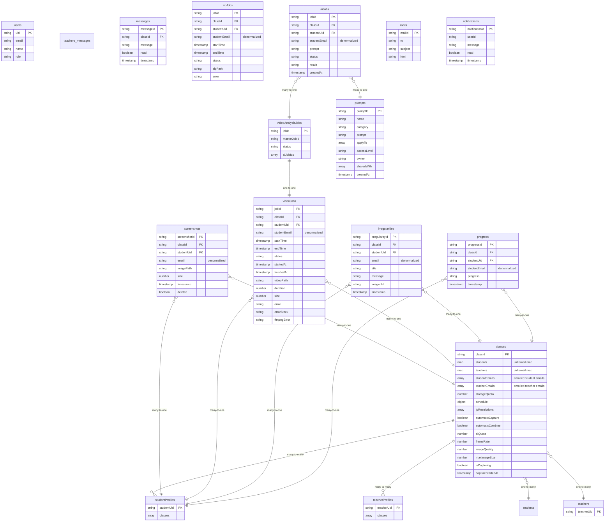

# Firestore Schema

This document outlines the Firestore database schema for the AI Invigilator application.

## Schema Diagram

## Collections

### `aiJobs`

Stores information about AI processing jobs.

*   **Document ID**: Auto-generated.
*   **Fields**:
    *   `classId`: (string) The ID of the class.
    *   `studentUid`: (string) The UID of the student.
    *   `studentEmail`: (string) The student's email, denormalized for easier querying/display.
    *   `prompt`: (string) The prompt used for the AI job.
    *   `status`: (string) The status of the job (e.g., `pending`, `processing`, `completed`, `failed`).
    *   `result`: (string) The result of the AI job.
    *   `createdAt`: (timestamp) A timestamp of when the job was created.

### `classes`

Stores information about each class.

*   **Document ID**: `classId` (string)
*   **Fields**:
    *   `studentEmails`: (array) An array of student emails used for enrollment.
    *   `teacherEmails`: (array) An array of teacher emails used for enrollment.
    *   `students`: (map) A map of student UIDs to their email addresses (`{ <studentUid>: <studentEmail> }`).
    *   `teachers`: (map) A map of teacher UIDs to their email addresses (`{ <teacherUid>: <teacherEmail> }`).
    *   `storageQuota`: (number) The storage limit for the class in bytes.
    *   `schedule`: (object) An object containing the class schedule.
        *   `startDate`: (string) The start date of the class.
        *   `endDate`: (string) The end date of the class.
        *   `timeZone`: (string) The time zone for the class.
        *   `timeSlots`: (array) An array of time slots, each with `startTime`, `endTime`, and an array of `days`.
    *   `ipRestrictions`: (array) An array of allowed IP addresses.
    *   `automaticCapture`: (boolean) A boolean indicating if automatic screen capture is enabled.
    *   `automaticCombine`: (boolean) A boolean indicating if automatic video combination is enabled.
    *   `aiQuota`: (number) The AI processing quota for the class.
    *   `frameRate`: (number) The frame rate for screen capture.
    *   `imageQuality`: (number) The image quality for screen capture.
    *   `maxImageSize`: (number) The maximum image size for screen capture.
    *   `isCapturing`: (boolean) A boolean indicating if screen capture is currently active.
    *   `captureStartedAt`: (timestamp) A timestamp indicating when the capture started.
*   **Subcollections**:
    *   **`metadata`**: Stores metadata for the class, like usage information.
        *   **Document ID**: Can be `storage` or `ai`.
        *   **If Document ID is `storage`**:
            *   `storageUsage`: (number) The total storage used by the class in bytes.
            *   `storageUsageScreenShots`: (number) Storage used by screenshots.
            *   `storageUsageVideos`: (number) Storage used by videos.
            *   `storageUsageZips`: (number) Storage used by zips.
        *   **If Document ID is `ai`**:
            *   `aiUsedQuota`: (number) The used AI processing quota.
    *   **`status`**: Stores the real-time status of students in the class.
        *   **Document ID**: `studentUid` (string)
        *   **Fields**:
            *   `isSharing`: (boolean) A boolean indicating if the student is currently sharing their screen.
            *   `email`: (string) The student's email.
            *   `name`: (string) The student's name.
            *   `lastUploadTimestamp`: (timestamp) A timestamp of the last screenshot upload.
            *   `sessionId`: (string) A unique ID for the student's session.
            *   `ipAddress`: (string) The student's IP address.
    *   **`messages`**: Stores class-wide messages.
        *   **Document ID**: Auto-generated.
        *   **Fields**:
            *   `message`: (string) The message content.
            *   `timestamp`: (timestamp) A timestamp of when the message was sent.

### `irregularities`

Stores information about any irregularities detected.

*   **Document ID**: Auto-generated.
*   **Fields**:
    *   `classId`: (string) The ID of the class where the irregularity occurred.
    *   `studentUid`: (string) The UID of the student involved.
    *   `email`: (string) The student's email, denormalized for display.
    *   `title`: (string) A title for the irregularity.
    *   `message`: (string) A description of the irregularity.
    *   `imageUrl`: (string) The URL of the image associated with the irregularity.
    *   `timestamp`: (timestamp) A timestamp of when the irregularity occurred.

### `mails`

Stores emails that are sent from the system.

*   **Document ID**: Auto-generated.
*   **Fields**:
    *   `to`: (string) The recipient's email address.
    *   `subject`: (string) The subject of the email.
    *   `html`: (string) The HTML content of the email.

### `notifications`

Stores notifications for users.

*   **Document ID**: Auto-generated.
*   **Fields**:
    *   `userId`: (string) The UID of the user the notification is for.
    *   `message`: (string) The notification message.
    *   `read`: (boolean) A boolean indicating if the notification has been read.
    *   `timestamp`: (timestamp) A timestamp of when the notification was created.

### `progress`

Stores student progress reports.

*   **Document ID**: Auto-generated.
*   **Fields**:
    *   `classId`: (string) The ID of the class.
    *   `studentUid`: (string) The UID of the student.
    *   `studentEmail`: (string) The student's email, denormalized for display.
    *   `progress`: (string) A description of the student's progress.
    *   `timestamp`: (timestamp) A timestamp of when the progress was recorded.

### `prompts`

Stores the AI prompts.

*   **Document ID**: Auto-generated.
*   **Fields**:
    *   `name`: (string) The name of the prompt.
    *   `category`: (string) The category of the prompt (e.g., `images`, `videos`).
    *   `prompt`: (string) The prompt text.
    *   `applyTo`: (array) An array of strings indicating where the prompt can be applied (e.g., `Per Image`, `All Images`, `Per Video`).
    *   `createdAt`: (timestamp) A timestamp of when the prompt was created.
    *   `accessLevel`: (string) The access level of the prompt (`private`, `shared`, `public`).
    *   `owner`: (string) The UID of the user who created the prompt.
    *   `sharedWith`: (array) An array of UIDs with whom the prompt is shared.

### `screenshots`

Stores metadata for each screenshot.

*   **Document ID**: Auto-generated.
*   **Fields**:
    *   `classId`: (string) The ID of the class the screenshot belongs to.
    *   `studentUid`: (string) The UID of the student who took the screenshot.
    *   `email`: (string) The student's email, denormalized for easier querying.
    *   `imagePath`: (string) The path to the screenshot image in Firebase Storage.
    *   `size`: (number) The size of the screenshot in bytes.
    *   `timestamp`: (timestamp) A timestamp of when the screenshot was taken.
    *   `deleted`: (boolean) A boolean indicating if the screenshot has been deleted.

### `studentProfiles`

Stores the class enrollments for each student. This is a core part of the authorization system.

*   **Document ID**: `studentUid` (string)
*   **Fields**:
    *   `classes`: (array) An array of `classId`s that the student is enrolled in.

### `students`

Used for sending messages to students.

*   **Document ID**: `studentUid` (string)
*   **Subcollections**:
    *   **`messages`**: Stores direct messages sent to the student.
        *   **Document ID**: Auto-generated.
        *   **Fields**:
            *   `message`: (string) The message content.
            *   `timestamp`: (timestamp) A timestamp of when the message was sent.

### `teacherProfiles`

Stores the class enrollments for each teacher. This is a core part of the authorization system.

*   **Document ID**: `teacherUid` (string)
*   **Fields**:
    *   `classes`: (array) An array of `classId`s that the teacher is enrolled in.

### `teachers`

Used for sending messages to teachers.

*   **Document ID**: `teacherUid` (string)
*   **Subcollections**:
    *   **`messages`**: Stores direct messages sent to the teacher.
        *   **Document ID**: Auto-generated.
        *   **Fields**:
            *   `message`: (string) The message content.
            *   `timestamp`: (timestamp) A timestamp of when the message was sent.

### `users`

Stores a directory of users for discovery and lookup purposes (e.g., finding a user's UID by their email address when sharing prompts). It is not the primary source for authorization.

*   **Document ID**: `uid` (string) - The Firebase Auth User ID.
*   **Fields**:
    *   `email`: (string) The user's email address.
    *   `name`: (string) The user's display name.
    *   `role`: (string) The user's role (e.g., `student`, `teacher`).

### `videoAnalysisJobs`

Stores information about video analysis jobs.

*   **Document ID**: `jobId` (string)
*   **Fields**:
    *   `masterJobId`: (string) The ID of the master job.
    *   `status`: (string) The status of the job (e.g., `pending`, `processing`, `completed`, `failed`).
    *   `aiJobIds`: (array) An array of `aiJob` IDs associated with this analysis.

### `videoJobs`

Stores information about video processing jobs.

*   **Document ID**: `jobId` (string)
*   **Fields**:
    *   `classId`: (string) The ID of the class the video belongs to.
    *   `studentUid`: (string) The UID of the student.
    *   `studentEmail`: (string) The student's email, denormalized for easier querying.
    *   `startTime`: (timestamp) The start time of the video.
    *   `endTime`: (timestamp) The end time of the video.
    *   `status`: (string) The status of the job (e.g., `pending`, `processing`, `completed`, `failed`).
    *   `startedAt`: (timestamp) A timestamp of when the job started.
    *   `finishedAt`: (timestamp) A timestamp of when the job finished.
    *   `videoPath`: (string) The path to the processed video in Firebase Storage.
    *   `duration`: (number) The duration of the video in seconds.
    *   `size`: (number) The size of the video in bytes.
    *   `error`: (string) An error message if the job failed.
    *   `errorStack`: (string) The stack trace of the error.
    *   `ffmpegError`: (string) The error from ffmpeg if it failed.

### `zipJobs`

Stores information about zip file creation jobs.

*   **Document ID**: `jobId` (string)
*   **Fields**:
    *   `classId`: (string) The ID of the class the zip file belongs to.
    *   `studentUid`: (string) The UID of the student.
    *   `studentEmail`: (string) The student's email, denormalized for easier querying.
    *   `startTime`: (timestamp) The start time of the zip file.
    *   `endTime`: (timestamp) The end time of the zip file.
    *   `status`: (string) The status of the job (e.g., `pending`, `processing`, `completed`, `failed`).
    *   `zipPath`: (string) The path to the zip file in Firebase Storage.
    *   `error`: (string) An error message if the job failed.

## Relationships

*   **`classes` <-> `studentProfiles` / `teacherProfiles`**: Many-to-many. A class has many users, and a user can be in many classes. This relationship is the core of the authorization system, managed by a cloud function that syncs the `students` and `teachers` maps in the `classes` collection with the `classes` array in the respective user profile collections.
*   **`classes` -> `students` / `teachers`**: One-to-many. A class has lists of student and teacher UIDs, which are used as keys in the `students` and `teachers` collections for direct messaging.
*   **`screenshots` -> `classes` & `studentProfiles`**: Many-to-one. A screenshot belongs to one class and one student, linked via `studentUid`.
*   **`videoJobs` -> `classes` & `studentProfiles`**: Many-to-one. A video job belongs to one class and one student, linked via `studentUid`.
*   **`videoAnalysisJobs` -> `videoJobs`**: One-to-one. A video analysis job is created from a video job.
*   **`aiJobs` -> `videoAnalysisJobs`**: Many-to-one. Many AI jobs can be part of one video analysis job.
*   **`irregularities` / `progress` -> `classes` & `studentProfiles`**: Many-to-one. These records belong to a class and a student, linked via `studentUid`.
*   **`aiJobs` -> `prompts`**: Many-to-one. An AI job uses one prompt.
*   **`notifications` -> `users` (Firebase Auth)**: Many-to-one. A notification is for a specific user, linked via `userId` (which should be a UID).
*   **`mails`**: Standalone collection for triggering emails.
*   **`users`**: A directory for user discovery. It is not directly linked in the authorization flow but is used to look up user UIDs by email for features like sharing.
