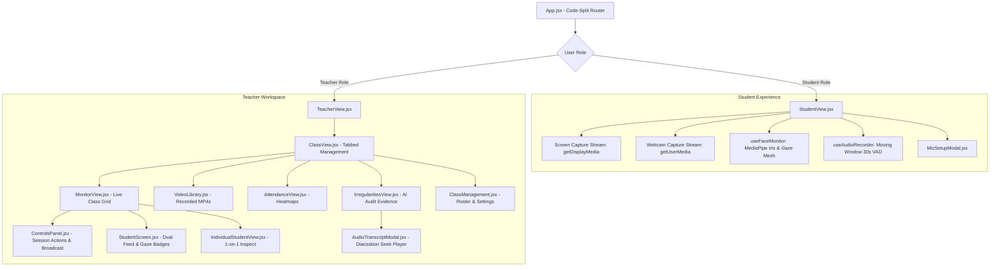

# Frontend Components

The `web-app/src/components/` directory contains all the React components that make up the user interface. Below is a breakdown of the main components, component hierarchy, and navigation flows.

## 🧭 Component Hierarchy & State Flow Diagram

---

*   **`App.jsx`**: The root application component configured with **Dynamic Route Code-Splitting** (`React.lazy` and `Suspense`) via a custom `lazyWithRetry` wrapper. This reduces the initial bundle size by over 99% (from 2.5MB down to ~3–17KB for initial view chunks) and features auto-retry for seamless client-side recovery across production deployments.
*   **`Layout.jsx`**: Provides the main application structure, including the header with application title, logo, notification center, profile dropdown (with user email, role badge, Change Password trigger, and logout), and the main content area.
*   **`ChangePasswordModal.jsx` (Modal in `App.jsx`)**: A lightweight dialog allowing authenticated users to securely update their Firebase Auth password with confirmation and validation, without occupying header real estate.
*   **`AuthComponent.jsx`**: Handles user authentication, displaying login and logout interfaces.
*   **`TeacherView.jsx`**: The main dashboard for teachers, showing a list of their classes and high-level statistics like storage and AI usage.
*   **`StudentView.jsx`**: The main view for students. Supports independent dual-channel streaming for screen sharing (`getDisplayMedia`) and webcam streaming (`getUserMedia`), multi-camera enumeration with automatic camera picker dropdown when multiple webcams are available, live camera hot-plugging (`devicechange`), on-device MediaPipe face and gaze tracking via `useFaceMonitor.js`, and schedule-driven automatic class association. For more details on its internal logic, see the [Student View Logic Documentation](./student-view-logic.md).
*   **`useFaceMonitor.js` (Hook in `StudentView.jsx`)**: An optimized custom hook managing on-device MediaPipe `FaceLandmarker` with Iris tracking (landmarks 468–477). Computes head orientation (Yaw, Pitch, Roll), depth-from-iris metric distance (cm), and pupil gaze deviations in real time with zero cloud quota consumption. Features intelligent fallback to Cloud Gemini Vision (`analyzeFaceFallback`) when configured or when client devices lack WebGL support.
*   **`ClassView.jsx`**: The primary view for managing a single class, containing a tabbed interface to navigate between different management functionalities like monitoring, video library, and attendance.

## Class & User Management

*   **`ClassManagement.jsx`**: A comprehensive component that allows teachers to create new classes and manage existing ones. Features configurable **AI Monitoring Modes** (`⚡ Client AI + Fallback`, `💻 Client AI Only`, `☁️ Cloud AI Only`, `🚫 AI Disabled`), customizable gaze sensitivity thresholds (Yaw/Pitch angles and debounce duration), configurable **Default Capture Mode** (`dual`, `screen`, `webcam`), one-click **Roster Import (CSV/TXT)** and **Roster Export (CSV)** for both student rosters and co-teaching teams, plus sub-components for handling class schedules and custom student metadata.
*   **`ScheduleManager.jsx`**: A sub-component of `ClassManagement.jsx` for setting up the class schedule, including start/end dates, time zones, and recurring time slots.
*   **`CustomPropertiesManager.jsx`**: A sub-component of `ClassManagement.jsx` for managing class-wide custom metadata and student-specific custom properties. Features one-click **CSV Template Download / Export Existing Properties**, asynchronous **CSV Property Upload** with real-time job processing badges (`completed`, `processing`, `failed`), and custom key-value field editors.
*   **`PromptManagement.jsx`**: A view for creating, editing, and managing AI prompts. It supports different access levels (private, shared, public) and categories (for images or videos).

## Real-time & Session Views

*   **`MonitorView.jsx`**: Provides a real-time grid view of all students during a live session. Features:
    *   **Single-Stream Listener Architecture**: Subscribes to `classes/{classId}/status` with dual-channel URL resolution and atomic state updates to prevent race conditions.
    *   **Zero-Space Compliance Filter Dropdown**: Real-time filtering by issue category (`👥 All Students`, `⚠️ Problems`, `📷 Missing Cam`, `🎙️ Missing Mic`, `🖥️ Not Sharing`, `🚨 AI Alerts`) with dynamic student counts.
    *   **Inline Targeted Nudge Button**: One-click broadcast trigger (`📢 Nudge (N)`) targeting only currently filtered non-compliant students with pre-formatted reminder messages.
    *   **Quick CSV Audit Export**: Instant one-click export (`📥 Export CSV`) capturing the currently filtered student compliance state, detected irregularities, stream flags, and gaze vector data into a timestamped CSV file.
    *   **Space-Optimized Channel Selector**: Compact dropdown for switching between `🔲 Dual View`, `🖥️ Screen`, and `📷 Webcam`.
    *   **Class Broadcast Channel**: Optimized Firestore write channel (`classes/{classId}/messages`) with pre-defined message templates.
*   **`ControlsPanel.jsx`**: The consolidated sidebar control center for teachers during live monitoring. Reorganized in a logical top-down hierarchy:
  1. **🎬 Session & Stream**: Capture start/stop, stream pause/resume, and compact channel/interval/resolution grid.
  2. **📢 Class Broadcast**: Predefined template selector with instant send.
  3. **👁️ AI & Invigilation**: Real-time mode indicators, gaze sensitivity summary, Gaze Configuration Modal launcher, and Cloud Gemini Multimodal Analysis controls.
  4. **👥 Attendance & Status**: 1-click "Not Sharing" student counter/modal and Attendance CSV export.
  5. **📊 Storage & AI Quotas**: Space-efficient dual progress bars for storage usage and class AI budget.
*   **`StudentScreen.jsx`**: A component used within `MonitorView.jsx` to display a single student's status, supporting split-dual viewports (side-by-side feeds) or single channel views with channel badges (🖥️ / 📷), live gaze orientation vectors, and face status badges (`normal`, `looking_away`, `no_face`, `multiple_faces`).
*   **`IndividualStudentView.jsx`**: A modal overlay for inspecting an individual student's live streams in high detail with:
    *   **Multi-Tab Feed Switcher**: `Dual View`, `🖥️ Screen Feed`, and `📷 Webcam Feed`.
    *   **Direct Quick Nudge Chips**: One-click intervention buttons (`🖥️ Screen`, `📷 Cam`, `🎙️ Mic`, `👁️ Face Screen`) that immediately dispatch targeted compliance notices to the student.
    *   **1-to-1 WebRTC Live Peek & Talkback**: Real-time 30 FPS peer-to-peer video streaming and two-way microphone audio talkback without loading cloud storage.
    *   **Private Direct Messaging**: Instant teacher-to-student text channel.
*   **`SessionReviewView.jsx`**: A view for reviewing a student's completed session, including their screen recording and any detected irregularities.
*   **`PlaybackView.jsx`**: A component for replaying a student's session as a sequence of screenshots with channel filtering (`All Channels`, `🖥️ Screen Only`, `📷 Webcam Only`), custom timeline scrubber, and channel-targeted video compilation.
*   **`TimelineSlider.jsx`**: A custom slider used in `PlaybackView.jsx` to navigate the screenshot timeline and show buffered content.

## Data & Analysis Views

*   **`VideoLibrary.jsx`**: A gallery of all recorded student sessions, with features for filtering, playback, download, and requesting AI analysis or ZIP archives.
*   **`VideoTable.jsx`**: A table used within `VideoLibrary.jsx` to display the list of videos with details like duration, size, and creation date.
*   **`DataManagementView.jsx`**: Allows teachers to manage class data, including downloading zipped videos and analysis results.
*   **`IrregularitiesView.jsx`**: Displays a list of all irregularities detected by the AI during a class session.
*   **`ProgressView.jsx`**: Shows reports on student progress generated by the AI.
*   **`PerformanceAnalyticsView.jsx`**: Provides analytics and visualizations of student performance data.
*   **`AttendanceView.jsx`**: Provides a comprehensive view of student attendance and AI analysis for a selected lesson. It displays a unified table showing screen share attendance (total minutes, percentage, and a per-minute heatmap), alongside AI-estimated working minutes and percentage. On initial load, it fetches pre-calculated summary data from the database. A "Calculate Live Attendance" button allows teachers to trigger a fresh calculation, which populates the detailed per-minute grid. The view also allows exporting the combined data to a CSV file and provides a modal to view detailed AI-generated summaries and feedback for each student.
*   **`AiJobsTable.jsx`**: A table used within `VideoAnalysisJobs.jsx` to display individual AI jobs with status, model used, token metrics, and computed cost ($ USD) via `formatAiCost`.
*   **`AiCostReportView.jsx`**: An interactive financial and token audit dashboard for teachers and administrators. Features:
  * **KPI Metric Cards**: Total spend vs class budget limit, token breakdown (input vs output), total job volume with reliability percentages, and unit economics (cost per job).
  * **Breakdown by Gemini Model**: Dynamic visual distribution bars for models (`gemini-3.5-flash-lite`, `gemini-3.7-flash`, `gemini-3.7-pro`, `gemini-3.5-transcribe`).
  * **Breakdown by Job Category**: Screenshot analysis, multi-student grid analysis, video inspection, audio STT/diarization, and cloud gaze fallback.
  * **Student AI Consumption Matrix**: Per-student audit table displaying job counts, input/output tokens, total spend, and percentage share of class budget.
  * **Filter Toolbar & CSV Export**: Real-time filtering by student, job category, model, and date range, with RFC 4180 CSV export.
*   **`aiCostAggregator.js` (Utility)**: A pure analytics utility aggregating raw `aiJobs` documents into multi-dimensional summaries, timeline series, and student cost shares.
*   **`aiCostCsvExporter.js` (Utility)**: Converts aggregated AI financial data and itemized job records into formatted CSV reports with automatic browser downloads.
*   **`studentCompliance.js` (Utility)**: Pure domain utility evaluating real-time student stream states, hardware sharing flags, and gaze orientation against class rules (`evaluateStudentCompliance`, `getComplianceSummary`, `filterStudentsByCompliance`, `getNudgeMessageForFilter`, `exportComplianceResultsToCsv`).
*   **`attendanceUtils.js` (Utility)**: Handles lesson duration math, per-minute screenshot bucket mapping, and attendance percentage aggregations for heatmaps.

## Communication

*   **`MailboxView.jsx`**: A simple email client interface for viewing messages sent to the user from the system (e.g., download links for ZIP archives).
*   **`EmailDetailView.jsx`**: A view for displaying the full content of a single email.
*   **`MessagesView.jsx`**: Displays a list of notifications and messages sent to the teacher for a specific class.

## Reusable & Utility Components

*   **`Banner.jsx`**: A simple banner component for displaying dismissible messages.
*   **`DateRangeFilter.jsx`**: A reusable component for filtering data by a date and time range.
*   **`Modal.jsx`**: A generic modal component for displaying content in a dialog overlay.
*   **`VideoPlayerModal.jsx`**: A specialized modal for playing back videos.
*   **`VideoPromptSelector.jsx`**: A component that allows a user to select from a list of predefined AI prompts or enter custom text.
*   **`MicSetupModal.jsx`**: Microphone selection, live RMS volume VU metering, speech verification challenge (STT), and audio playback test modal for students.
*   **`AudioTranscriptModal.jsx`**: Dialogue playback modal for teachers displaying multi-speaker turns, synchronized webcam snapshots, and clickable seek buttons.
*   **`IncidentDossierExportModal.jsx`**: Comprehensive export modal allowing teachers to select incident periods (session-specific or custom range), choose target students, select output format (Microsoft Word `.docx`, CSV, or both), and trigger cloud compilation jobs.