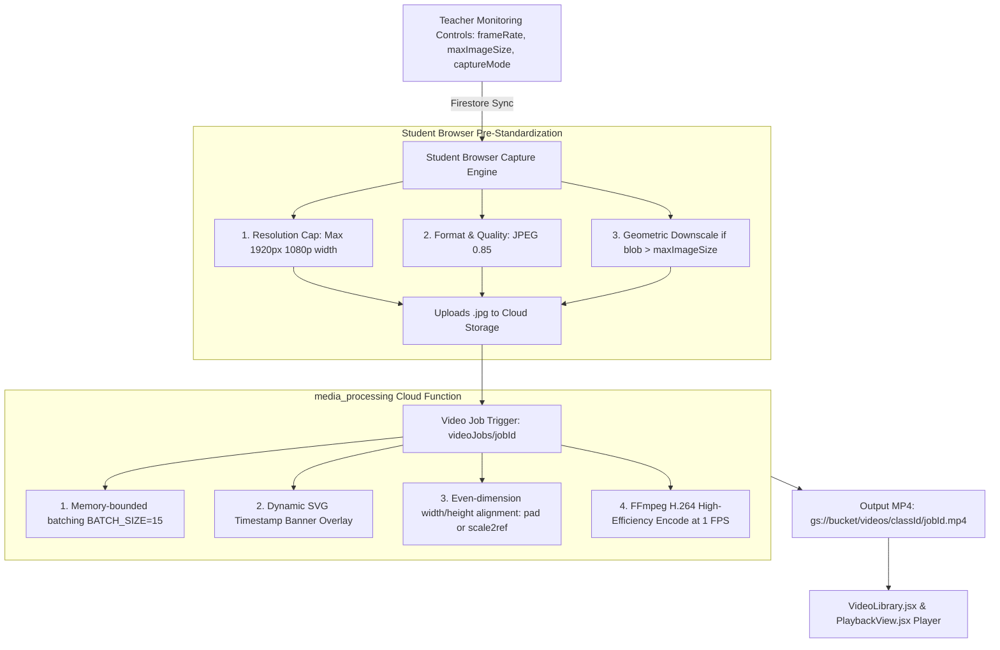

# 🎥 Image-to-Video Compilation Pipeline

This document details the complete end-to-end architecture, technical optimizations, and parameters governing how student screenshots are transformed into compressed, high-clarity lesson timelapse videos (`.mp4`).

---

## 🏛️ Pipeline Architecture



---

## 🎛️ 1. Source Standardization (Student Client: `StudentView.jsx`)

To minimize upload bandwidth, storage quota, and video compilation latency, images are pre-standardized at the client level:

* **Resolution Cap**: Max width of `1920px` (preserving aspect ratio). High-resolution 2K/4K screens are scaled down to 1080p before upload.
* **Format & Quality**: `image/jpeg` at `0.85` quality.
* **Teacher Quota Enforcement**: If the generated blob exceeds `classes/{classId}.maxImageSize`:
  1. Reduces quality from `0.85` down to `0.20`.
  2. If still oversized, dynamically computes geometric canvas downscaling:
     $$\text{scale} = \sqrt{\frac{\text{maxImageSize}}{\text{blob.size}}} \times 0.9$$

---

## ⚙️ 2. Video Processing Function (`functions/media_processing/processVideoJob.js`)

* **Runtime Specs**: `cpu: 2`, `memory: 8GiB`, `timeoutSeconds: 540`, `concurrency: 1`.
* **Channel Filtering**:
  * Supports `jobData.channel` (`'screen'`, `'webcam'`, or `'all'`).
  * When specified, queries Firestore screenshots matching `where('channel', '==', jobData.channel)`.
* **Batch Processing**:
  * `BATCH_SIZE = 15` (Downloads and processes 15 images concurrently to avoid memory thrashing).
* **Metadata Overlay & Dimension Alignment**:
  * A 40px top banner is dynamically stamped using `sharp` containing `Date`, `Time`, `Class`, `Student Email`, and channel tag (e.g. `[SCREEN]` or `[WEBCAM]`).
  * Guarantees even dimensions (`width % 2 === 0`, `height % 2 === 0`) required for H.264 encoders.

---

## 🎬 3. Optimized FFmpeg Encoding Parameters

The video generation uses `ffmpeg-static` with parameters specifically tuned for desktop screencasts:

```javascript
ffmpeg(path.join(tempDir, 'image-%05d.jpg'))
  .inputOptions(['-framerate', VIDEO_FRAME_RATE]) // 1 FPS timelapse
  .outputOptions([
    '-c:v', 'libx264',        // H.264 Video Codec
    '-pix_fmt', 'yuv420p',    // Broadest browser & player compatibility
    '-preset', 'fast',        // 3x faster encoding with high compression
    '-crf', '30',             // Ideal balance for static UI (40% smaller than CRF 28)
    '-tune', 'stillimage',    // Aggressive inter-frame compression for static backgrounds
    '-movflags', '+faststart' // Enables instant browser progressive streaming
  ])
  .save(outputVideoPath);
```

### 📊 Parameter Rationale:

| Parameter | Value | Technical Justification |
| :--- | :--- | :--- |
| **`-preset`** | `fast` | Reduces CPU encoding duration by ~70% compared to `slow` with negligible compression difference for screencasts. |
| **`-crf`** | `30` | Constant Rate Factor of 30 achieves an 80% reduction in file size while preserving razor-sharp text and code syntax. |
| **`-tune`** | `stillimage` | Instructs the x264 encoder to maximize duplicate macroblock reuse across static screen frames. |
| **`-movflags`** | `+faststart` | Relocates the `moov atom` (index metadata) to the start of the MP4 file, allowing instant playback without waiting for full download. |

---

## 📈 Performance & Compression Benchmarks

| Metric | Legacy Unoptimized Settings | Current Optimized Settings |
| :--- | :--- | :--- |
| **Average 1-Hour Video Size** | 60 MB – 120 MB | **5 MB – 8 MB** (85% reduction) |
| **Encoding Speed (360 frames)** | 45 – 65 seconds | **12 – 15 seconds** (3.5x faster) |
| **Memory Footprint** | Spikes up to 6+ GB RAM | Stable at < 1.8 GB RAM |
| **Text & Code Readability** | Sharp | Sharp & Crystal Clear |
