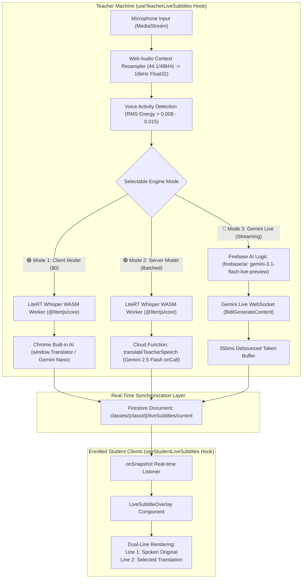

# Live Subtitles & Multilingual Translation Feature

## 1. Overview & Problem Statement

In computer science higher education environments (such as vocational and university degree programs in Hong Kong), lectures are predominantly delivered in **Cantonese with intensive English technical code-switching** (e.g., *"今日我哋會用 `useState` 同埋 `useEffect` 去整一個 real-time component，跟住 push 上 `Docker` container"*).

This creates two distinct technical challenges:
1. **Multilingual Inclusivity**: International and non-Cantonese speaking students struggle to comprehend spoken colloquial Cantonese mixed with programming terminology.
2. **Technical Vocabulary Integrity**: Generic speech recognition tools and standard translators frequently mistranslate programming terms into literal spoken words (e.g., translating `Docker` into "碼頭工人", `git commit` into "提交禮物", or `useState` into "使用州").

The **Live Subtitle & Multilingual Translation** feature provides real-time, bi-line subtitles (original spoken lecture + translated text) directly inside the teacher's screen broadcast and student viewers, offering **three selectable operational architectures** tailored for privacy, broad compatibility, or sub-second live streaming.

---

## 2. System Architecture & 3-Tier Operational Modes



### Feature & Architecture Comparison Matrix

| Dimension | 🟢 Mode 1: Client Model | 🟣 Mode 2: Server Model | 🔴 Mode 3: Gemini Live Stream |
| :--- | :--- | :--- | :--- |
| **STT Engine** | On-device LiteRT Whisper (`litertWhisper.worker.js`) | On-device LiteRT Whisper (`litertWhisper.worker.js`) | Gemini Live Server STT (`inputAudioTranscription: {}`) |
| **Translation Engine** | Chrome Built-in AI (`window.Translator` - Gemini Nano) | Cloud Function (`translateTeacherSpeech` - Gemini 2.5 Flash) | Gemini Live Multimodal (`gemini-3.1-flash-live-preview`) |
| **Streaming Latency** | ~500ms - 1s (Sentence-level at pause) | ~1s - 2s (Sentence-level at pause) | **Sub-second (~200ms - 400ms word-by-word token streaming)** |
| **Cloud Cost & Quota** | **$0.00 (Zero cloud API consumption)** | Pay-per-sentence prompt tokens | Pay-per-minute audio/text session |
| **Teacher CPU/GPU Load** | Moderate (Local Whisper WASM execution) | Moderate (Local Whisper WASM execution) | **Minimal (Raw PCM streaming only; zero local AI load)** |
| **Term Retention** | Good (prompt instruction) | **Exceptional** (strict JSON schema & system prompt) | **Exceptional** (specialized system instruction) |
| **Browser Compatibility** | Chrome Canary / experimental flags | Any modern WebRTC browser | Any browser supporting WebSockets & W3C Web Audio |
| **Target Languages** | English, Chinese, Spanish, French, etc. | 7 languages (`en`, `zh-Hant`, `zh-Hans`, `ja`, `ko`, `es`, `fr`) | 7 languages (`en`, `zh-Hant`, `zh-Hans`, `ja`, `ko`, `es`, `fr`) |

---

## 3. Audio Ingestion & Processing Pipeline

### 3.1 Audio Resampling & Downsampling
Modern browser audio interfaces capture microphone input at 44.1 kHz or 48.0 kHz. Both the LiteRT Whisper model and the Gemini Live API strictly require **16.0 kHz 1-channel mono PCM audio**.

The custom resampler downsamples the incoming Float32 buffer dynamically:
```javascript
export function downsamplePcmTo16k(inputData, inputSampleRate, targetSampleRate = 16000) {
  if (inputSampleRate === targetSampleRate) return inputData;
  const sampleRatio = inputSampleRate / targetSampleRate;
  const newLength = Math.round(inputData.length / sampleRatio);
  const result = new Float32Array(newLength);
  let offsetResult = 0;
  let offsetInput = 0;
  while (offsetResult < result.length) {
    const nextOffsetInput = Math.round((offsetResult + 1) * sampleRatio);
    let accum = 0;
    let count = 0;
    for (let i = offsetInput; i < nextOffsetInput && i < inputData.length; i++) {
      accum += inputData[i];
      count++;
    }
    result[offsetResult] = count > 0 ? accum / count : 0;
    offsetResult++;
    offsetInput = nextOffsetInput;
  }
  return result;
}
```

### 3.2 Voice Activity Detection (VAD) & Energy Calculation
To prevent transmitting continuous background noise or silence:
- **Root Mean Square (RMS)** is calculated across every audio block:
  $$\text{RMS} = \sqrt{\frac{1}{N} \sum_{i=1}^{N} x_i^2}$$
- In **Mode 1 & 2** (LiteRT Whisper): An RMS threshold of `rms > 0.015` identifies active voice chunks. A trailing silence timer of `700ms` triggers sentence finalization and dispatches accumulated PCM buffers to the worker.
- In **Mode 3** (Gemini Live): An RMS threshold of `rms > 0.008` filters silence packets while keeping the WebSocket connection active.

### 3.3 Float32 to 16-Bit Linear PCM Base64 Encoding
The Gemini Live API requires raw 16-bit Little-Endian Linear PCM data (`audio/pcm;rate=16000`) encoded in Base64:
```javascript
export function pcmFloat32ToBase64(float32Array) {
  if (!float32Array || float32Array.length === 0) return '';
  const buffer = new ArrayBuffer(float32Array.length * 2);
  const view = new DataView(buffer);
  for (let i = 0; i < float32Array.length; i++) {
    const s = Math.max(-1, Math.min(1, float32Array[i]));
    view.setInt16(i * 2, s < 0 ? s * 0x8000 : s * 0x7fff, true); // Little-Endian
  }
  const bytes = new Uint8Array(buffer);
  let binary = '';
  for (let i = 0; i < bytes.byteLength; i++) {
    binary += String.fromCharCode(bytes[i]);
  }
  return btoa(binary);
}
```

---

## 4. Operational Modes In-Depth

### 4.1 Mode 1: Client-Side ($0 Cost, Offline, Complete Privacy)
- **STT**: Executes the Whisper-tiny quantized TFLite model inside a dedicated Web Worker (`litertWhisper.worker.js`) via Google's LiteRT Web engine (`@litertjs/core`). Utilizes WebGPU hardware acceleration if supported, falling back to WebAssembly (WASM).
- **Prompt Biasing**: Injects Cantonese colloquial phrases into the decoder context to enhance code-switching transcription accuracy.
- **Translation**: Uses the experimental W3C Translation API (`window.Translator`) backed by Google's on-device **Gemini Nano** model built into Chrome.
- **Cost**: **$0.00**. No data leaves the user's browser for AI inference.

### 4.2 Mode 2: Server-Side Cloud Function (Universal Compatibility & High Precision)
- **STT**: Uses on-device LiteRT Whisper (avoiding server audio transmission and keeping voice STT processing local).
- **Translation**: Completed sentences are sent to Cloud Function `translateTeacherSpeech` via Firebase `httpsCallable`.
- **Backend Model**: Powered by **Gemini 2.5 Flash** using structured system instructions that enforce preservation of programming keywords:
  ```text
  You are an expert technical translator specialized in computer science classroom education.
  Translate the spoken Cantonese phrase into the specified target languages.
  CRITICAL RULES:
  1. DO NOT translate programming keywords, library names, command-line arguments, or code snippets
     (e.g., useState, Docker, git commit, npm, SQL, flexbox).
  2. Return ONLY a JSON object: {"translations": {"en": "...", "zh-Hant": "..."}}
  ```
- **Quota Protection**: Verifies teacher authorization and validates that the classroom's monthly AI allowance has not been exhausted before dispatching the request.

### 4.3 Mode 3: Gemini Live Multimodal Streaming (Firebase AI Logic)
- **SDK**: Built using the official **Firebase AI Logic** client SDK (`firebase/ai` v12.18.0) with `GoogleAIBackend`.
- **Supported Models**:
  - **Primary**: `gemini-3.1-flash-live-preview` (Gemini 3.x Live model on the Gemini Developer API free tier).
  - **Resilient Fallback**: `gemini-2.5-flash-native-audio-preview-12-2025` (Stable 2.5 Live model).
- **Live Generative Model Configuration**:
  ```javascript
  const liveModel = getLiveGenerativeModel(ai, {
    model: 'gemini-3.1-flash-live-preview',
    systemInstruction: `You are a real-time classroom lecture subtitler... Maintain all programming keywords in English.`,
    generationConfig: {
      responseModalities: [ResponseModality.TEXT],
      inputAudioTranscription: {}
    }
  });
  const session = await liveModel.connect();
  ```
- **Bidirectional Streaming**: Audio is continuously pushed via `session.sendAudioRealtime({ mimeType: 'audio/pcm;rate=16000', data: base64Data })`. The teacher's browser receives:
  - `inputTranscription.text`: Real-time Cantonese transcription generated directly by Gemini.
  - `modelTurn.parts`: Streaming translated text tokens.
  - `turnComplete`: Notification indicating that a spoken sentence/clause has concluded.
- **Throttled Firestore Intermediate Sync**: Incoming streaming tokens update the teacher's UI state immediately. To comply with Firestore's recommended document update rates (~1 write/sec) while preserving near-instant student updates, intermediate writes are debounced to a **350ms window**. When `turnComplete` fires, the finalized sentence is committed to Firestore immediately.

---

## 5. Firestore Real-Time Delivery Schema

All live subtitles are coordinated through a single designated document per classroom:

**Document Path**: `classes/{classId}/liveSubtitles/current`

```typescript
interface LiveSubtitleDocument {
  // Whether the live subtitle stream is active
  active: boolean;

  // Active engine mode: 'client' | 'server' | 'firebase_live'
  engineMode: 'client' | 'server' | 'firebase_live';

  // Spoken lecture original transcript (e.g. Cantonese)
  original: string;

  // Map of translated subtitle strings keyed by language code
  translations: {
    en?: string;
    'zh-Hant'?: string;
    'zh-Hans'?: string;
    ja?: string;
    ko?: string;
    es?: string;
    fr?: string;
  };

  // Whether the current subtitle is finalized (turn complete) or streaming
  isFinal: boolean;

  // Source language code (default 'zh-HK')
  speechLanguage: string;

  // Selected target translation languages
  targetLanguages: string[];

  // Server timestamp of the update
  updatedAt: FieldValue;

  // Rolling buffer of the last 5 finalized turns for UI context
  history: Array<{
    original: string;
    translations: Record<string, string>;
    timestamp: number;
  }>;
}
```

### Student Client Subscription Model
The custom hook `useStudentLiveSubtitles(classId, preferredLanguage)` establishes a single `onSnapshot` listener on `classes/{classId}/liveSubtitles/current`:
1. When `active === false`, the subtitle display unmounts cleanly, incurring 0 re-renders.
2. When `active === true`, the hook extracts the user's preferred language from the `translations` map with intelligent fallback (`preferredLanguage -> classDefault -> 'en'`).
3. Updates the dual-line state with sub-second responsiveness without polling.

---

## 6. Frontend Presentation Components

### 6.1 `TeacherSubtitleControlModal.jsx`
- Provides the teacher with full control over the subtitle broadcast.
- Features three distinct engine cards:
  - 🟢 **Mode 1: 本地輕量模型 (Client)** (`window.Translator` · $0 費用 · 零 API 額度)
  - 🟣 **Mode 2: 雲端標準模型 (Server)** (Gemini 2.5 Flash · 批次句子翻譯)
  - 🔴 **Mode 3: Gemini Live (雙向串流)** (`gemini-3.1-flash-live-preview` · ⚡ WebSocket · 免本地 GPU)
- Multi-language selection chips (`English`, `繁體中文`, `简体中文`, `日本語`, `한국어`, `Español`, `Français`).
- Live preview drawer displaying real-time dual-line subtitles as the teacher speaks.

### 6.2 `LiveSubtitleOverlay.jsx`
- Renders the dual-line subtitle bar inside `StudentView` and `TeacherScreenViewerModal`:
  - **Top Line (Original Spoken)**: Rendered in muted grey (`#94a3b8`) indicating the teacher's exact Cantonese speech with highlighted technical keywords.
  - **Bottom Line (Translated Output)**: Rendered in high-contrast crisp text (`#38bdf8` or `#ffffff`) with active font sizing.
- **Docked Mode**: Seamlessly docked beneath the screen broadcast video stream without obscuring presentation slides or code editors.
- **Floating HUD Mode**: Draggable and resizable floating window with backdrop blur (`backdrop-filter: blur(12px)`), opacity controls, and custom positioning.

---

## 7. Security, App Check, Student Isolation & Quota Management

### 7.1 Compliance with Official Firebase AI Logic Documentation
Mode 3 strictly implements the official specifications outlined in the [Firebase AI Logic Live API Guide (`?api=dev`)](https://firebase.google.com/docs/ai-logic/live-api?api=dev):
- **Backend Provider**: Explicitly configured with `GoogleAIBackend` singleton (`getAI(app, { backend: new GoogleAIBackend() })`) to leverage Gemini Developer API.
- **Model Identifiers**: Targets officially supported Live models (`gemini-3.1-flash-live-preview` as primary with automatic fallback to `gemini-2.5-flash-native-audio-preview-12-2025`).
- **PCM Audio Transport**: 16kHz, 16-bit linear PCM Little-Endian Base64 chunks sent via `session.sendAudioRealtime({ mimeType: 'audio/pcm;rate=16000', data })`.
- **Response Handling**: Asynchronous streaming via `for await (const message of session.receive())` parsing `serverContent` tokens and input transcription events.

### 7.2 Student Isolation & Accidental Usage Prevention
A common architectural concern is whether students could accidentally or maliciously trigger Mode 3 (Gemini Live WebSocket sessions):
1. **Zero Accidental Usage in UI**:
   - `TeacherSubtitleControlModal.jsx` and `useTeacherLiveSubtitles.js` are exclusively mounted within `MonitorView.jsx`.
   - `MonitorView.jsx` is locked behind the `/teacher` route and guarded by `App.jsx` role checks (`role === 'teacher'`).
   - Students logging in are routed strictly to `/student` (`StudentView.jsx`).
2. **Read-Only Student Subtitle Consumer**:
   - `StudentView.jsx` only mounts `useStudentLiveSubtitles.js`.
   - `useStudentLiveSubtitles.js` contains **NO audio recording**, **NO `aiLogic.js` imports**, and **NO WebSocket connections**. It operates exclusively as a read-only listener (`onSnapshot`) on `classes/{classId}/liveSubtitles/current`.
3. **Firestore Security Rule Hardening**:
   - `firestore.rules` enforces that only verified instructors can write to the subtitle channel:
     ```javascript
     match /liveSubtitles/{docId} {
       allow read: if isTeacher() || isStudentInClass(classId);
       allow write: if isTeacher();
     }
     ```
   - Even if a student attempted a direct database write, Firestore security rules reject it.
4. **Student Audio Stream Isolation**:
   - Student microphones in `StudentView.jsx` are utilized solely for anti-cheating invigilation via local Web Workers (`litertWhisper.worker.js`). Student audio is never piped into `createLiveSubtitleSession`.
5. **Defense-in-Depth Programmatic Assertions**:
   - In [`aiLogic.js`](file:///home/developer/Documents/Gemini-AI-Classroom-Assistant/web-app/src/utils/aiLogic.js), `createLiveSubtitleSession().connect()` checks `auth.currentUser` and `isTeacherEmail(user.email)`. If called by a student or unauthenticated client, it immediately throws `Unauthorized: Gemini Live subtitle broadcast can only be initiated by verified instructors.`
   - In [`useTeacherLiveSubtitles.js`](file:///home/developer/Documents/Gemini-AI-Classroom-Assistant/web-app/src/hooks/useTeacherLiveSubtitles.js), audio setup and WebSocket initiation abort if `teacherEmail` does not belong to an authorized instructor domain.

### 7.3 App Check & Quota Management
1. **Firebase App Check Enforcement**:
   - `firebase/ai` automatically attaches `X-Firebase-AppCheck` tokens (reCAPTCHA Enterprise / Debug Token) to all Gemini Live WebSocket connection handshakes.
   - Cloud Function `translateTeacherSpeech` rejects requests missing valid App Check tokens or teacher authentication claims.
2. **Classroom Budget Guardrails**:
   - `translateTeacherSpeech` checks the classroom's monthly AI allowance in Firestore (`classes/{classId}/aiUsage`). If the limit is exceeded, it prevents further API charges and prompts the teacher to switch to Mode 1 (Client Model).
3. **Automatic Lifecycle Cleanup**:
   - When the teacher stops screen broadcasting or unmounts the control modal, `useTeacherLiveSubtitles` automatically sets `{ active: false }` in Firestore, gracefully disconnects active WebSockets, terminates Web Audio Contexts, and closes Whisper Web Workers to eliminate memory leaks.

### 7.4 AI Costing Mechanics & Telemetry for Gemini Live (Mode 3)

Unlike classical Cloud Speech-to-Text APIs billed by flat audio minutes ($0.016–$0.024/min), the **Gemini Multimodal Live API is billed on token consumption (Audio In + Text Out)**:

$$\text{Total Cost (USD)} = \left(\frac{\text{Audio Input Tokens}}{1,000,000} \times \$0.60\right) + \left(\frac{\text{Text Output Tokens}}{1,000,000} \times \$2.50\right)$$

#### 1. Cost Parameters & Unit Economics
- **Audio Input (Teacher's speech)**:
  - 16kHz linear PCM audio is natively tokenized at **~25 to 32 tokens/second** (~1,500–1,920 tokens/minute).
  - Rate: **$0.30 - $0.60 / 1M audio tokens** (approx. **$0.005 - $0.006 per minute**).
- **Text Output (Translated Subtitles)**:
  - Because `responseModalities: [TEXT]` is configured, audio return synthesis ($18.00/1M tokens) is completely disabled ($0.00).
  - Rate: Standard Flash text rate (**$2.50 / 1M tokens**). At 120 words spoken/min, this costs only **~$0.0004 per minute**.
- **Real-World Unit Cost**:
  - **1-hour continuous lecture**: **~$0.06 to $0.10 USD total** (~108k audio tokens + ~10k text tokens).
  - **Google AI Studio Free Tier**: **$0.00 USD** (within RPM/TPM rate limits).

#### 2. Four-Layer Telemetry & Tracking Implementation
1. **Layer 1: WebSocket Server `usageMetadata`**:
   - In [`aiLogic.js`](file:///home/developer/Documents/Gemini-AI-Classroom-Assistant/web-app/src/utils/aiLogic.js), incoming WebSocket stream messages are inspected for `message.usageMetadata`. When returned, `promptTokenCount` and `candidatesTokenCount` update the session token registers.
2. **Layer 2: Deterministic Audio Sample Counter Fallback**:
   - If early preview chunks omit metadata, the system calculates audio tokens from streaming PCM buffer length:
     $$\text{Audio Tokens} = \frac{\text{Total PCM Samples}}{16000} \times 28 \text{ tokens/sec}$$
3. **Layer 3: Real-Time UI Telemetry HUD**:
   - [`TeacherSubtitleControlModal.jsx`](file:///home/developer/Documents/Gemini-AI-Classroom-Assistant/web-app/src/components/subtitles/TeacherSubtitleControlModal.jsx) features a live telemetry card displaying:
     - ⏱️ Streaming duration
     - 🎙️ Audio input tokens
     - 📝 Subtitle output tokens
     - 💰 Real-time estimated cost in USD with "Free Tier Eligible" indicator
4. **Layer 4: Firestore `aiJobs` Recording & Institutional Dashboard**:
   - Upon session termination, [`useTeacherLiveSubtitles.js`](file:///home/developer/Documents/Gemini-AI-Classroom-Assistant/web-app/src/hooks/useTeacherLiveSubtitles.js) creates an audit document in Firestore root collection `/aiJobs`:
     ```javascript
     {
       jobType: 'liveSubtitleStream',
       classId,
       teacherUid,
       modelUsed: 'gemini-3.1-flash-live-preview',
       durationSeconds: 1845,
       usage: { inputTokens: 51660, outputTokens: 4120, totalTokens: 55780 },
       cost: 0.0413,
       status: 'completed',
       timestamp: serverTimestamp()
     }
     ```
   - Firestore cloud function trigger `onAiJobCreated` automatically logs and updates class quota in real-time.
   - The job is visually aggregated and reported in [`AiCostReportView.jsx`](file:///home/developer/Documents/Gemini-AI-Classroom-Assistant/web-app/src/components/AiCostReportView.jsx) and exported to institutional CSV reports.

---

## 8. File Structure & Reference Map

| Component / Utility | File Path | Responsibility |
| :--- | :--- | :--- |
| **Firebase AI Logic Wrapper** | [`web-app/src/utils/aiLogic.js`](file:///home/developer/Documents/Gemini-AI-Classroom-Assistant/web-app/src/utils/aiLogic.js) | LiveGenerativeModel initialization, PCM encoding, WebSocket stream handler. |
| **Teacher Subtitle Hook** | [`web-app/src/hooks/useTeacherLiveSubtitles.js`](file:///home/developer/Documents/Gemini-AI-Classroom-Assistant/web-app/src/hooks/useTeacherLiveSubtitles.js) | Audio capture, VAD, engine selection, debounced Firestore sync. |
| **Student Subtitle Hook** | [`web-app/src/hooks/useStudentLiveSubtitles.js`](file:///home/developer/Documents/Gemini-AI-Classroom-Assistant/web-app/src/hooks/useStudentLiveSubtitles.js) | Real-time Firestore subscriber, language fallback resolution. |
| **Teacher Control Modal** | [`web-app/src/components/subtitles/TeacherSubtitleControlModal.jsx`](file:///home/developer/Documents/Gemini-AI-Classroom-Assistant/web-app/src/components/subtitles/TeacherSubtitleControlModal.jsx) | Modal UI for toggling subtitles, selecting engine modes, and previewing. |
| **Student Subtitle HUD** | [`web-app/src/components/subtitles/LiveSubtitleOverlay.jsx`](file:///home/developer/Documents/Gemini-AI-Classroom-Assistant/web-app/src/components/subtitles/LiveSubtitleOverlay.jsx) | Dual-line docked and floating HUD overlay rendering. |
| **Backend Translation Flow** | [`functions/ai_flows/subtitleFlows.js`](file:///home/developer/Documents/Gemini-AI-Classroom-Assistant/functions/ai_flows/subtitleFlows.js) | Callable Cloud Function for Gemini 2.5 Flash batch translation. |
| **Whisper Web Worker** | [`web-app/src/workers/litertWhisper.worker.js`](file:///home/developer/Documents/Gemini-AI-Classroom-Assistant/web-app/src/workers/litertWhisper.worker.js) | Background LiteRT Whisper WebGPU/WASM STT worker. |
