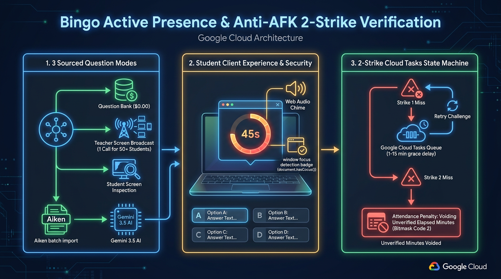
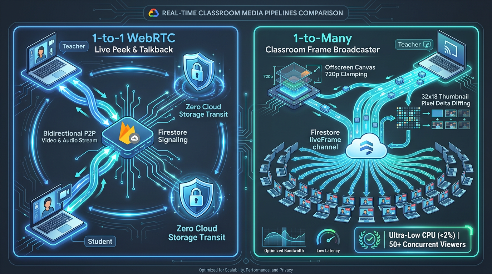
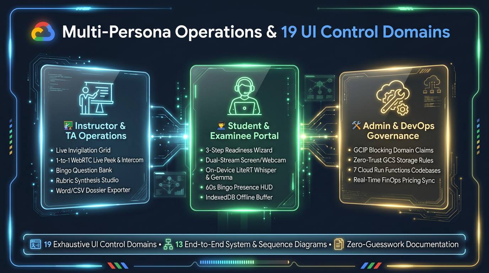

<!-- _class: lead -->
# Gemini Multimodal Classroom Agent
### Architecting Edge-to-Cloud Multimodal AI with Google Cloud, Firebase & Gemini
**Google Cloud Tech Talk & Developer Conference Series**  
**Presenter:** **Cyrus Wong (黃俊彥)** — Google Developer Expert (GCP & AI/ML)  
Senior Lecturer, Hong Kong Institute of Information Technology (HKIIT), VTC Hong Kong


---

## About the Speaker: Cyrus Wong (黃俊彥)
### Senior Lecturer, HKIIT / VTC Hong Kong & Google Developer Expert


- **Institution:** Hong Kong Institute of Information Technology (HKIIT), Vocational Training Council (VTC)
- **Academic Focus:** Cloud & Data Centre Administration, Edge AI Systems Architecture
- **Developer Community Recognitions:**
  - <span class="highlight-google">Google Developer Expert (GDE)</span> in **Google Cloud Platform (GCP)** & **AI/ML**
  - **AWS AI Hero** (since 2016; 1st AWS Academy Instructor globally)
  - **Microsoft MVP** in Azure AI
- **Email:** `cywong@vtc.edu.hk`
- **GitHub:** `github.com/wongcyrus/Gemini-AI-Classroom-Assistant`

---

## 01 | The Real-Time Invigilation & Assessment Challenge
### Why Traditional Proctoring and Commercial Surveillance Fail at Scale


1. **Academic Integrity:**
   - LLMs & AI Copilots make unsupervised coding exams unreliable.
   - Screen swapping, second monitors, unauthorized tabs, and peer collusion.
2. **Student Privacy & Trust:**
   - Hostile kernel surveillance drivers cause student backlash and severe privacy violations.
3. **Institutional Cost Barrier:**
   - Commercial SaaS costs $15–$25 per student per exam—unsustainable for university and polytechnic budgets.

---

## Paradigm Shift: Surveillance Spyware vs. Edge-AI Assistant
### Moving from Punitive Surveillance to Privacy-Preserving Pedagogy


- **Legacy Surveillance Proctoring:**
  - Kernel-level drivers (risk of OS compromise and crashes).
  - 100% continuous video streaming (classroom Wi-Fi saturation).
  - High false-positive flags with zero pedagogical context.
  - $15–$25/student institutional licensing fees.
- **Our Multimodal Edge Classroom Agent:**
  - **100% Browser-Native** (Zero software installation).
  - **95%+ Local Edge Compute** (Zero raw biometrics leave student laptop).
  - Real-time teacher command center with 1-click targeted nudges.
  - <span class="highlight-green">Sub-$0.02 per student total cloud cost (99.8% reduction).</span>

---

## 02 | High-Level 4-Tier Hybrid Architecture on GCP
### Balancing Extreme Low Bandwidth at the Edge with Hyperscale Cloud Reasoning


1. **Student Browser Edge:** MediaPipe FaceLandmarker, LiteRT Whisper STT, LiteRT Gemma 4 E2B Web Workers.
2. **Realtime Signaling & Data:** Firestore single-stream status channel + Cloud Storage chunks.
3. **Cloud Intelligence & Serverless:** Cloud Run Functions Gen 2, Gemini Enterprise Agent Platform (Gemini 3.7 & 3.5).
4. **Teacher Command Center:** Live compliance matrix, WebRTC live peek, and broadcast nudges.

---

## Google Cloud Run & Cloud Functions Gen 2 Topology
### 7 Isolated Domain Micro-Codebases Deployed in `asia-east2` (Hong Kong)


- **Modular Domain Boundaries:**
  1. `ai_flows`: Genkit & Gemini Enterprise Agent Platform reasoning
  2. `attendance`: Aggregated status rollups & screen-time heatmaps
  3. `auth_triggers`: Domain auto-provisioning & IP CIDR gating
  4. `media_processing`: Containerized FFmpeg workers
  5. `property_processing`: Realtime telemetry ingestion
  6. `scheduled_tasks`: Declarative TTL cleanup & SKU pricing sync
  7. `storage_triggers`: Upload quotas & cascading lifecycle
- **Zero Cold-Start Cascades:** Independent scaling and deployment isolation.

---

## Cloud Data Optimization: Firestore Single-Stream Channel
### 98% Read Operation Reduction in High-Density Computer Labs

```javascript
// web-app/src/hooks/useMonitorClass.js: Atomic Single Listener
const statusDocRef = doc(db, 'classes', classId, 'status', 'current');

const unsubscribe = onSnapshot(statusDocRef, (snapshot) => {
  if (!snapshot.exists()) return;
  
  // Single atomic payload containing all 50 students
  const { activeStudents, lastUpdated } = snapshot.data();
  updateStudentGrid(activeStudents);
});
```

- **The Naive Flaw:** 50 students $\times$ 50 dashboard listeners = 2,500 reads every 5 seconds.
- **The Single-Stream Solution:** Background aggregator combines student heartbeats into 1 single document.
- **Teacher Dashboard:** 1 read per polling interval. Quota exhaustion eliminated!

---

## 03 | Gemini Enterprise Agent Platform: Gemini 3 Constellation & Model Routing
### Matching Model Capabilities, Latency Profiles, and Cost Parameters


- **`gemini-3.7-flash` (Deep Multimodal Reasoning):**
  - Extended thinking budget for asynchronous video auditing and cheating forensics.
- **`gemini-3.8-flash` (Coursework Rubric & Milestone Synthesis):**
  - High-throughput cross-student aggregator synthesizing lab task rubrics.
- **`gemini-3.5-flash-lite` (Ultra Low Latency Workhorse):**
  - Rapid single-frame inspection, instant tool calling, resilient fallback target.
- **`gemini-3.5-transcribe-preview` (Long Audio Reasoning):**
  - Native multi-speaker diarization, ambient noise suppression, word timestamps.
- **`LiteRT Gemma 4 E2B` (On-Device Edge Proctor):**
  - Runs in browser Web Worker via WebGPU/WASM at $0 cloud cost.

---

## Google Genkit Resilience & Autonomous Tool Calling
### Self-Healing Failover, Exponential Backoff, and Deterministic Zod Validation


```javascript
// functions/ai_flows/analysisFlows.js: Resilience Interceptor
async function generateWithResilience(prompt, context, retryCount = 0) {
  try {
    return await ai.generate({ model: 'gemini-3.7-flash', prompt });
  } catch (err) {
    if ((err.status === 503 || err.status === 429) && retryCount < 3) {
      await sleep(Math.pow(2, retryCount) * 1000 + Math.random() * 500);
      return generateWithResilience(prompt, context, retryCount + 1);
    }
    // Dynamic fallback to lightweight model
    return await ai.generate({ model: 'gemini-3.5-flash-lite', prompt });
  }
}
```

---

## Production Prompt Engineering: Strict Schemas & Tools

```markdown
<!-- admin/prompts/audios/AI Speech Intent Proctor (Gemma On-Device).md -->
You are an AI exam proctor. Classify a student's spoken transcript by meaning and context.
Use exactly one category:
- COLLUSION_EXAM: discussing exam questions, answers, options, code snippets
- EXTERNAL_AI_ASSIST: querying Siri, Alexa, phone AI, ChatGPT via voice
- UNAUTHORIZED_TALK: casual conversation with peers
- LEGITIMATE_INQUIRY: technical question addressed to teacher/proctor
- BENIGN: self-talk, thinking aloud, reading code, background noise

Respond with ONLY one valid JSON object:
{
  "isViolation": boolean,
  "category": "COLLUSION_EXAM" | "EXTERNAL_AI_ASSIST" | "UNAUTHORIZED_TALK" | "LEGITIMATE_INQUIRY" | "BENIGN",
  "severity": "critical" | "high" | "medium" | "low" | "none",
  "confidence": 0.95,
  "evidence": "quoted speech snippet",
  "rationale": "one-sentence explanation"
}
```

---

## 04 | On-Device Vision AI: 468-Point Mesh & Iris Geometry
### MediaPipe Landmarker in Web Workers (Zero UI Thread Jank)


- **3D Head Pose Matrix:**
  - Real-time Yaw, Pitch, Roll calculation.
  - Yaw $\pm 25^\circ$ = Looking Away.
  - Pitch $\pm 20^\circ$ = Looking Down at Phone.
- **Metric Iris Distance:**
  $$D = \frac{11.7\text{ mm} \times f_x}{\Delta\text{Iris}_{\text{pixels}}}$$
- **Facial Ratios:**
  - **EAR (Eye Aspect Ratio):** Drowsiness & blink duration (`calculateEAR`).
  - **MAR (Mouth Aspect Ratio):** Whispering & talking detection (`calculateMAR`).
- **1-Click Baseline Calibration HUD:** Neutral view offset zeroing.

---

## Vision Code Deep Dive: Hardware-Synchronized Loop

```javascript
// web-app/src/hooks/useFaceMonitor.js
const processFrame = async (now, metadata) => {
  if (!workerRef.current || !isDetecting) return;

  // Zero-copy Transferable ImageBitmap transferred to Web Worker
  const bitmap = await createImageBitmap(videoEl);
  workerRef.current.postMessage(
    { type: 'DETECT_FRAME', bitmap, timestamp: now },
    [bitmap] // Instant zero-copy memory ownership transfer
  );

  // Synchronized directly with GPU hardware refresh rate
  videoEl.requestVideoFrameCallback(processFrame);
};
```

- Zero dropped frames on budget Chromebooks and student laptops.
- Web Worker isolates MediaPipe WASM computation from React rendering.

---

## Browser-Native Edge Speech AI: LiteRT Whisper & Gemma 4
### Bilingual Cantonese & English Code-Switching with Zero Cloud Egress


- **16kHz Float32 Audio Stream:** Captured via Web Audio API.
- **LiteRT Whisper STT Worker:** Real-time bilingual transcription.
- **LiteRT Gemma 4 E2B Worker:** Real-time intent classification.
- **Browser Cache Storage Persistence:**
  - `caches.open('litert-gemma-cache-v1')` caches ~1.5 GB model locally.
  - `navigator.storage.persist()` prevents browser disk eviction.
- **Sub-$0.00 Cloud Incurrence:** Total privacy-by-design.

---

## Cloud Audio Diarization & Moving Window Timeline
### RMS Silence Suppression Drops >80% Audio Locally; Gemini Diarizes


- **Rolling 30-Second Window:** 15-second overlapping stride ensures continuous context across boundaries.
- **Web Audio RMS Silence Detection:** Silent audio chunks are dropped right in the browser. Quota saved: >80%!
- **Google Cloud Gemini Enterprise Agent Platform (Gemini 3.5 Transcribe):** Multi-speaker separation (`Student` vs `External Voice`).
- **Synchronized Waveform Seek:** Teachers click any word to jump audio directly to that exact millisecond.

---

## 05 | Zero-Trust Assessment Security & Live Exam Mode
### Protecting Exam Confidentiality Across Storage Rules, Cloud Run & Student Portal


- **Zero-Trust Cloud Storage Rules:**
  - `storage.rules`: Student read access to `/videos/{classId}/{videoId}` rejected if `resource.metadata.isExam == 'true'`.
- **Scheduled Exam Periods & Metadata Stamping:**
  - Class-level scheduled `examPeriods: [{ name, startTime, endTime, requireFullScreenOnly }]`.
  - Cloud Run FFmpeg container evaluates `isExamTimeRange` and stamps `isExam: 'true'` onto GCS objects & Firestore jobs.
- **Mandatory Full-Screen Enforcement (`requireFullScreenOnly: true`):**
  - Reject window/tab sharing to prevent students hiding unauthorized AI windows.
- **Student Records Portal Shielding (`StudentRecordsView.jsx`):**
  - Confidentially shields exam videos, transcripts, and irregularity evidence during exam windows.

---

## Bingo Active Presence & 2-Strike Anti-AFK Verification
### Sourced Question Modes, Cloud Tasks Delayed Retries & Attendance Voiding



- **3 Sourced FinOps Question Modes:**
  - **Question Bank ($0.00 zero-AI):** Instant local dispatch from class question pool.
  - **Teacher Screen Broadcast:** 1 single Gemini call generates questions for 50+ students.
  - **Student Screen Inspection:** On-demand individual deep verification.
- **Client Experience & Anti-Cheat:**
  - Web Audio chime synthesis alert + 45s countdown timer (pulsing red under 10s).
  - Window focus detection (`document.hasFocus()`) + zero DOM answer leakage.
- **2-Strike Cloud Tasks State Machine:**
  - **Strike 1 Miss / Timeout:** Enqueues delayed retry via Google Cloud Tasks with configurable teacher grace delay (`bingoRetryDelayMinutes`: 1m, 2m, 3m, 5m, 10m).
  - **Strike 2 Miss:** Unverified AFK confirmed; applies Attendance Penalty.
- **Attendance Penalty Voiding:**
  - Voids unverified elapsed minutes with Bitmask Code `2` (`attendanceAdjustments`).
- **Question Bank Ingestion:**
  - Aiken format parser, JSON batch import & Gemini 3.5 Flash Lite Question Drafter.

---

## 06 | Real-Time Classroom Media Pipelines
### 1-to-1 WebRTC Live Peek & Pure Frame Classroom Broadcaster



- **1-to-1 WebRTC Live Peek & Talkback:**
  - Direct P2P connection between teacher and student via Firestore signaling.
  - 30 FPS smooth video verification & two-way talkback without loading cloud storage.
- **1-to-Many Classroom Frame Broadcaster (Scales to 50+ Students):**
  - Eliminates the 6-peer limit & CPU exhaustion of WebRTC star-mesh networks.
  - Screen captured into offscreen canvas, clamped to **720p**, and diffed via **32x18 thumbnail pixel delta engine**.
  - Emits compressed JPEG (~35–65 KB, <8% doc limit) to Firestore `screenBroadcast/liveFrame`.
  - Keeps teacher CPU <2% and renders in student Picture-in-Picture (PiP) window.

---

## Teacher Command Center: Solving Cognitive Overload
### Zero-Space Compliance Filtering & 1-Click Targeted Nudge ('N')


- **Zero-Space Compliance Filter:** Instantly isolate students flagged with `Problems` or `Critical Alerts`.
- **1-Click Targeted Nudge:** Press `N` keyboard shortcut to display a gentle focus alert on the student's screen.
- **Offline Resilience:** If a student disconnects, their tile caches the last known frame and displays `(Offline)`.
- **Integrated Video Peek:** Instant one-click jump to full-screen peer-to-peer live stream.

---

## Cloud Media Lifecycle & Automated Storage Governance
### Automatic Screenshot-to-MP4 Compilation & Declarative Firestore TTL


1. **Client Upload:** Regular discrete screenshots uploaded to Cloud Storage with secure signed URLs.
2. **Containerized FFmpeg Cloud Run Worker:** Stitches 300+ screenshots into a compact, timestamped MP4 exam video (CRF 30, faststart H.264, 85% smaller).
3. **Declarative Firestore TTL Engine (`expireAt`):**
   - Raw screenshots: Purged automatically after retention window.
   - MP4 exam videos: Auto-deleted post-audit according to class retention policy.
   - Ephemeral ZIP export archives: Purged after 7 days.

---

## 07 | Serverless Map-Reduce-Map Video Intelligence Pipeline
### Fan-Out Discovery $\to$ Prompt Synthesis $\to$ Sortable Milestone Matrix


- **Phase 1: Map (Parallel Video Discovery):**
  - Master job fans out parallel Gemini 3.7 vision jobs across student screen recordings to extract actions and shell logs.
- **Phase 2: Reduce (Coursework Rubric Synthesis):**
  - Cross-student aggregator combines findings into Gemini 3.8 Flash, generating a unified coursework rubric.
  - UI displays an animated multi-stage progress stepper (Aggregating $\to$ Synthesis $\to$ Rubric formatting).
- **Phase 3: Map (Milestone Evaluation & Matrix):**
  - Evaluates student videos against synthesized rubric; autonomous tool calls log milestones into `StudentMilestoneMatrix.jsx`.
  - Color-coded heatmap duration badges (<20m emerald, 20-40m amber, >40m ruby red) with RFC 4180 CSV export.

---

## 08 | Green AI & Cloud FinOps: Institutional Cost Sustainability
### 99.8% Cost Reduction: $0.85 per 50-Student Exam vs. $750.00 Commercial SaaS


| Resource Layer | Commercial Surveillance SaaS | Gemini Multimodal Classroom Agent | Savings |
| :--- | :--- | :--- | :--- |
| **Compute Location** | 100% Cloud Servers | 95%+ Local Student Edge | **-95% Server Load** |
| **Audio Processing** | Continuous 100% Streaming | Local Whisper + RMS Silence Cut | **-80% Ingestion** |
| **Video Storage** | Uncompressed Continuous Video | Discrete Frames $\to$ MP4 FFmpeg | **-90% Storage** |
| **Active Presence** | High-Egress Polling Streams | $0.00 Question Bank / Tasks | **-100% Idle Load** |
| **Total Cost / Student** | **$15.00 – $25.00** | **<$0.02** | **99.8% Reduction** |

- **Live Google Cloud Billing Catalog API:** Ingests dynamic SKU rates into `system_config/pricing`.
- **Bingo FinOps:** $0.00 local Question Bank mode vs $0.000075/check 1-to-many Teacher Broadcast.

---

## Academic Integrity Incident Dossier Pipeline
### Automated 1-Click Export to Verifiable Microsoft Word (.docx) & RFC 4180 CSV


- **Step 1:** Flag raised for gaze diversion, unauthorized speech, or collusion.
- **Step 2:** Multimodal aggregator bundles screenshots, 3D head poses, transcripts, and LLM reasoning chain.
- **Step 3:** Automated generation of formal Microsoft Word (`.docx`) report with institutional header and verifiable raw CSV logs.
- **Step 4:** Ready for immediate submission to Academic Integrity Disciplinary Boards. Zero-tamper evidence!

---

## Multi-Persona Operations & 19 UI Control Domains
### Role-Based Manuals, 13 End-to-End System Diagrams & Granular UI Controls



- **Instructor & TA Command Center (17 Chapters):**
  - Live invigilation grid with zero-space filters, 1-to-1 WebRTC Live Peek & Talkback Opus intercom, Pure Frame Broadcaster, 60s Bingo dispatches, rubric synthesis studio & Word/CSV incident dossiers.
- **Student & Examinee Portal (11 Chapters):**
  - 3-step hardware readiness wizard, dual-stream webcam/screen capture, on-device LiteRT Whisper & Gemma AI proctor, 60s Bingo focus HUD & IndexedDB offline resilience.
- **Admin & DevOps Governance (11 Chapters):**
  - GCIP blocking functions for institutional domain custom claims, zero-trust exam storage rules, 7 Cloud Run Functions codebases & daily FinOps Gemini pricing sync.
- **19 Audited UI Control Domains & 13 Mermaid Diagrams:**
  - Complete operational transparency with zero guesswork across all platform features.

---

## 09 | DevSecOps & Production Reliability Engineering
### Multi-Tier Automated Testing Pyramid & Dual-Environment Deployments


- **846+ Automated Tests & Assertions (Zero Flaky Tests):**
  - **Level 1 (Frontend):** 636 tests across 90 suites (>80% code coverage across all core modules).
  - **Level 2 (Backend Cloud Functions):** 138 tests across 6 domain codebases (including 94.2% attendance coverage).
  - **Level 3 (Security Rules):** 42 real-token isolation test scenarios (student self-read, exam shielding & attendance adjustment isolation).
  - **Level 4 (Live Smoke Tests):** 28 live end-to-end cloud assertions.
  - **Admin Suite:** 2 validation tests.
- **Automated Dual-Environment CI/CD:**
  - Development (`it114115-dev-2026`) & Production (`it114115-2627`).
  - Pre-bundling credential mismatch guardrails in `vite.config.js`.

---

## Live System Demonstration: 5-Stage Verification Flow


1. **Student Onboarding:** 3-step hardware readiness wizard (Screen share + Dual webcam + 1-Click calibration).
2. **Teacher Live Grid:** Multi-camera invigilation grid with zero-space problem filters.
3. **Active Presence Check:** Teacher triggers Bingo check; student responds with focus detection or triggers Cloud Tasks 2-strike retry.
4. **Targeted Intervention:** 1-click broadcast nudge (`N`) & 30 FPS WebRTC Live Peek.
5. **Instant Verification:** Audio waveform seek player, attendance adjustment audit & 1-click Word dossier export.

---

<!-- _class: lead -->
## 10 | Empowering Education with Google Cloud & Edge AI
### Live System & Open-Source Repository


- **Live Application:** [https://it114115-2627.web.app](https://it114115-2627.web.app)
- **Open-Source Repository:** [github.com/wongcyrus/Gemini-AI-Classroom-Assistant](https://github.com/wongcyrus/Gemini-AI-Classroom-Assistant)
- **Enterprise Documentation:** Comprehensive User Manuals (Teacher, Student, Admin) & 19 UI Control Domains Catalog with 13 Mermaid interaction diagrams.
- **Presenter:** **Cyrus Wong (黃俊彥)**
  - Google Developer Expert in GCP & AI/ML
  - Senior Lecturer, HKIIT / VTC Hong Kong
  - `cywong@vtc.edu.hk`
- **Questions & Discussion:** Edge AI, Google Genkit & Gemini 3 Architecture
