<!-- _class: lead -->
# Gemini AI Classroom Assistant & Multimodal Invigilator
### A Privacy-Preserving, Sub-$0.02 Edge-First Architecture for Computing & Engineering Education
**ISATE 2026: International Symposium on Advances in Technology Education**  
**NIT Kisarazu College, Chiba, Japan (Sept 8–11, 2026)**

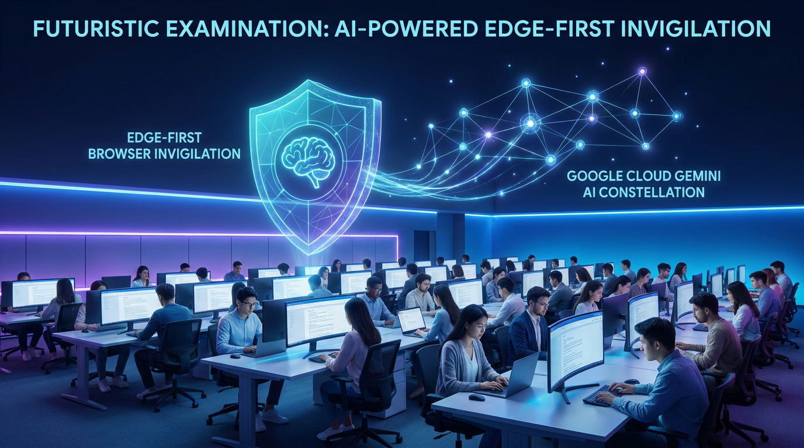

---

## About the Speaker: Cyrus Wong (黃俊彥)
### Senior Lecturer, HKIIT / VTC Hong Kong

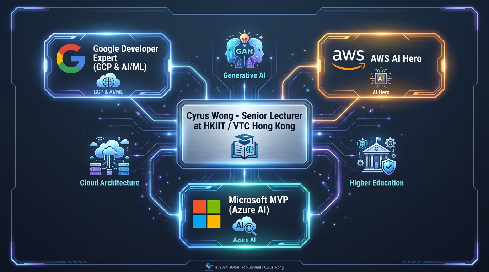

- **Institution:** Hong Kong Institute of Information Technology (HKIIT), Vocational Training Council (VTC)
- **Specialization:** Cloud & Data Centre Administration, AI Systems Architecture
- **Global Recognitions (Triple Cloud):**
  - **Google Developer Expert (GDE)** in Google Cloud Platform (GCP) & AI/ML
  - **AWS AI Hero** (since 2016; 1st AWS Academy Instructor globally)
  - **Microsoft MVP** in Azure AI
- **Email:** `cywong@vtc.edu.hk`
- **GitHub:** `wongcyrus/Gemini-AI-Classroom-Assistant`

---

## Act I: The Assessment Trilemma in Technology Education
### Why Traditional Invigilation and Commercial Surveillance Fail at Scale

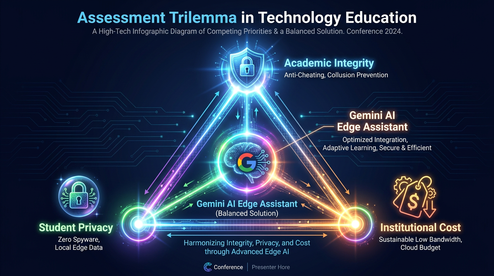

1. **Academic Integrity:**
   - LLMs (Gemini, ChatGPT) & AI Copilots make unsupervised coding exams unreliable.
   - Screen swapping, second monitors, and whispered collaboration.
2. **Student Privacy:**
   - Hostile kernel surveillance causes student backlash and GDPR/privacy violations.
3. **Institutional Cost:**
   - Commercial SaaS costs $15–$25 per student per exam—impossible for public vocational education.

---

## Paradigm Shift: Surveillance Spyware vs. Edge-AI Assistant
### Moving from Punitive Surveillance to Human-in-the-Loop Pedagogy

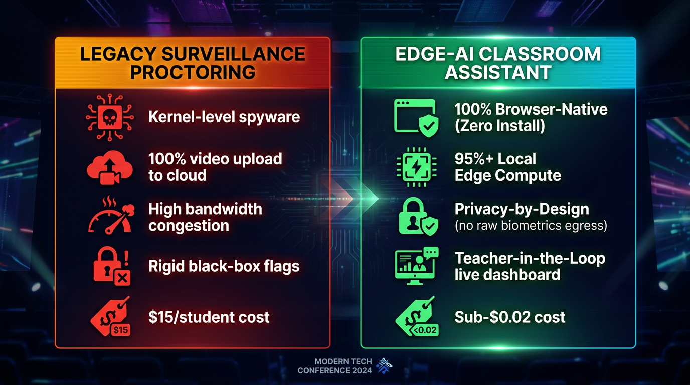

- **Legacy Surveillance Proctoring:**
  - Kernel-level drivers (risk of BSOD and system compromise).
  - 100% continuous video upload (Wi-Fi bandwidth collapse).
  - High false-positive flags with zero context.
  - $15/student institutional licensing.
- **Our Edge-AI Classroom Assistant:**
  - 100% Browser-Native (Zero software installation).
  - 95%+ Local Edge Compute (Zero raw biometrics leave laptop).
  - Real-time teacher command center with 1-click targeted nudges.
  - **Sub-$0.02 per student total cloud cost.**

---

## Act II: High-Level 4-Tier Hybrid Architecture
### Balancing Extreme Low Bandwidth at the Edge with Hyperscale Cloud Reasoning

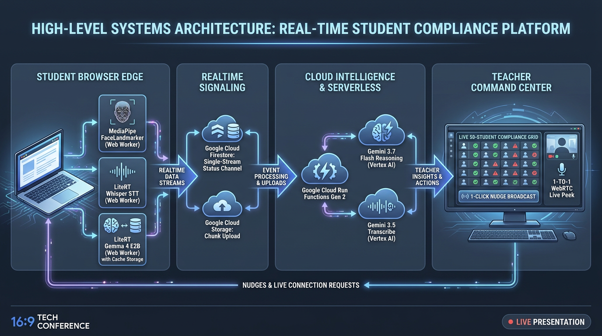

1. **Student Browser Edge:** MediaPipe FaceLandmarker, LiteRT Whisper STT, LiteRT Gemma 4 E2B Web Workers.
2. **Realtime Signaling:** Firestore single-stream status channel + Cloud Storage chunks.
3. **Cloud Intelligence & Serverless:** Cloud Run Functions Gen 2, Vertex AI Gemini 3.7 & 3.5.
4. **Teacher Command Center:** Live compliance matrix, WebRTC live peek, and broadcast nudges.

---

## Google Cloud Run & Cloud Functions Gen 2 Topology
### 7 Isolated Domain Micro-Codebases Deployed in `asia-east2` (Hong Kong)

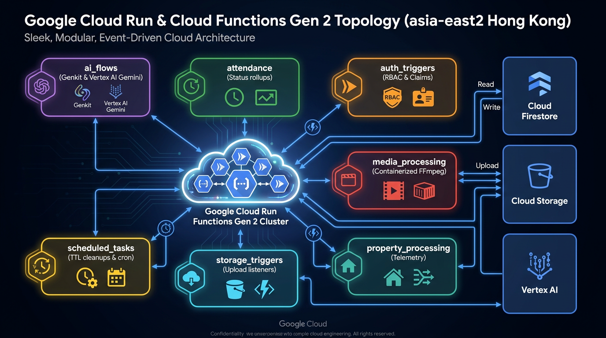

- **Modular Domain Boundaries:**
  1. `ai_flows`: Genkit & Vertex AI Gemini reasoning
  2. `attendance`: Aggregated status rollups
  3. `auth_triggers`: Custom claims & RBAC
  4. `media_processing`: Containerized FFmpeg workers
  5. `property_processing`: Realtime telemetry ingestion
  6. `scheduled_tasks`: Declarative TTL cleanup cron
  7. `storage_triggers`: Upload event handlers
- **Zero Cold-Start Cascades:** Independent scaling and deployment isolation.

---

## Cloud Data Optimization: Firestore Single-Stream Channel
### 98% Read Operation Reduction in High-Density Computer Labs

```javascript
// web-app/src/hooks/useMonitorClass.js: Atomic Single Listener
const statusDocRef = doc(db, 'classes', classId, 'status', 'current');

const unsubscribe = onSnapshot(statusDocRef, (snapshot) => {
  if (!snapshot.exists()) return;
  
  // Single atomic payload containing all 50 students
  const { activeStudents, lastUpdated } = snapshot.data();
  updateStudentGrid(activeStudents);
});
```

- **The Naive Flaw:** 50 students $\times$ 50 dashboard listeners = 2,500 reads every 5 seconds.
- **The Single-Stream Solution:** Background aggregator combines student heartbeats into 1 single document.
- **Teacher Dashboard:** 1 read per polling interval. Quota exhaustion eliminated!

---

## Act III: Google Gemini 3 Suite & Model Routing Strategy
### Matching Model Capabilities, Latency Profiles, and Cost Parameters

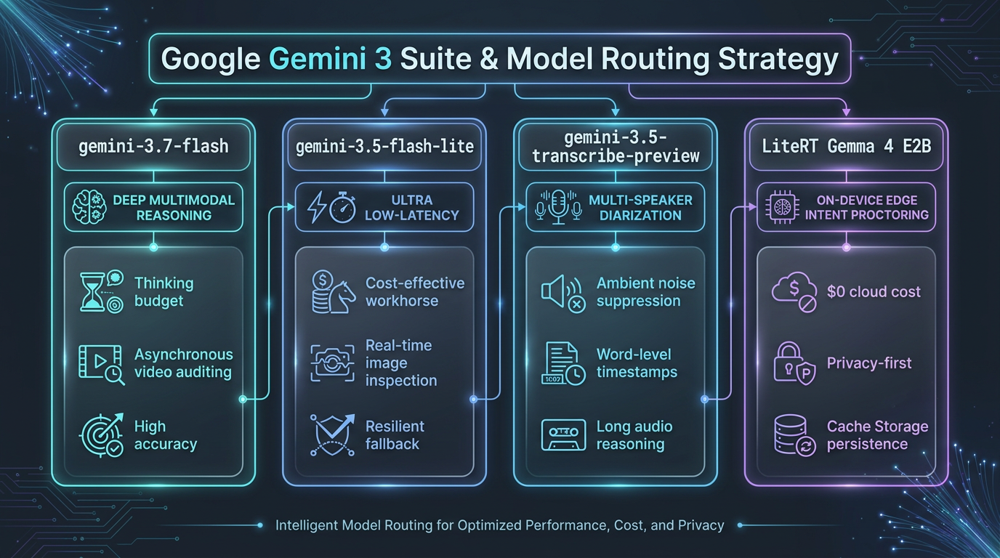

- **`gemini-3.7-flash` (Deep Multimodal Reasoning):**
  - Extended thinking budget for complex multimodal video exam analysis and cheating forensic reports.
- **`gemini-3.5-flash-lite` (Ultra Low Latency Workhorse):**
  - Rapid single-frame inspection, instant tool calling, resilient failover target.
- **`gemini-3.5-transcribe-preview` (Long Audio Reasoning):**
  - Native multi-speaker diarization, ambient noise suppression, word-level seekable timestamps.
- **`LiteRT Gemma 4 E2B` (On-Device Edge Proctor):**
  - Runs in browser Web Worker at $0 cloud cost.

---

## Google Genkit Resilience & Autonomous Tool Calling
### Self-Healing Failover, Exponential Backoff, and Deterministic Zod Validation

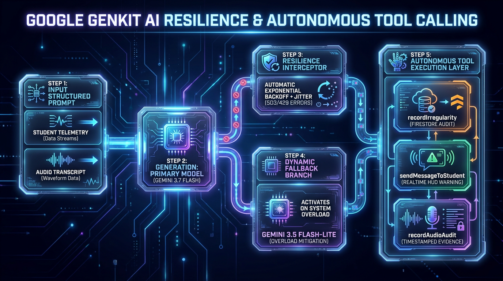

```javascript
// functions/ai_flows/analysisFlows.js: Resilience Interceptor
async function generateWithResilience(prompt, context, retryCount = 0) {
  try {
    return await ai.generate({ model: 'gemini-3.7-flash', prompt });
  } catch (err) {
    if ((err.status === 503 || err.status === 429) && retryCount < 3) {
      await sleep(Math.pow(2, retryCount) * 1000 + Math.random() * 500);
      return generateWithResilience(prompt, context, retryCount + 1);
    }
    // Dynamic fallback to lightweight model
    return await ai.generate({ model: 'gemini-3.5-flash-lite', prompt });
  }
}
```

---

## Production Prompt Engineering: Strict Schemas & Tools

```markdown
<!-- admin/prompts/audios/AI Speech Intent Proctor (Gemma On-Device).md -->
You are an AI exam proctor. Classify a student's spoken transcript by meaning and context.
Use exactly one category:
- COLLUSION_EXAM: discussing exam questions, answers, options, code snippets
- EXTERNAL_AI_ASSIST: querying Siri, Alexa, phone AI, ChatGPT via voice
- UNAUTHORIZED_TALK: casual conversation with peers
- LEGITIMATE_INQUIRY: technical question addressed to teacher/proctor
- BENIGN: self-talk, thinking aloud, reading code, background noise

Respond with ONLY one valid JSON object:
{
  "isViolation": boolean,
  "category": "COLLUSION_EXAM" | "EXTERNAL_AI_ASSIST" | "UNAUTHORIZED_TALK" | "LEGITIMATE_INQUIRY" | "BENIGN",
  "severity": "critical" | "high" | "medium" | "low" | "none",
  "confidence": 0.95,
  "evidence": "quoted speech snippet",
  "rationale": "one-sentence explanation"
}
```

---

## Act IV: On-Device Vision AI: 468-Point Mesh & Iris Geometry
### MediaPipe Landmarker in Web Workers (Zero UI Thread Jank)

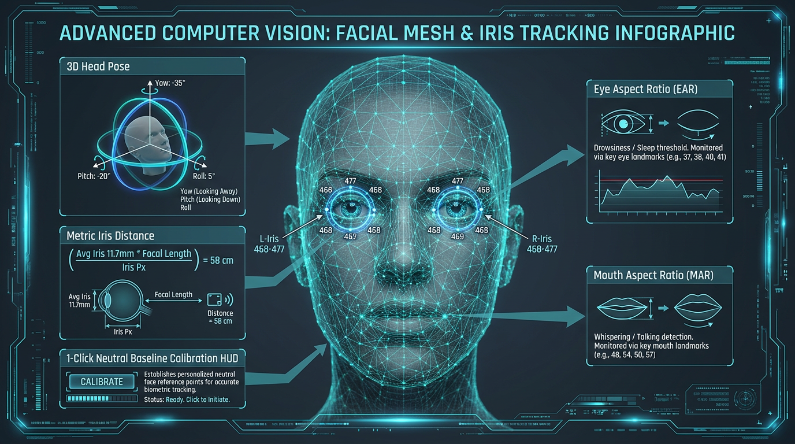

- **3D Head Pose Matrix:**
  - Real-time Yaw, Pitch, Roll calculation.
  - Yaw $\pm 25^\circ$ = Looking Away.
  - Pitch $\pm 20^\circ$ = Looking Down at Phone.
- **Metric Iris Distance:**
  $$D = \frac{11.7\text{ mm} \times f_x}{\Delta\text{Iris}_{\text{pixels}}}$$
- **Facial Ratios:**
  - **EAR (Eye Aspect Ratio):** Drowsiness & blink duration.
  - **MAR (Mouth Aspect Ratio):** Whispering & talking detection.
- **1-Click Baseline Calibration HUD:** Neutral view offset zeroing.

---

## Vision Code Deep Dive: Hardware-Synchronized Loop

```javascript
// web-app/src/hooks/useFaceMonitor.js
const processFrame = async (now, metadata) => {
  if (!workerRef.current || !isDetecting) return;

  // Zero-copy Transferable ImageBitmap transferred to Web Worker
  const bitmap = await createImageBitmap(videoEl);
  workerRef.current.postMessage(
    { type: 'DETECT_FRAME', bitmap, timestamp: now },
    [bitmap] // Instant zero-copy memory ownership transfer
  );

  // Synchronized directly with GPU hardware refresh rate
  videoEl.requestVideoFrameCallback(processFrame);
};
```

- Zero dropped frames on budget Chromebooks and student laptops.
- Web Worker isolates MediaPipe WASM computation from React rendering.

---

## Browser-Native Edge Speech AI: LiteRT Whisper & Gemma 4
### Bilingual Cantonese & English Code-Switching with Zero Cloud Egress

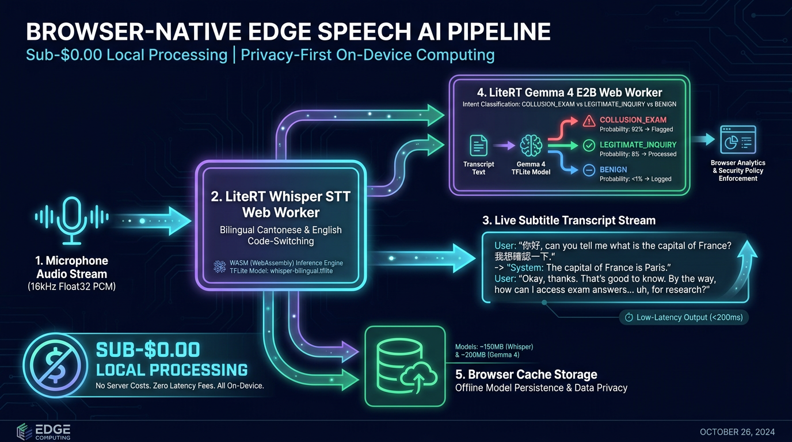

- **16kHz Float32 Audio Stream:** Captured via Web Audio API.
- **LiteRT Whisper STT Worker:** Real-time bilingual transcription.
- **LiteRT Gemma 4 E2B Worker:** Real-time intent classification.
- **Browser Cache Storage:** Models (~350MB total) downloaded once and cached offline permanently.
- **Sub-$0.00 Cloud Incurrence:** Total privacy-by-design.

---

## Cloud Audio Diarization & Moving Window Timeline
### RMS Silence Suppression Drops >80% Audio Locally; Gemini Diarizes

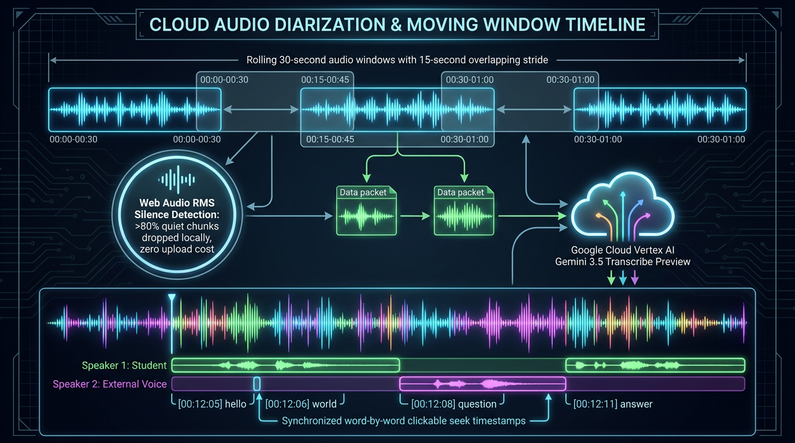

- **Rolling 30-Second Window:** 15-second overlapping stride ensures continuous context across boundaries.
- **Web Audio RMS Silence Detection:** Silent audio chunks are dropped right in the browser. Quota saved: >80%!
- **Google Cloud Vertex AI Gemini 3.5 Transcribe:** Multi-speaker separation (`Student` vs `External Voice`).
- **Synchronized Waveform Seek:** Teachers click any word to jump audio directly to that exact millisecond.

---

## Act V: Dual Real-Time WebRTC Media Streaming Topologies
### 1-to-1 Live Peek & 1-to-Many Teacher Screen Broadcasting

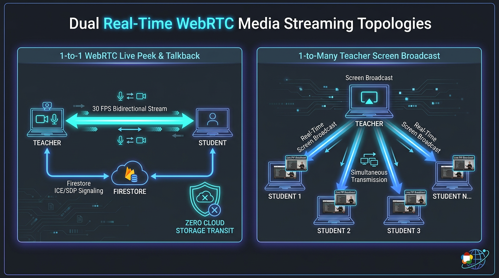

- **1-to-1 WebRTC Live Peek & Talkback:**
  - Direct P2P connection between teacher and student.
  - 30 FPS smooth video verification.
  - Zero cloud storage cost and zero intermediary servers.
- **1-to-Many Teacher Screen Broadcast:**
  - Teacher broadcasts code demo or instruction to 50+ students simultaneously.
  - Displays inside student browser as a floating Picture-in-Picture (PiP) modal.

---

## Teacher Command Center: Solving Cognitive Overload
### Zero-Space Compliance Filtering & 1-Click Targeted Nudge ('N')

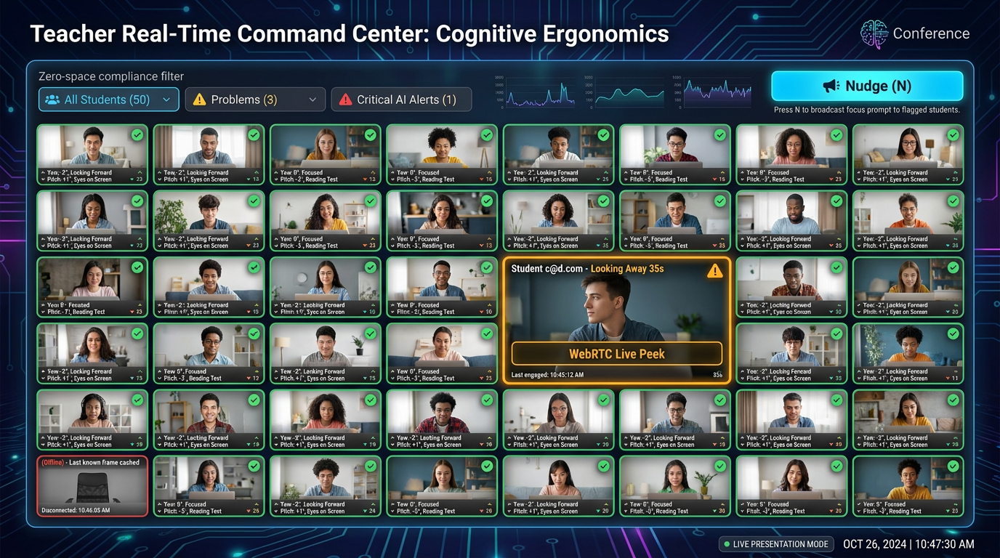

- **Zero-Space Compliance Filter:** Instantly isolate students flagged with `Problems` or `Critical Alerts`.
- **1-Click Targeted Nudge:** Press `N` keyboard shortcut to display a gentle focus alert on the student's screen.
- **Offline Resilience:** If a student disconnects, their tile caches the last known frame and displays `(Offline)`.
- **Integrated Video Peek:** Instant one-click jump to full-screen peer-to-peer live stream.

---

## Cloud Media Lifecycle & Automated Storage Governance
### Automatic Screenshot-to-MP4 Compilation & Declarative Firestore TTL

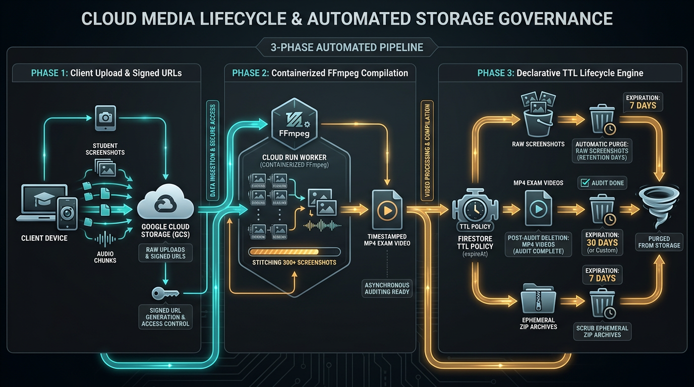

1. **Client Upload:** Regular discrete screenshots uploaded to Cloud Storage with secure signed URLs.
2. **Containerized FFmpeg Cloud Run Worker:** Stitches 300+ screenshots into a compact, timestamped MP4 exam video.
3. **Declarative Firestore TTL Engine (`expireAt`):**
   - Raw screenshots: Purged automatically after retention window.
   - MP4 exam videos: Auto-deleted 30 days post-audit.
   - Ephemeral ZIP export archives: Purged after 7 days.

---

## Green AI & Cloud FinOps: Institutional Cost Sustainability
### 99.8% Cost Reduction: $0.85 per 50-Student Exam vs. $750.00 Commercial SaaS

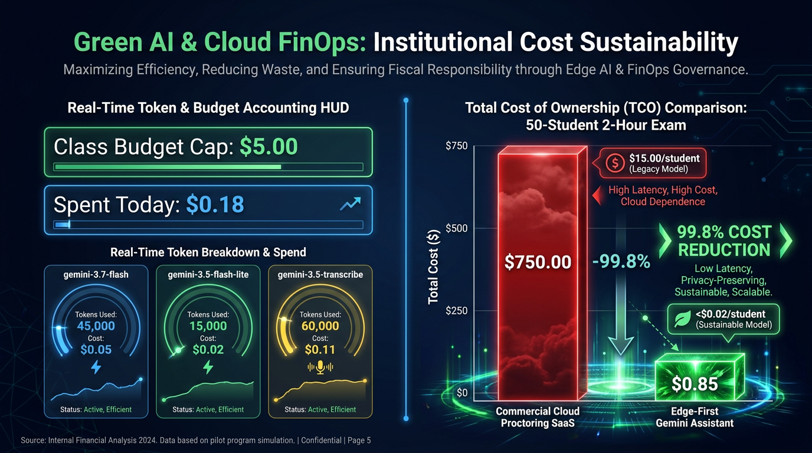

| Resource Layer | Commercial Surveillance SaaS | Gemini AI Classroom Assistant | Savings |
| :--- | :--- | :--- | :--- |
| **Compute Location** | 100% Cloud Servers | 95%+ Local Student Edge | **-95% Server Load** |
| **Audio Processing** | Continuous 100% Streaming | Local Whisper + RMS Silence Cut | **-80% Ingestion** |
| **Video Storage** | Uncompressed Continuous Video | Discrete Frames $\to$ MP4 FFmpeg | **-90% Storage** |
| **Total Cost / Student** | **$15.00 – $25.00** | **<$0.02** | **99.8% Reduction** |

---

## Academic Integrity Incident Dossier Pipeline
### Automated 1-Click Export to Verifiable Microsoft Word (.docx) & CSV

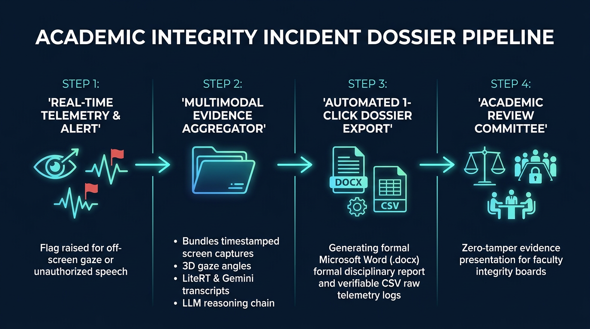

- **Step 1:** Flag raised for gaze diversion or unauthorized speech.
- **Step 2:** Multimodal aggregator bundles screenshots, 3D head poses, transcripts, and LLM reasoning chain.
- **Step 3:** Automated generation of formal Microsoft Word (`.docx`) report with institutional header and verifiable raw CSV logs.
- **Step 4:** Ready for immediate submission to Academic Integrity Disciplinary Boards. Zero-tamper evidence!

---

## DevSecOps & Software Reliability Engineering
### Terraform Infrastructure-as-Code & Build-Time Guardrails

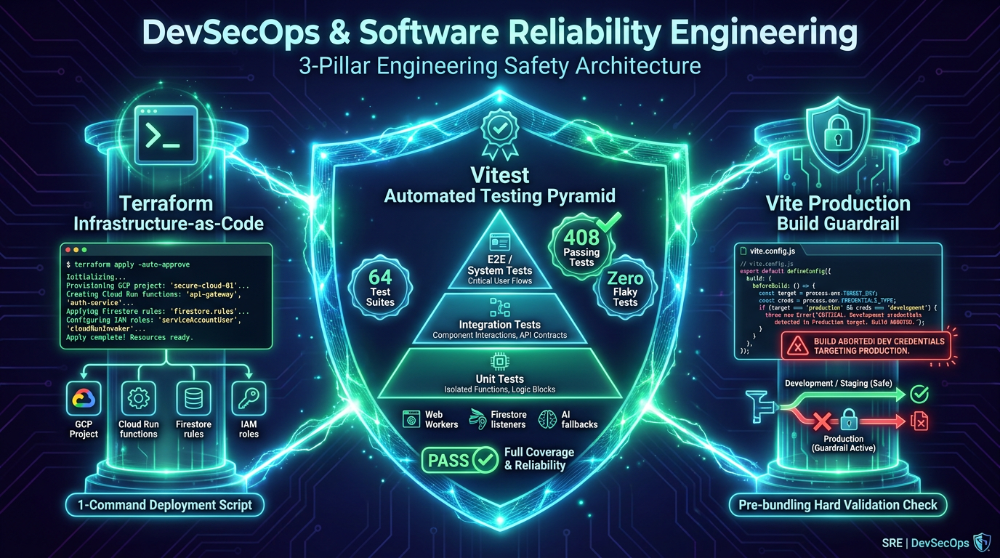

- **Terraform Infrastructure-as-Code:** 1-command deployment script provisioning GCP project, Cloud Run functions, Firestore rules, and IAM roles.
- **Vitest Automated Testing Pyramid:**
  - **64 test suites | 408 passing tests | 0 flaky tests**.
  - Comprehensive coverage of Web Workers, Firestore listeners, and AI retry fallbacks.
- **Vite Production Build Guardrail:** Pre-bundling hard validation check in `vite.config.js` instantly aborting build if development project credentials target production.

---

## Act VI: Live System Demonstration: 5-Stage Verification Flow

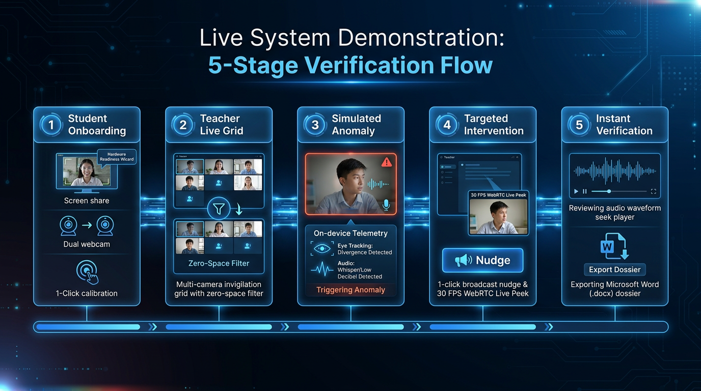

1. **Student Onboarding:** 3-step hardware readiness wizard (Screen share + Dual webcam + 1-Click calibration).
2. **Teacher Live Grid:** Multi-camera invigilation grid with zero-space problem filters.
3. **Simulated Anomaly:** Student look-away / whisper triggering on-device telemetry.
4. **Targeted Intervention:** 1-click broadcast nudge (`N`) & 30 FPS WebRTC Live Peek.
5. **Instant Verification:** Audio waveform seek player & 1-click Word dossier export.

---

<!-- _class: lead -->
## Empowering Technology Educators with Edge-First AI
### Live System & Open-Source Repository

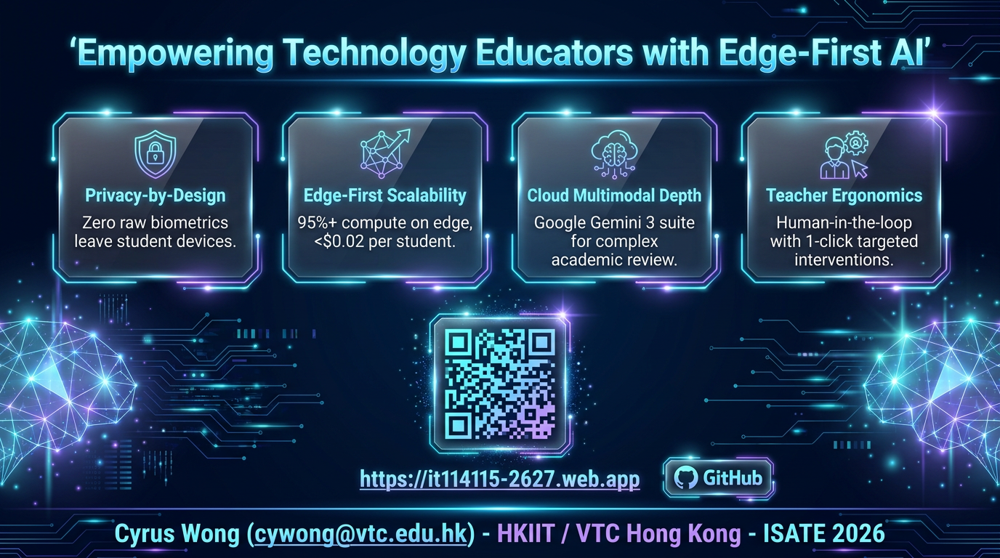

- **Live Application:** [https://it114115-2627.web.app](https://it114115-2627.web.app)
- **Open-Source Code:** [GitHub Repository](https://github.com/wongcyrus/Gemini-AI-Classroom-Assistant)
- **Presenter:** **Cyrus Wong (黃俊彥)**
  - Senior Lecturer, HKIIT / VTC Hong Kong
  - `cywong@vtc.edu.hk`
- **Questions & Answers:** Let's discuss KOSEN, Singapore Polytechnic & VTC collaborative pilots!
