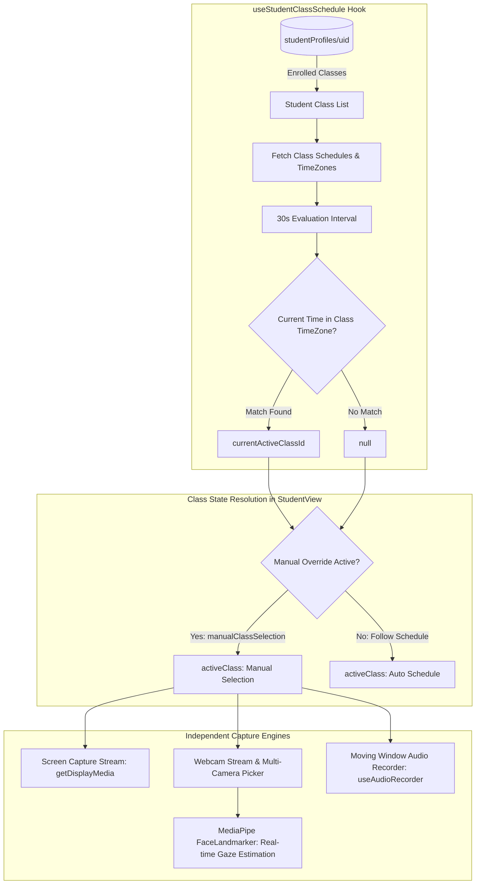

# Student View: Schedule-Driven Logic

This document outlines the automated, schedule-driven logic implemented in the `StudentView.jsx` component. The primary goal of this architecture is to ensure that a student's screen capture data is always associated with the correct, currently active class, especially in scenarios with back-to-back lessons.

## Core Architecture & State Flow

### 1. The `useStudentClassSchedule` Hook

This hook is the brain of the operation and works in three stages:

1.  **Fetch Student's Class List:** The hook subscribes to the logged-in student's profile document at `studentProfiles/{user.uid}`. It maintains a real-time list of all classes the student is enrolled in.

2.  **Fetch All Schedules:** Whenever the student's list of classes changes, the hook fetches the `schedule` object from each corresponding class document (`classes/{classId}`). This object contains the `timeSlots` and, crucially, the `timeZone` for that class.

3.  **Determine the Active Class:** Every 30 seconds, the hook performs the following check:
    *   It gets the current time.
    *   It iterates through each of the student's class schedules.
    *   For each schedule, it converts the current time into that class's specific timezone.
    *   It checks if the current, timezone-adjusted time falls within any of the defined `timeSlots` for the current day.
    *   The first class that matches becomes the `currentActiveClassId`.
    *   If no class is currently scheduled, `currentActiveClassId` is `null`.

### 2. `StudentView.jsx` Integration

The `StudentView.jsx` component consumes the `useStudentClassSchedule` hook and implements the following logic:

#### Automatic Class Selection

- The component gets the `currentActiveClassId` from the hook.
- A new variable, `activeClass`, is used as the source of truth for all data subscriptions and actions (e.g., listening for capture signals, uploading screenshots, fetching messages).

#### Manual Override

To handle edge cases or provide user flexibility, a manual override system is in place:

- The `activeClass` is determined by the formula: `manualClassSelection || currentActiveClassId`.
- The class selection dropdown in the UI now sets the `manualClassSelection` state, which takes precedence over the schedule-driven `currentActiveClassId`.
- When a class is manually selected, a **"Follow Schedule"** button appears. Clicking this button resets `manualClassSelection` to `null`, immediately returning the component to the automatic, schedule-driven mode.

#### UI Indicators

- The class dropdown now visually indicates which class is currently **"(Live)"** according to the schedule, guiding the user to the correct class without requiring them to think about it.

## Handling Overlap in Back-to-Back Classes

A key design consideration is how the system handles the transition between two classes scheduled back-to-back (e.g., Class A from 8:00-9:00 and Class B from 9:00-10:00).

The backend's `handleAutomaticCapture` function uses a 5-minute look-ahead to start capturing and a 5-minute look-behind to stop. This creates a 10-minute "overlap" in the database where both class documents may have `isCapturing: true`.

The schedule-driven frontend logic ensures this overlap does not affect the student's device. Here is a timeline of events:

**Scenario:**
*   **Class A:** 8:00 AM - 9:00 AM
*   **Class B:** 9:00 AM - 10:00 AM

---

### **At 8:55 AM**

*   **Backend:** Sets `isCapturing: true` for the upcoming **Class B**.
*   **Frontend:** The `activeClass` is still **Class A** based on the schedule. The app continues to capture and save screenshots for **Class A**, unaware of the change to Class B's database record.

---

### **At 9:00:00 AM (The Instant of Transition)**

*   **Frontend:** The `useStudentClassSchedule` hook detects the schedule change. The `activeClass` instantly switches from **Class A** to **Class B**.
*   The component begins listening to the Class B document, sees `isCapturing: true`, and starts saving all new screenshots for **Class B**.

---

### **At 9:05 AM**

*   **Backend:** Sets `isCapturing: false` for the now-finished **Class A**.
*   **Frontend:** The `activeClass` is **Class B**. The app is unaffected by the change to the Class A document it is no longer listening to.

### Conclusion

The backend flags may overlap in the database, but the frontend logic ensures a clean and instantaneous handoff. The student's screen is captured continuously, but the `classId` associated with the saved screenshots switches precisely at the scheduled time, ensuring data integrity.

---

## Dual Stream & Split-Channel Capture

The student interface supports independent screen sharing (`getDisplayMedia`) and webcam streaming (`getUserMedia`):

1. **Independent Control:** Students can start or stop their screen and webcam streams individually.
2. **Dual-Channel Ingestion:** When both streams are active, `captureAndUploadAllChannels` periodically captures frames from each stream, compresses them according to the class settings, and stores them under distinct paths:
   - Screen: `screenshots/{classId}/{studentUid}/screen_{timestamp}.jpg` (stamped with `channel: 'screen'`)
   - Webcam: `screenshots/{classId}/{studentUid}/webcam_{timestamp}.jpg` (stamped with `channel: 'webcam'`)
3. **Status Aggregation:** The real-time status document `classes/{classId}/status/{studentUid}` tracks `isScreenSharing`, `isWebcamSharing`, `latestScreenPath`, and `latestWebcamPath`, allowing teachers to monitor dual feeds simultaneously or switch views per channel seamlessly.
4. **Multi-Camera Selection:** When multiple webcams/video input devices are detected (`navigator.mediaDevices.enumerateDevices`), a camera selector dropdown dynamically appears next to the webcam button, allowing the student to pick their desired camera or switch seamlessly during an active session. Live device changes (`navigator.mediaDevices.ondevicechange`) are automatically detected.
5. **Stream Swapping:** When dual streams are active, students can toggle feed placement via a Swap Feeds control to switch primary and secondary picture-in-picture viewports.
6. **In-Flight Upload Concurrency Guards:** To prevent latency stacking over slow or fluctuating network connections, `StudentView` maintains channel-specific in-flight upload locks (`isUploadingScreenRef`, `isUploadingWebcamRef`). If an upload is still in progress when a scheduled tick fires, that frame is safely dropped rather than queued, guaranteeing immediate real-time sync once network bandwidth frees up.
7. **Background Capture & Occlusion Resilience (Edge / Chromium):**
   - **`ImageCapture` API (`grabFrame()`):** Grabs video frames directly from the hardware `MediaStreamTrack` buffer, preventing canvas blackouts/freezes when Edge or Chrome runs behind other windows or in minimized states.
   - **Inline Web Worker Timer:** Drives frame capture ticks using an isolated Web Worker thread, immune to Chromium's background timer throttling (which would otherwise throttle `setInterval` down to 1 minute or suspend tabs via Edge Sleeping Tabs).
   - **Screen Wake Lock API:** Automatically acquires a `screen` wake lock (`navigator.wakeLock.request('screen')`) during active capture sessions to prevent OS/browser power-saving suspension.

---

## Real-Time On-Device Face & Gaze Tracking (`useFaceMonitor.js`)

The student client embeds an on-device AI invigilation pipeline powered by **MediaPipe FaceLandmarker with Iris Tracking**:

### 1. 4 AI Monitoring Modes
- **`hybrid` (⚡ Client AI + Fallback)**: Real-time on-device MediaPipe inference on the student's browser at ~15-30 FPS with zero cloud cost. If detection confidence is low or irregularities persist, it triggers periodic Cloud Gemini Vision fallbacks (`analyzeFaceFallback`).
- **`cloud_only` (☁️ Cloud AI Only)**: Deactivates client-side MediaPipe WASM. The teacher receives periodic Cloud Gemini Vision inspections directly.
- **`client_only` (💻 Client AI Only)**: 100% on-device MediaPipe processing. Zero Cloud Gemini quota consumed.
- **`disabled` (🚫 AI Disabled)**: Completely turns off face and gaze tracking.

### 2. Iris Tracking & Depth Estimation
- Utilizes MediaPipe Iris landmarks (Landmarks `468–472` for left eye, `473–477` for right eye).
- **Metric Distance:** Computes accurate metric distance in cm using the known anatomical human iris diameter (~11.7 mm).
- **Pupil Gaze Ratio:** Evaluates horizontal and vertical iris displacement within eye contours to detect subtle looking-away gestures before head rotation occurs.

### 3. Head Pose & Angle Calibration
- Extracts 3D facial landmarks to calculate head rotation angles:
  - **Yaw** (Left / Right turn)
  - **Pitch** (Look Up / Down)
  - **Roll** (Head Tilt)
- Configurable preset thresholds (`standard`, `relaxed`, `strict`, `custom`) with custom yaw and asymmetric pitch up/down boundaries.

### 4. Debounce & Anomaly Gate
- Deviations must be sustained for the teacher-configured debounce threshold (e.g., 3 consecutive seconds) before triggering a `looking_away` irregularity, eliminating transient glance false positives.
- State telemetry is mirrored atomically to `classes/{classId}/status/{studentUid}`:
  - `faceStatus`: `normal` | `looking_away` | `no_face` | `multiple_faces` | `loading` | `disabled`
  - `gazeYaw`, `gazePitch`, `gazeDirection`, `metricDistance`, `irisGazeAway`.

---

## Microphone Input Selection & Moving Window Audio (`useAudioSetup.js` & `useAudioRecorder.js`)

In addition to screen and webcam video streams, the student interface integrates microphone capture and hardware selection:

1. **Microphone Setup & Calibration (`MicSetupModal.jsx`)**:
   - Students can open the setup dialog via the **"⚙️ Mic Test"** button (or it automatically opens if `audioCaptureMode === 'mandatory'`).
   - Automatically enumerates connected audio inputs (`audioinput` kind) and dynamically listens to `devicechange` events for newly connected USB or Bluetooth headsets.
   - The selected device is saved in `localStorage ('preferred_mic_device_id')` for persistence.
   - Displays a real-time Web Audio RMS volume meter ($0–100\%$) for instant visual feedback.
   - Features a built-in Speech-to-Text verification challenge to confirm voice clarity before the session starts.

2. **Moving Window Segmentation (`useAudioRecorder.js`)**:
   - Audio from the selected device is recorded in continuous 1-second slices into a circular memory buffer.
   - Every 15 seconds (stride), the previous 30-second window is packaged and transmitted to Cloud Storage for `gemini-3.5-transcribe` processing.
   - Client-side silence suppression drops chunks with average volume $<4\%$, reducing network bandwidth and cloud processing costs by $>80\%$.
   - Live telemetry (`isAudioSharing`, `audioStatus`, `audioLevel`) is updated in `classes/{classId}/status/{studentUid}`.

