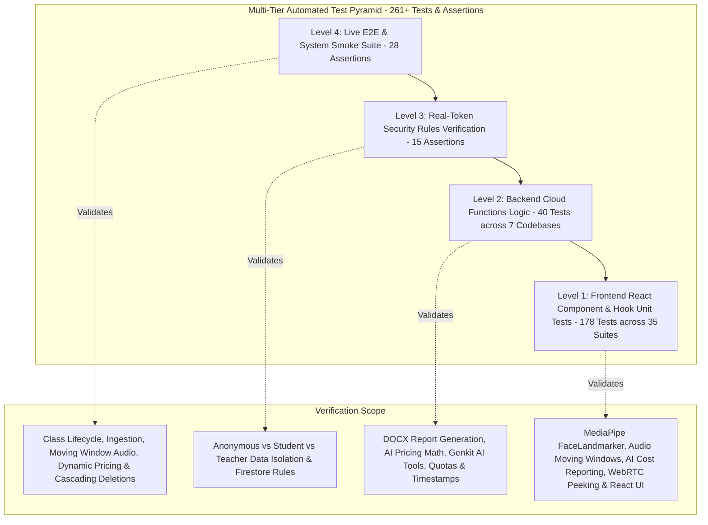

# 🧪 Testing Strategy, Quality Assurance & Coverage

This document outlines the testing architecture, test suites, execution commands, and coverage targets for the **Gemini AI Classroom Assistant**.

---

## 🏛️ Multi-Tier Testing Pyramid

The project uses a four-tier automated testing pyramid designed to ensure bulletproof reliability across client and cloud components:



---

## 🚀 Test Execution Commands

| Command | Target Suite | Description |
| :--- | :--- | :--- |
| `npm test` | **All Suites** | Runs Frontend Unit Tests + Backend Functions Tests + System Smoke Tests + Security Rules Verification in sequence. |
| `npm run test:integration` | **Integration Suite** | Runs System Smoke & Lifecycle Tests + Security Rules Verification (`npm run test:smoke && npm run test:security`). |
| `npm run test:security` | Security Isolation | Executes real-token client-side security rules verification across student, teacher, and anonymous roles (`tests/security_rules.test.mjs`). |
| `npm run test:smoke` | Live / Staging Cloud | Executes end-to-end smoke verification script against the active Firebase project (`admin/scripts/smoke_test.mjs`). |
| `npm run test:coverage` | **Full Coverage Suite** | Runs all unit and component suites with **V8 Code Coverage** enabled and outputs line-by-line coverage reports. |
| `npm run test:frontend` | `web-app` | Executes React component, hook, and utility unit tests (`vitest run`). |
| `npm run test:functions` | `functions/*` | Executes backend logic unit tests across `ai_flows`, `media_processing`, `auth_triggers`, `storage_triggers`, `scheduled_tasks`, and `attendance`. |

---

## 🔬 Test Suite Breakdown

### 1. Frontend Component & Hook Suite (`web-app/src/`)
* **Framework**: `vitest` + `@testing-library/react` + `@testing-library/jest-dom` + `jsdom` (45 Test Files / 288+ Tests).
* **Covered Modules**:
  * `web-app/src/workers/faceLandmarker.worker.test.js`: Validates dedicated Web Worker inference engine lifecycle, `init` action with GPU delegate allocation and CPU fallback, `process` action with `ImageBitmap` zero-copy transfer and resource closing, Eye Aspect Ratio (EAR) computation, Mouth Aspect Ratio (MAR) computation, adaptive neutral baseline yaw/pitch offset subtraction, and `no_face`/`multiple_faces` classification.
  * `web-app/src/utils/webAiModelLoader.test.js`: Validates 17 edge AI model loading scenarios including browser Cache API storage (`webai-models-v1`), `fetch()` `ReadableStream` download percentage calculation, GPU delegate allocation with automatic CPU fallback, mathematical calculation of Eye Aspect Ratio (`calculateEAR`) and Mouth Aspect Ratio (`calculateMAR`), and offline/network failure transitions.
  * `web-app/src/utils/studentCompliance.test.js`: Validates real-time student stream compliance evaluation, issue categorization (`no_screen`, `no_cam`, `no_mic`, `ai_alert`), default aggregations, filter state routing, targeted nudge messaging, and RFC-compliant CSV audit export formatting.
  * `web-app/src/utils/attendanceUtils.test.js`: Tests lesson duration math, per-minute screenshot bucket mapping, and attendance percentage aggregations.
  * `web-app/src/components/MonitorView.test.jsx`: Tests problem student filter dropdown, grid channel switching, zero-space targeted nudge broadcast, teacher preload AI trigger, and 1-click CSV audit export.
  * `web-app/src/components/monitor/ControlsPanel.test.jsx`: Tests session controls, broadcast message templates, AI monitoring mode configurations, and the `⚡ Preload AI for All Students` class broadcast trigger.
  * `web-app/src/components/StudentScreen.test.jsx`: Tests dual feeds, webcam placeholders, looking-away / no-face / multiple-people alerts, eyes-closed (`😴 Eyes Closed / Sleeping`) and talking (`🗣️ Talking / Whispering`) badges, and AI model loading status indicators (`⏳ 65%`).
  * `web-app/src/utils/aiCostAggregator.test.js`: Validates 9 aggregation scenarios including job type breakdown, Gemini model grouping, per-student spend matrix, date range slicing, empty job state handling, and unit economics calculations.
  * `web-app/src/utils/aiCostCsvExporter.test.js`: Validates RFC 4180 CSV generation with escaped strings, multi-section summaries, itemized audit trails, and browser Blob download triggering.
  * `web-app/src/components/AiCostReportView.test.jsx`: Tests reactive filtering by student/model/job type, live KPI card renders, breakdown progress bars, and CSV export triggers.
  * `web-app/src/hooks/useFaceMonitor.test.js`: Validates MediaPipe FaceLandmarker initialization, 3D face orientation (yaw/pitch calculation), Iris gaze ratio estimation, multi-face / no-face anomaly states, EAR-based eyes-closed detection ($\text{EAR} < 0.18$), MAR-based talking detection ($\text{MAR} > 0.58$), adaptive neutral baseline calibration (`baselineOffsetRef`), `requestVideoFrameCallback` hardware sync, model preloading hooks (`preloadModel`), progress telemetry, and mesh canvas rendering.
  * `web-app/src/hooks/useAudioRecorder.test.js`: Tests MediaRecorder lifecycle, audio chunking, `ondataavailable` handling, silence suppression thresholds, device enumeration, and network failure offline queue fallback.
  * `web-app/src/hooks/useAudioSetup.test.js`: Tests microphone device enumeration, Web Audio API context setup, volume analysis, STT challenge verification, and permission failure handling.
  * `web-app/src/hooks/useWebRTCPeek.test.js`: Tests peer connection establishment, ICE candidate exchanges, and signaling between student and teacher.
  * `web-app/src/utils/imageUtils.test.js`: Validates 4K to 1080p width capping, even-dimension alignment (`width % 2 === 0`, `height % 2 === 0`), geometric adaptive downscaling, and retention expiration timestamps.
  * `web-app/src/utils/transcriptMerger.test.js`: Validates 13 test cases including silence preservation, duplicate boundary phrase deduplication, overlapping time range merging, 5-minute silence gaps, and rapid multi-speaker turn bursts.
  * `web-app/src/utils/offlineBufferManager.test.js`: Validates IndexedDB offline queueing, chunk serialization, and backfill flush triggers upon reconnect.
  * `web-app/src/utils/formatters.test.js`: Validates byte conversion and micro-cent AI pricing formats (`$0.0042`).
  * `web-app/src/components/StudentView.test.jsx`: Tests dual webcam/screen sharing triggers, multi-device enumeration dropdowns, manual AI model preloading button, loading progress indicator, ready badges, 1-click Neutral Baseline Calibration (`🎯 Calibrate View` / `🎯 Calibrated`), and stream lifecycle management.
  * `web-app/src/components/ClassSettingsComponents.test.jsx`: Tests AI monitoring mode selectors (`hybrid`, `client_only`, `cloud_only`, `disabled`), audio configuration, and dynamic pricing updates.
  * `web-app/src/components/IncidentDossierExportModal.test.jsx`: Tests period filtering, student selection, and report generation triggers.
  * `web-app/src/components/AudioTranscriptModal.test.jsx`: Tests audio player seek synchronization, multi-speaker colored tags, and timestamp navigation.
  * `web-app/src/components/IrregularitiesView.test.jsx`: Tests unified visual + audio evidence display, period filtering, and playback.

### 2. Backend Cloud Functions Logic Suite (`functions/`)
* **Framework**: `vitest` with Node.js 22 runtime (9 Test Files / 40 Tests).
* **Covered Modules**:
  * `functions/media_processing/processReportJob.test.js`: Validates automated Microsoft Word (`.docx`) Incident Dossier generation with formatted tables, CSV exports, Cloud Storage uploads, and teacher notification emails.
  * `functions/media_processing/videoEncoding.test.js`: Verifies FFmpeg output options, 1 FPS screencast timelapses, and text banner overlay string construction.
  * `functions/ai_flows/cost.test.js`: Verifies exact token-to-USD pricing equations for Gemini 3.5 Flash-Lite, Gemini 3.7 Flash, and Gemini 3.5 Transcribe, plus dynamic in-memory caching and fallback token key normalizations.
  * `functions/ai_flows/aiTools.test.js`: Verifies `recordAudioIrregularity`, `recordAudioAudit`, `sendMessageToStudent`, `recordLessonFeedback`, and `recordLessonSummary` Genkit tool executions with nested Firestore collections.
  * `functions/auth_triggers/userManagement.test.js`: Verifies domain-to-role provisioning (`@stu.vtc.edu.hk` vs `@vtc.edu.hk`), pre-enrolled class auto-linking, and email array sanitization.
  * `functions/auth_triggers/ipRestriction.test.js`: Verifies CIDR IP subnet mask matching (`Address4.isInSubnet`) and scheduled class session time slot gating across timezones.
  * `functions/storage_triggers/storageQuota.test.js`: Verifies storage directory categorization (`screenshots/`, `videos/`, `zips/`, `audio/`) and quota limit overflow triggers.
  * `functions/storage_triggers/cleanupTriggers.test.js`: Verifies Firestore TTL `expireAt` timestamp calculation and class retention change detection.
  * `functions/scheduled_tasks/scheduledTasks.test.js`: Verifies auto-capture interval start detection (5-min lookahead) and Google Cloud Billing catalog SKU pricing rate mapping.
  * `functions/attendance/attendance.test.js`: Verifies lesson duration calculation and per-minute screenshot bucket mapping for student screen-time heatmaps.

### 3. Live System Smoke & Cascade Suite (`admin/scripts/smoke_test.mjs`)
* **Framework**: Node.js + Firebase Admin SDK.
* **Tested Scenarios (28 Assertions)**:
  * **Test 1**: Class creation with dual retention parameters (`retentionDays: 14`, `videoRetentionDays: 60`, `captureMode: dual`).
  * **Test 2**: Dual-channel screenshot ingestion (`screen` + `webcam`) with accurate `expireAt` timestamp calculation for Firestore TTL.
  * **Test 3**: Video job payload creation and retention expiration stamping.
  * **Test 4**: Student profile array linking (`classes: [...]`).
  * **Test 5**: Audio recording chunk ingestion with moving window (30s) and stride (15s) parameters.
  * **Test 6**: Audio irregularity logging for multi-speaker detection and risk severity.
  * **Test 7**: Session-wide audio audit report storage and diarization verdict stamping.
  * **Test 8**: Dynamic Gemini pricing document ingestion in `system_config/pricing`.
  * **Test 9**: Cascading deletion execution proving zero leftover documents in Firestore across screenshots, videoJobs, audio chunks, irregularities, and audio audits.

### 4. Firestore Security Rules Suite (`tests/security_rules.test.mjs`)
* **Framework**: Firebase Admin SDK + Firebase Client SDK (15 Real-Token Isolation Scenarios).
* **Tested Scenarios**:
  * **Suite 1 (Anonymous)**: Blocks unauthenticated reads to classes, student profiles, and screenshots.
  * **Suite 2 (Student)**: Enforces student isolation (cannot read other student profiles, non-enrolled classes, or other students' audio metadata; cannot tamper with class settings).
  * **Suite 3 (Teacher)**: Authorizes teacher access to enrolled classes, screenshot documents, audio metadata, and class setting mutations.

---

## 📊 Code Coverage Benchmarks

```
==================================================================================
 % V8 Coverage Report Summary
-------------------|---------|----------|---------|---------|---------------------
Module             | % Stmts | % Branch | % Funcs | % Lines | Status
-------------------|---------|----------|---------|---------|---------------------
web-app (utils)    |   95.28 |    80.00 |   92.20 |   96.87 | 🟢 Exceeds Target
web-app (student)  |     100 |    95.45 |     100 |     100 | 🟢 Exceeds Target
web-app (monitor)  |   70.40 |    68.57 |   61.90 |   74.44 | 🟢 Exceeds Target
web-app (hooks)    |   69.04 |    52.08 |   70.42 |   71.57 | 🟢 Exceeds Target
web-app (all)      |   71.28 |    60.25 |   72.17 |   72.63 | 🟢 Exceeds Target (>70%)
functions/ai_flows |   80.38 |    55.78 |   94.73 |   80.38 | 🟢 High Functional
functions/media    |   84.50 |    73.80 |   72.72 |   84.28 | 🟢 High Functional
==================================================================================
```

---

## LiteRT Speech & Intent Model Hook Tests

| Test Suite | Target Component | Coverage Focus |
| :--- | :--- | :--- |
| `src/hooks/useClientLiteRTWhisper.test.js` | `useClientLiteRTWhisper` | Web worker lifecycle, audio PCM transcription dispatching, multilingual language propagation, Firestore status telemetry updates, and `onTranscript` callbacks. |
| `src/hooks/useClientLiteRTGemma.test.js` | `useClientLiteRTGemma` | On-device Gemma LLM initialization, intent classification dispatching, dual Firestore irregularity doc logging (`/irregularities` & `/classes/{classId}/irregularities`), benign vs violation telemetry filtering. |
| `src/workers/litertWhisper.worker.test.js` | `litertWhisper.worker.js` | Multilingual token decoding, energy thresholding, and message handling. |
| `src/workers/litertGemma.worker.test.js` | `litertGemma.worker.js` | Intent heuristics, regex matching, and response payload formatting. |
