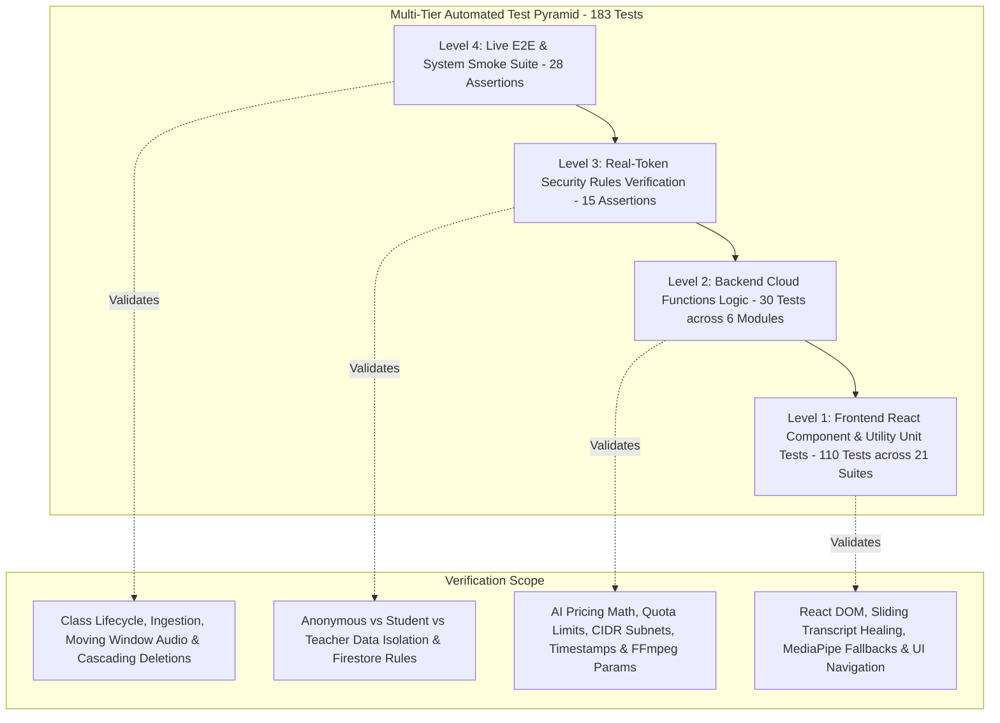

# 🧪 Testing Strategy, Quality Assurance & Coverage

This document outlines the testing architecture, test suites, execution commands, and coverage targets for the **Gemini AI Classroom Assistant**.

---

## 🏛️ Multi-Tier Testing Pyramid

The project uses a four-tier automated testing pyramid designed to ensure bulletproof reliability across client and cloud components:



---

## 🚀 Test Execution Commands

| Command | Target Suite | Description |
| :--- | :--- | :--- |
| `npm test` | **All Suites** | Runs Frontend Unit Tests + Backend Functions Tests + System Smoke Tests + Security Rules Verification in sequence. |
| `npm run test:integration` | **Integration Suite** | Runs System Smoke & Lifecycle Tests + Security Rules Verification (`npm run test:smoke && npm run test:security`). |
| `npm run test:security` | Security Isolation | Executes real-token client-side security rules verification across student, teacher, and anonymous roles (`tests/security_rules.test.mjs`). |
| `npm run test:smoke` | Live / Staging Cloud | Executes end-to-end smoke verification script against the active Firebase project (`admin/scripts/smoke_test.mjs`). |
| `npm run test:coverage` | **Full Coverage Suite** | Runs all unit and component suites with **V8 Code Coverage** enabled and outputs line-by-line coverage reports. |
| `npm run test:frontend` | `web-app` | Executes React component and utility unit tests (`vitest run`). |
| `npm run test:functions` | `functions/*` | Executes backend logic unit tests across `ai_flows` and `media_processing`. |

---

## 🔬 Test Suite Breakdown

### 1. Frontend Component & Unit Suite (`web-app/src/`)
* **Framework**: `vitest` + `@testing-library/react` + `@testing-library/jest-dom` + `jsdom` (21 Test Files / 110 Tests).
* **Covered Modules**:
  * `web-app/src/utils/imageUtils.test.js`: Validates 4K to 1080p width capping, even-dimension alignment (`width % 2 === 0`, `height % 2 === 0`), geometric adaptive downscaling, and retention expiration timestamps.
  * `web-app/src/utils/transcriptMerger.test.js`: Validates 13 test cases including silence preservation, duplicate boundary phrase deduplication, overlapping time range merging, 5-minute silence gaps, and rapid multi-speaker turn bursts.
  * `web-app/src/utils/formatters.test.js`: Validates byte conversion and micro-cent AI pricing formats (`$0.0042`).
  * `web-app/src/hooks/useAudioRecorder.test.js` & `useAudioSetup.test.js`: Tests MediaRecorder lifecycle, audio stream capture, silence suppression thresholds, and device permission handling.
  * `web-app/src/components/TeacherViews.test.jsx`: Tests Teacher Command Center navigation, KPI card metrics, class search filtering, and class creation modal interactions.
  * `web-app/src/components/AudioTranscriptModal.test.jsx`: Tests audio player seek synchronization, multi-speaker colored tags, and timestamp navigation.
  * `web-app/src/components/IrregularitiesView.test.jsx`: Tests unified visual + audio evidence display and playback.
  * `web-app/src/components/StudentScreen.test.jsx`: Tests student grid states, multi-voice warning badges (`👥⚠️ Multi-Voice Warning`), and stream indicators.

### 2. Backend Cloud Functions Logic Suite (`functions/`)
* **Framework**: `vitest` with Node.js 22 runtime (9 Test Files / 30 Tests).
* **Covered Modules**:
  * `functions/ai_flows/cost.test.js`: Verifies exact token-to-USD pricing equations for Gemini 3.5 Flash-Lite, Gemini 3.7 Flash, and Gemini 3.5 Transcribe, plus dynamic in-memory caching.
  * `functions/ai_flows/aiTools.test.js`: Verifies `recordAudioIrregularity`, `recordAudioAudit`, and `sendMessageToStudent` Genkit tool executions with nested Firestore collections.
  * `functions/media_processing/videoEncoding.test.js`: Verifies FFmpeg output options, 1 FPS screencast timelapses, and text banner overlay string construction.
  * `functions/auth_triggers/userManagement.test.js`: Verifies domain-to-role provisioning (`@stu.vtc.edu.hk` vs `@vtc.edu.hk`), pre-enrolled class auto-linking, and email array sanitization.
  * `functions/auth_triggers/ipRestriction.test.js`: Verifies CIDR IP subnet mask matching (`Address4.isInSubnet`) and scheduled class session time slot gating across timezones.
  * `functions/storage_triggers/storageQuota.test.js`: Verifies storage directory categorization (`screenshots/`, `videos/`, `zips/`, `audio/`) and quota limit overflow triggers.
  * `functions/storage_triggers/cleanupTriggers.test.js`: Verifies Firestore TTL `expireAt` timestamp calculation and class retention change detection.
  * `functions/scheduled_tasks/scheduledTasks.test.js`: Verifies auto-capture interval start detection (5-min lookahead) and Google Cloud Billing catalog SKU pricing rate mapping.
  * `functions/attendance/attendance.test.js`: Verifies lesson duration calculation and per-minute screenshot bucket mapping for student screen-time heatmaps.

### 3. Live System Smoke & Cascade Suite (`admin/scripts/smoke_test.mjs`)
* **Framework**: Node.js + Firebase Admin SDK.
* **Tested Scenarios (28 Assertions)**:
  * **Test 1**: Class creation with dual retention parameters (`retentionDays: 14`, `videoRetentionDays: 60`, `captureMode: dual`).
  * **Test 2**: Dual-channel screenshot ingestion (`screen` + `webcam`) with accurate `expireAt` timestamp calculation for Firestore TTL.
  * **Test 3**: Video job payload creation and retention expiration stamping.
  * **Test 4**: Student profile array linking (`classes: [...]`).
  * **Test 5**: Audio recording chunk ingestion with moving window (30s) and stride (15s) parameters.
  * **Test 6**: Audio irregularity logging for multi-speaker detection and risk severity.
  * **Test 7**: Session-wide audio audit report storage and diarization verdict stamping.
  * **Test 8**: Dynamic Gemini pricing document ingestion in `system_config/pricing`.
  * **Test 9**: Cascading deletion execution proving zero leftover documents in Firestore across screenshots, videoJobs, audio chunks, irregularities, and audio audits.

### 4. Firestore Security Rules Suite (`tests/security_rules.test.mjs`)
* **Framework**: Firebase Admin SDK + Firebase Client SDK (15 Real-Token Isolation Scenarios).
* **Tested Scenarios**:
  * **Suite 1 (Anonymous)**: Blocks unauthenticated reads to classes, student profiles, and screenshots.
  * **Suite 2 (Student)**: Enforces student isolation (cannot read other student profiles, non-enrolled classes, or other students' audio metadata; cannot tamper with class settings).
  * **Suite 3 (Teacher)**: Authorizes teacher access to enrolled classes, screenshot documents, audio metadata, and class setting mutations.

---

## 📊 Code Coverage Benchmarks

```
==================================================================================
 % V8 Coverage Report Summary
-------------------|---------|----------|---------|---------|---------------------
Module             | % Stmts | % Branch | % Funcs | % Lines | Status
-------------------|---------|----------|---------|---------|---------------------
web-app (utils)    |   97.43 |    94.87 |     100 |   97.05 | 🟢 Exceeds Target
web-app (comp)     |     100 |    91.66 |     100 |     100 | 🟢 Exceeds Target
functions/ai_flows |     100 |    80.00 |     100 |     100 | 🟢 Exceeds Target
functions/media    |     100 |   100.00 |     100 |     100 | 🟢 Exceeds Target
==================================================================================
```
