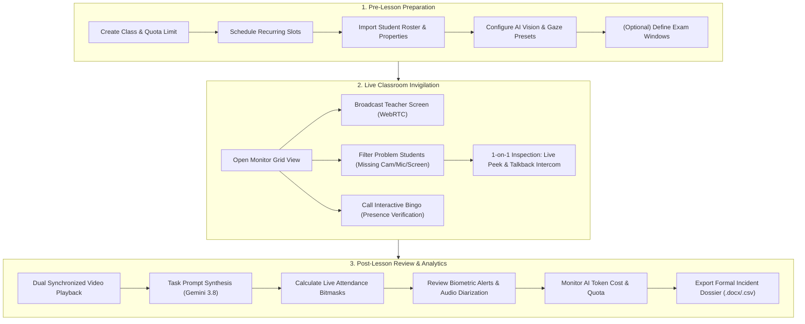
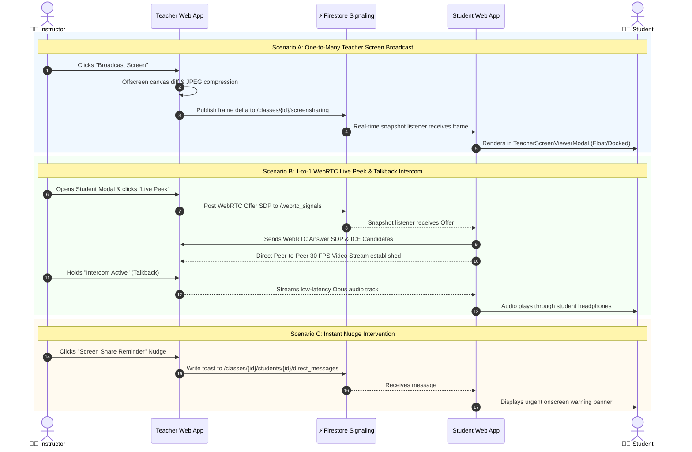
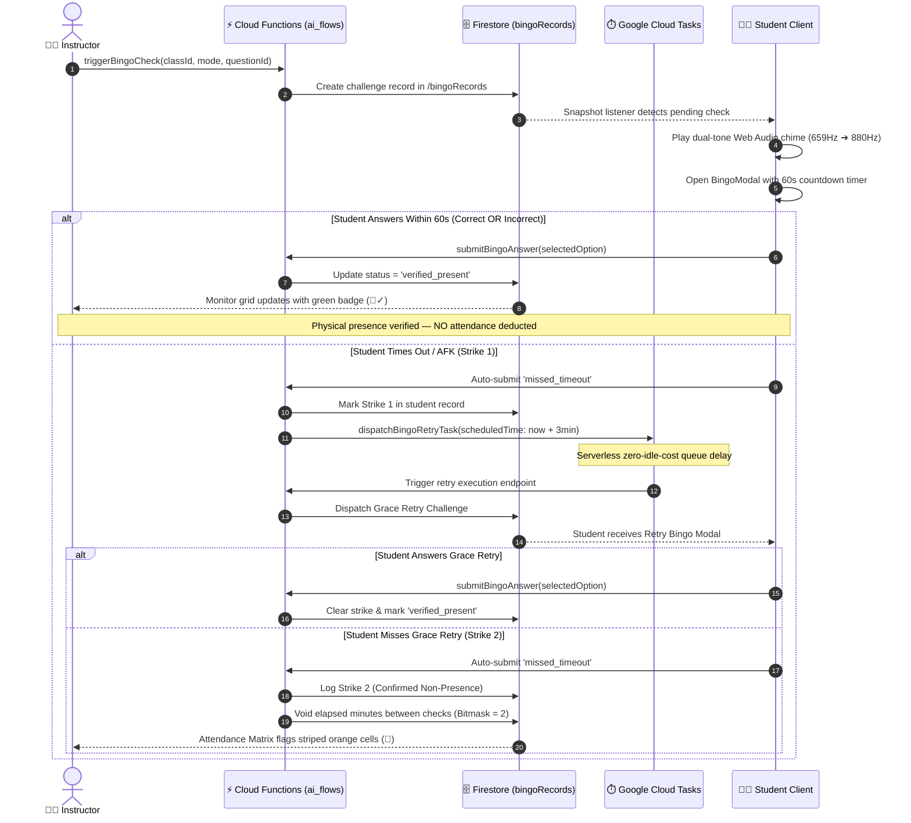
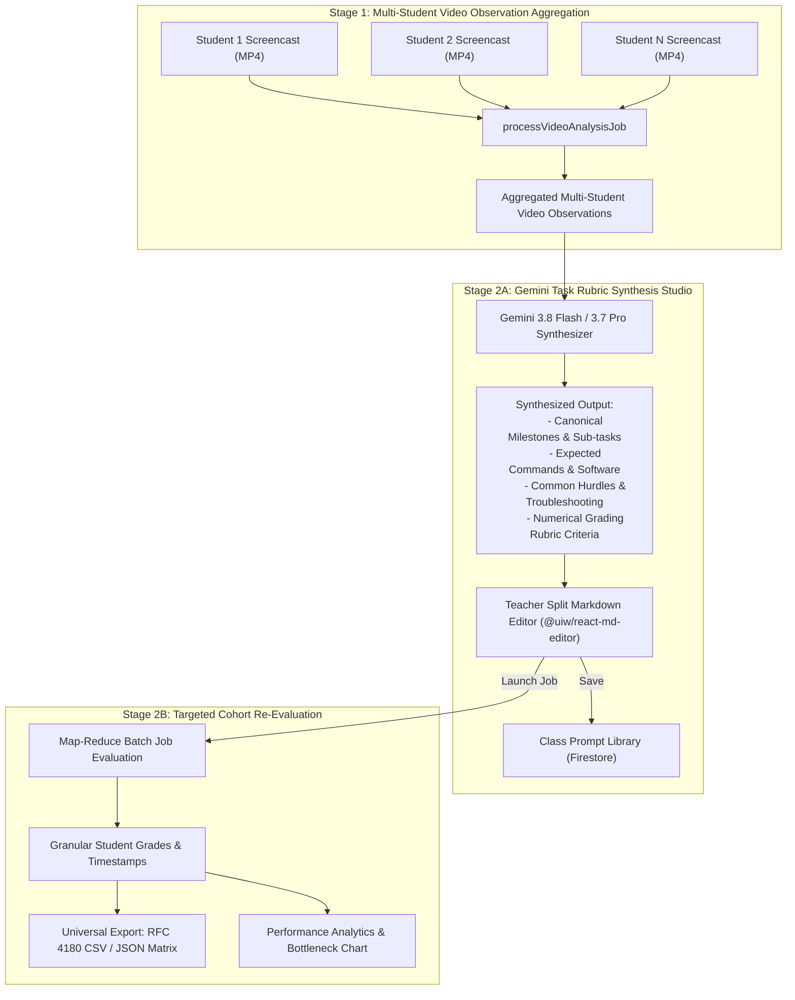
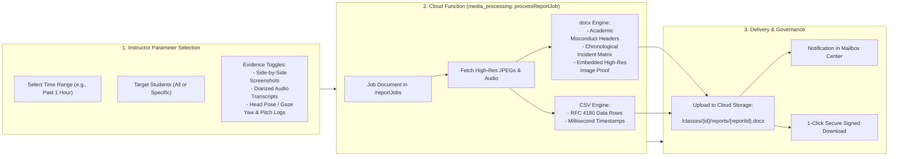

# 👨‍🏫 Instructor & Teaching Assistant User Manual

[🏠 Documentation Index](../README.md#documentation-index) | [🧑‍🎓 Student Manual](./user-manual-student.md) | [🛠️ Admin Manual](./user-manual-admin.md) | [📘 UI Catalog](./comprehensive-ui-controls-and-features-catalog.md)

---

Welcome to the **Gemini AI Classroom Assistant** Instructor Guide. This manual details everything you need to know to create classes, configure proctoring settings, monitor live student sessions, conduct one-on-one interventions, trigger active presence challenges, review synthesized AI rubrics, and export formal academic incident dossiers.

---

## 📑 Table of Contents
1. [Getting Started & Navigation](#1-getting-started--navigation)
2. [Classroom Setup & Timetable Configuration](#2-classroom-setup--timetable-configuration)
3. [Managing Student Rosters & Custom Properties](#3-managing-student-rosters--custom-properties)
4. [Configuring AI Models & Proctoring Parameters](#4-configuring-ai-models--proctoring-parameters)
5. [Exam Mode & Assessment Confidentiality Safeguards](#5-exam-mode--assessment-confidentiality-safeguards)
6. [Live Invigilation & Classroom Monitor](#6-live-invigilation--classroom-monitor)
7. [Screen Broadcasting to Students](#7-screen-broadcasting-to-students)
8. [Individual Student Inspection, Intercom & Interventions](#8-individual-student-inspection-intercom--interventions)
9. [Interactive "Bingo" Active Presence Verification](#9-interactive-bingo-active-presence-verification)
10. [Session Review, Video Library & Synchronized Scrubbing](#10-session-review-video-library--synchronized-scrubbing)
11. [AI Video Analysis & Task Prompt Synthesis Studio](#11-ai-video-analysis--task-prompt-synthesis-studio)
12. [Attendance Matrix, Bitmasks & Working Time Estimation](#12-attendance-matrix-bitmasks--working-time-estimation)
13. [Irregularities, Biometric Logs & Audio Diarization](#13-irregularities-biometric-logs--audio-diarization)
14. [Performance Analytics & Milestone Bottlenecks](#14-performance-analytics--milestone-bottlenecks)
15. [AI Cost Monitoring & FinOps Governance](#15-ai-cost-monitoring--finops-governance)
16. [Exporting Formal Incident Dossiers](#16-exporting-formal-incident-dossiers)
17. [Troubleshooting & Best Practices](#17-troubleshooting--best-practices)

---

## 1. Getting Started & Navigation

### Authentication & First Login
1. Navigate to your institution's deployment URL (e.g., `https://it114115-2627.web.app`).
2. Click **Sign in with Google** or enter your assigned institutional email and password.
3. Your account must end in an approved instructor domain (e.g., `@vtc.edu.hk`). Upon login, the system automatically routes you to the **Teacher Command Center** (`/`).

### Global Header Navigation
- **Class Switcher (`<select>`):** Located in the top header; allows you to jump directly between courses you teach without navigating back to the home dashboard.
- **Top Navigation Links:**
  - `Classes`: Returns to the main teacher dashboard listing all your classrooms.
  - `Prompts`: Opens the AI Prompt Studio to draft, optimize, and share rubric prompts.
  - `Mailbox`: Displays system notices, asynchronous export downloads, and background job alerts (badged with unread count).
- **Profile Menu & Role Switcher:** Click your avatar in the upper right corner to view your account details, trigger password changes, or sign out. On administrative accounts, you can toggle between **Teacher** and **Student** view simulations.

### 🔄 End-to-End Instructor Lesson Lifecycle Flow

---

## 2. Classroom Setup & Timetable Configuration

### Creating a New Class
1. On the Teacher Dashboard, click the **`+ Create Class`** button.
2. Fill in the **Basic Class Information**:
   - **Class ID:** A unique alphanumeric identifier (e.g., `IT114115-2026-A`).
   - **Display Name:** Friendly course title (e.g., *DevOps & Cloud Computing Laboratory*).
   - **Storage Quota:** Select `5 GB`, `10 GB`, `20 GB`, or `Unlimited`. Each class is pre-allocated 5 GB by default with a $10.00 AI token budget cap.
   - **Screenshot Retention:** Choose how long raw student frame snapshots are retained before automatic deletion (`7` to `365` days).
   - **Video Retention:** Choose how long compiled MP4 videos are kept (`14` to `730` days).

### Timetable & Schedule Builder
Open the **Settings** tab in your class workspace and locate the **Timetable & Schedule** panel:
1. **Semester Dates:** Set the course **Start Date** and **End Date**.
2. **Timezone:** Select your local timezone (e.g., `Asia/Hong_Kong`).
3. **Weekly Slots:**
   - Select the day of the week (e.g., `Tuesday`).
   - Pick the **Start Time** and **End Time** in 30-minute intervals.
   - Click **`+ Add Schedule`**. The system contains built-in collision detection to prevent overlapping slots.
4. **Automated Scheduling Behaviors:**
   - ✅ *Automatically start live capture during scheduled hours*: Student clients automatically connect when a scheduled lesson begins.
   - ✅ *Automatically compile lesson screencasts into MP4 videos after class*: Cloud Functions assemble student frames into full MP4 videos as soon as the scheduled lesson finishes.

---

## 3. Managing Student Rosters & Custom Properties

### Adding Students to the Roster
1. In the **Class Management (`⚙️ Settings`)** tab, scroll to **Student Roster**.
2. **Manual Input:** Enter student institutional emails separated by commas or new lines into the textarea.
3. **File Import:** Click **`📥 Import (CSV/TXT)`** to upload an institutional roster file.
4. **Export Roster:** Click **`📤 Export CSV`** to download current roster records.

### Custom Properties & AI Injection
The platform supports passing contextual variables directly into Gemini prompts:
- **Class-wide Properties:** Define key-value pairs (e.g., `ProjectRepo: github.com/school/lab1`, `OperatingSystem: Ubuntu 24.04`). These keys are automatically available in all video and vision evaluation prompts.
- **Student-Specific Properties:**
  1. Click **`📥 Download Student Template`** in the Custom Properties Manager.
  2. Populate columns for each student (e.g., `AssignedSeat: Lab-302-A`, `AccommodationTier: ExtendedTime`).
  3. Click **`📤 Upload Properties CSV`**. Cloud Functions asynchronously parse and link these attributes to individual student UIDs.

---

## 4. Configuring AI Models & Proctoring Parameters

In **Class Settings (`⚙️ Settings`)**, configure the automated proctoring intelligence:

### Vision AI Settings
- **Default Capture Mode:**
  - `Dual (Screen + Webcam)`: Recommended for official labs and proctored exams.
  - `Screen Only`: For coding labs without webcam requirements.
  - `Webcam Only`: For oral presentations or interviews.
- **Vision Model Selection:**
  - `gemini-3.5-flash-lite`: Lowest latency and lowest token cost ($0.075/1M tokens); ideal for continuous frame scanning.
  - `gemini-3.7-flash` / `gemini-3.8-flash`: Balanced multi-modal models for nuanced screen and code reading.
  - `gemini-3.7-pro`: Deep reasoning model for high-stakes exam integrity checks.

### Biometric Gaze & Face Tracking
- **MediaPipe Monitoring Mode:** Choose `Hybrid (Client MediaPipe + Cloud Fallback)`, `Client Only`, `Cloud Only`, or `Disabled`.
  - In *Hybrid Mode*, students' devices run 468-point face tracking locally in WebAssembly. If a student's machine lacks GPU acceleration, the system seamlessly falls back to cloud Gemini vision.
- **Gaze Sensitivity Presets:** `Relaxed`, `Standard`, `Strict`, or `Custom`.
- **Custom Angular Limits (in Custom Mode):**
  - **Yaw Tolerance Slider:** Adjust between ±10° and ±50° (flags turning head away from display).
  - **Pitch Down Tolerance Slider:** Adjust between -45° and -10° (detects looking down at phones or notes).
  - **Pitch Up Tolerance Slider:** Adjust between +10° and +45° (detects looking up at ceiling or bystanders).
- **Face Debounce Gate:** Set a delay (2–10 seconds) before logging a look-away event to prevent false alarms from momentary natural glances.

### Acoustic & Speech Monitoring
- **Microphone Requirement:** `Mandatory` (forces students to grant mic permissions) or `Optional`.
- **Client-Side Silence Suppression (VAD):** When enabled, client Web Audio nodes mute chunks below the volume threshold, saving over 80% in cloud storage and transcription costs.
- **Mode 1 (Moving Window Transcription):** Continuously transcribes 20s–45s rolling audio slices using on-device Whisper or `gemini-3.5-transcribe-preview`.
- **Mode 2 (Session Audio Diarization):** Assembles recorded audio clips into a full session timeline with speaker separation.

---

## 5. Exam Mode & Assessment Confidentiality Safeguards

### Pre-Scheduling Exam Windows
1. In **Class Settings**, scroll to **Exam & Assessment Windows**.
2. Specify the **Exam Title** (e.g., `Final Practical Exam`), **Start Datetime**, and **End Datetime**.
3. Click **`+ Add Exam Window`**.

### Live Exam Mode Activation
If you need to conduct an unscheduled quiz or immediate test, activate Exam Mode instantly:
1. In the **Monitor (`🖥️ Monitor`)** tab, locate the **Proctored Exam Mode** toggle in the controls toolbar.
2. Click **`🔒 Exam Mode: ACTIVE`**.

### Zero-Trust Security Guarantees
When Exam Mode is active:
- **Cloud Storage Shields:** Storage security rules automatically reject student read requests for any video or evidence asset flagged as exam material.
- **Student Portal Redaction:** Students attempting to view recordings, transcripts, or incident details in their self-service portal see a locked shield: `🔒 Official Examination Material — Records Withheld Under Proctoring Policy`.
- **Full-Screen Enforcement:** Student browsers are locked into full-desktop sharing (`displaySurface === 'monitor'`). Window or single-tab shares are rejected with an irregularity alert.
- **Watermark Banner:** A persistent red security banner appears on all student viewports.

---

## 6. Live Invigilation & Classroom Monitor

The **Monitor View** ([`MonitorView.jsx`](file:///home/developer/Documents/Gemini-AI-Classroom-Assistant/web-app/src/components/MonitorView.jsx)) is your primary live control center.

### Layout & Cadence Controls
- **Layout Density Selector:** Select `2x2`, `3x3`, `4x4`, or `Dynamic Auto-Fit` to adjust student grid cards according to your monitor size.
- **Snapshot Upload Cadence Slider:** Adjust the student upload interval between **5 seconds** (high security) and **60 seconds** (bandwidth-conserving).
- **Audio Master Listen / Mute Toggle:** Listen in on classroom ambient microphones or mute all incoming student audio.

### Problem Student Quick Filters
Use the zero-space filter buttons on top of the student grid to focus immediately on anomalies:
- `👥 All Students`: Default view.
- `⚠️ Problems`: Shows students with active flags (missing feeds, looking away, or unverified presence).
- `📷 Missing Cam`: Isolates students who have not initialized or have muted their webcam.
- `🎙️ Missing Mic`: Isolates students whose microphones are disabled.
- `🖥️ Not Sharing`: Displays students whose desktop screen stream has dropped.
- `🚨 AI Alerts`: Filters students triggering active MediaPipe or LiteRT Gemma intent violations.
- `📢 Targeted Nudge`: Sends an immediate visual alert to all filtered students with one click.

### Reading Student Card Telemetry
Each card in the student grid provides real-time multi-sensor status:
- **Dual Viewports:** Picture-in-picture student desktop and webcam. Click **`🔄 Swap View`** to flip them, or **`⛶ Fullscreen`** to inspect full-size.
- **Biometric Pills:**
  - `🟢 Centered`: Normal posture.
  - `🟡 Looking Away`: Head rotated past configured angle threshold.
  - `🔴 Multiple People`: Unauthorized persons detected in frame.
  - `🔴 No Person`: Student has stepped away from camera.
- **VU Meter:** Visual green-to-red bar indicating speech volume.
- **Whisper Speech Bubble:** Displays real-time subtitles of student speech with language tags (粵 / 普 / EN).
- **Gemma Intent Tag:** If LiteRT Gemma detects an anomaly, a red tag appears: `COLLUSION_EXAM`, `EXTERNAL_AI_ASSIST`, or `UNAUTHORIZED_TALK`.
- **Bingo Status Pill:** Displays active countdown (`🎯 Bingo Pending (35s)`) or verification badge (`🎯✓ Passed`).

---

## 7. Screen Broadcasting to Students

You can broadcast your own instructor desktop directly to all 50+ students in real-time without external software:

1. In the **Controls Panel**, locate the **Teacher Screen Sharing** section.
2. Select **Broadcast Quality**:
   - `720p (Fast)`: Recommended for low-bandwidth networks.
   - `1080p (Standard)`: Standard laboratory quality.
   - `1440p (High-Res)`: For fine text or small terminal fonts.
3. Select **Broadcast Frame Rate (FPS)**: Choose `5 FPS`, `10 FPS`, or `15 FPS`.
4. Click **`🖥️ Broadcast Screen`**.
5. Select the display or application window you wish to present.
6. The broadcast transmits through lightweight frame diffing directly into the student client's floating presentation window.
7. Click **`⏹️ Stop Sharing`** when your demonstration is finished.

---

## 8. Individual Student Inspection, Intercom & Interventions

Clicking any card in the Student Grid opens the **Individual Student Modal** ([`IndividualStudentView.jsx`](file:///home/developer/Documents/Gemini-AI-Classroom-Assistant/web-app/src/components/IndividualStudentView.jsx)).

### Viewing Channels
- **`Dual View`:** High-res side-by-side feed of screen and webcam.
- **`Screen Only`:** High-definition desktop view with anti-aliasing.
- **`Webcam Only`:** Full camera feed with live MediaPipe 3D face mesh vectors.
- **`Live Peek (P2P)`:** Initiates a direct 30 FPS peer-to-peer WebRTC stream.

### Push-to-Talk Intercom
1. Under the **Intercom & Talkback** section, select your instructor microphone from the device dropdown.
2. Click and hold (or toggle) **`🎙️ Intercom Active (Speaking...)`**.
3. Speak directly into your microphone; your voice will play through the student's headphones in real-time.
4. Release the button to close the channel.

### Quick Nudge Interventions
Send instant standardized visual toasts to the student's viewport:
- **`🖥️ Screen Share Reminder`**: Prompts the student to restore entire-screen sharing.
- **`📷 Cam Turn On`**: Nudges the student to turn their webcam on.
- **`🎙️ Mic Enable`**: Nudges the student to enable their microphone.
- **`👁️ Face Screen`**: Reminds the student to align their face with the display.
- **Custom Direct Message:** Type any message in the input box and click **`Send`**.

### Isolated Anti-Decoy Bingo Check
Click **`🎯 Call Bingo`** inside the student modal to trigger a surprise presence check targeting *only this student*. The system captures an unannounced screen snapshot (`student_screen`) to confirm the student is not running an automated video looper.

### Audio Clip Inspection & Diarization
- **HTML5 Player:** Listen to the student's latest 30-second audio clip.
- **`📋 Clips Drawer`**: Expand to see the playlist of all recorded audio segments for this student during the lesson.
- **`📜 View Transcript & Diarization`**: Opens the full diarization modal showing multi-speaker turn-taking, risk level, and Gemini cheat-detection rationale.

### 📡 Real-Time Broadcasting, Live Peek & Intercom Signaling Flow

---

## 9. Interactive "Bingo" Active Presence Verification

The Bingo system distinguishes between genuinely engaged students and unattended computers running loopers or background browser tabs.

### Choosing a FinOps Cost Mode
Open **`📚 Bingo Question Bank`** in the controls panel:
1. **Mode 1: Predefined Question Bank ($0.00 / 0 AI tokens):** Uses questions you have written or imported. Completely free.
2. **Mode 2: Teacher Screen Broadcast (1 AI Call per Lecture):** Gemini analyzes your instructor screen, automatically drafts a question based on what you are presenting, and sends it to all students. Costs ~$0.00015 for the whole class.
3. **Mode 3: Student Individual Screens:** Gemini reviews each student's current coding screen to verify active task work.

### Launching a Class-Wide Bingo Check
1. On the live monitor controls bar, click **`🎯 Call Class Bingo`**.
2. Every student receives an audio chime and an urgent 60-second countdown popup with 4 multiple-choice options.
3. The Student Grid immediately shows countdown progress for each student.

### Question Bank Management Studio
In the Question Bank Modal:
- **Manual Question Creator:** Enter a question, options A/B/C/D, specify the correct answer, and save.
- **AI Generator (`✨ Generate with Gemini`):** Enter a lecture topic (e.g., *Docker Container Networking*) and question count (3–10). Gemini 3.5 Flash Lite generates formatted questions with options and answer keys for one-click import.
- **Bulk Import:** Paste questions formatted in Aiken format (`ANSWER: B`) or raw JSON arrays and click **`Import All`**.

### The Two-Strike Attendance Deduction Rule
- **Incorrect Answer (`failed_incorrect`):** The student is physically present and tried to answer. Their presence is verified; **attendance is NOT docked**.
- **Timeout / AFK (`missed_timeout`):** The student did not respond within 60 seconds.
  - **Strike 1:** Schedules a grace retry in 1–5 minutes (handled serverlessly via Google Cloud Tasks).
  - **Strike 2:** If the retry also times out, elapsed minutes between the checks are automatically voided (coded as bitmask state `2` / Orange in the attendance matrix).

### 🎯 Interactive Bingo Challenge & Cloud Tasks Two-Strike Grace Flow

---

## 10. Session Review, Video Library & Synchronized Scrubbing

Navigate to the **`🎥 Videos`** tab to inspect completed screencasts.

### Synchronized Dual Playback (`SessionReviewView.jsx`)
1. Select the **Session Review** subtab.
2. Filter by student email using the search dropdown.
3. The player loads both the student's desktop recording and webcam recording.
4. Dragging the timeline scrubber advances both video streams in synchronized lock-step, allowing you to cross-examine what was on the student's screen with their physical head posture.

### Video Library & Bulk Downloads
1. Select the **Video Library** subtab.
2. Review the table of compiled MP4 recordings with date, duration, and file size.
3. Select checkboxes for specific recordings or select all.
4. Click **`📦 Request Selected as ZIP`** (or **`📦 Request All as ZIP`**). Cloud Functions will assemble a single ZIP package in the background. A download notification will appear in your **Mailbox** upon completion.
5. Click **`📥 Export Video Manifest (CSV)`** to export recording URLs and timestamps for grading spreadsheets.

---

## 11. AI Video Analysis & Task Prompt Synthesis Studio

Navigate to the **Video Analysis Jobs** subtab to run asynchronous rubric evaluations across recorded video screencasts.

### Two-Stage Lab Task Prompt Synthesis
Rather than writing grading rubrics by hand, let Gemini synthesize rubrics from actual student recordings:
1. In the Video Analysis Jobs tab, click **`✨ Synthesize Task Prompt`**.
2. Select your analysis engine: **Gemini 3.8 Flash** or **Gemini 3.7 Pro**.
3. Gemini inspects student video observations across the class cohort and generates:
   - Canonical task milestones (e.g., *Task 1: GitHub MFA Setup*, *Task 2: AWS CloudShell Execution*).
   - Expected technical tools and commands.
   - Common blockers and pitfalls.
   - Granular grading rubric criteria with expected outputs.
4. Review the generated rubric in the split Markdown editor.
5. Check **`Save to Prompt Library`** to store the rubric for future classes.
6. Select evaluation scope: *Analyze only videos in this job* vs *Analyze all class videos*.
7. Click **`🚀 Launch Analysis Job`**.

### Reviewing and Exporting Results
- Click any completed job to open the **Level 2 Detail Matrix** (powered by View Transitions API).
- Click **`👁️ View Prompt`** to inspect the exact prompt used.
- Click **`📥 Export Results (CSV)`** or **`📥 Export Results (JSON)`** to download comprehensive grades and feedback.
- If any video timed out, click **`🔄 Retry Failed Videos`** to re-queue the evaluation.

### 🔬 Two-Stage AI Video Analysis & Rubric Synthesis Architecture

---

## 12. Attendance Matrix, Bitmasks & Working Time Estimation

Navigate to **`📊 Analytics` $\to$ `Attendance`** ([`AttendanceView.jsx`](file:///home/developer/Documents/Gemini-AI-Classroom-Assistant/web-app/src/components/AttendanceView.jsx)).

### Computing Attendance
1. Click **`Calculate Live Attendance`** to trigger the Cloud Function.
2. The system computes attendance by combining screen-share duration bitmasks, camera presence logs, and Bingo responses.

### Understanding the 3 Core Metrics
- **Attendance Presence %:** Percentage of scheduled lesson time the student was logged in and active.
- **Screen Sharing %:** Percentage of lesson time the student shared their entire desktop without interruption.
- **AI Working %:** Estimated percentage of time the student spent actively engaged in IDEs, compilers, or class tasks (calculated from screen telemetry).

### Reading the Timeline Matrix Grid
- 🟩 **Green (1):** Present, verified, desktop stream active.
- 🟥 **Red (0):** Absent or stream dropped.
- 🟧 **Striped Orange (2):** Deducted minutes resulting from consecutive missed Bingo presence checks.

### Detailed Student AI Feedback
Click any student's row in the attendance table to open the **Student AI Summary Modal**:
- **Class-wide Summary:** General observations across all students.
- **Student-Specific Summary:** Individual assessment of the student's progress and focus.
- **Actionable Recommendations:** Specific technical guidance tailored to that student's work.
- Click **`Export to CSV`** to download the complete bitmask matrix and written feedback.

---

## 13. Irregularities, Biometric Logs & Audio Diarization

Navigate to **`📊 Analytics` $\to$ `Irregularities`** ([`IrregularitiesView.jsx`](file:///home/developer/Documents/Gemini-AI-Classroom-Assistant/web-app/src/components/IrregularitiesView.jsx)).

### Filtering Incidents
- Choose a scope button: `Today`, `Past 24h`, `Past 7 Days`, or `Custom Range...` (with start and end datetime pickers).
- Click **`Apply Filter`**.

### Inspecting Evidence
Click on any incident thumbnail to launch the **Dual Evidence Player**:
- **Dual Screen & Webcam Snapshots:** Side-by-side high-resolution captures taken at the exact second the alert was triggered.
- **Acoustic Incident Bar:** Plays the corresponding audio recording.
- **Transcript Quote:** Displays the captured speech quote highlighted in red.
- **`🎙️ Diarization Timeline & Seek`:** Launches the Audio Diarization Modal. Click any speaker turn to seek audio playback directly to that phrase.

---

## 14. Performance Analytics & Milestone Bottlenecks

Navigate to **`📊 Analytics` $\to$ `Performance`** ([`PerformanceAnalyticsView.jsx`](file:///home/developer/Documents/Gemini-AI-Classroom-Assistant/web-app/src/components/PerformanceAnalyticsView.jsx)).

### Class Performance KPIs
- **Completion Rate:** Percentage of students who completed all assigned lab milestones.
- **Average Completion Time:** Mean time spent per student across all tasks.
- **Primary Bottleneck Milestone:** Highlights the specific exercise that took the longest average time (e.g., *Task 3: DevOps Assignment 2 (48m)*).
- **Students Needing Attention:** Counter of students taking $\ge 1.5\times$ the class average duration.

### Visual Bottleneck Bar Chart
Review the interactive `recharts` bar chart to compare average completion times across tasks and identify where students encountered technical hurdles.

### Student Performance Table
- Search by student email.
- Filter by status: `All Students`, `Completed All`, `In Progress`, or `Needs Help`.
- Students exceeding 1.5× the average duration on a task are highlighted with red warning badges.
- Click **`📥 Export Performance (CSV)`** to download the milestone performance dataset.

---

## 15. AI Cost Monitoring & FinOps Governance

Navigate to **`📊 Analytics` $\to$ `AI Cost`** ([`AiCostReportView.jsx`](file:///home/developer/Documents/Gemini-AI-Classroom-Assistant/web-app/src/components/AiCostReportView.jsx)).

### Financial Metrics & Quotas
- **Total AI Spend:** Real-time dollar amount formatted in USD and percentage of your class budget used (e.g., *84.2% of $10.00 budget limit*).
- **Token Consumption:** Exact breakdown of Input Tokens vs Output Tokens.
- **Execution Volume:** Total jobs run and overall success rate percentage.
- **Unit Economics:** Average cost per evaluated job (e.g., *$0.0034 / job*).

### Spend Distribution Graphs
- **By Gemini Model:** Visual color bars tracking spend across `gemini-3.5-flash-lite`, `gemini-3.7-flash`, `gemini-3.8-flash`, and `gemini-3.7-pro`.
- **By Job Category:** Spend breakdown across single screenshots, multi-student grids, video screencasts, and audio transcription.

### Student AI Consumption Table
- Lists token usage and dollar spend per student.
- Click **`📥 Export CSV Report`** to download a detailed FinOps accounting spreadsheet.

---

## 16. Exporting Formal Incident Dossiers

When academic misconduct or severe proctoring violations occur during an exam, you can generate a formal, signed incident report.

1. In the **Irregularities** tab, click **`📄 Export Formal Dossier (.docx / .csv)`**.
2. Select your **Time Range**: `Current Active Session`, `Past 1 Hour`, `Past 3 Hours`, or `Custom Range`.
3. Choose the **Format**: Check **Microsoft Word (.docx)** and/or **Data Spreadsheet (.csv)**.
4. Select **Evidence Types to Embed**:
   - ✅ *High-Resolution Screenshots (Screen & Webcam)*
   - ✅ *Audio Incident Recordings & Transcripts*
   - ✅ *Biometric Gaze & Head Pose Deviation Logs*
5. Choose **Students**: Export for *All Students* or check individual student names.
6. Optional: Enter your email to receive a notification upon completion.
7. Click **`🚀 Generate Incident Dossier`**.
8. Cloud Functions compile the Word document, embed the full-resolution evidence images, and format standard academic misconduct declarations.
9. When the progress pill displays `✅ Completed`, click **`⬇ Download Dossier`**.

### 📋 Formal Incident Dossier Export Pipeline

---

## 17. Troubleshooting & Best Practices

| Symptom | Cause | Solution |
| :--- | :--- | :--- |
| **Student card displays `🖥️ Not Sharing`** | Student stopped desktop share or minimized browser. | Click the **`🖥️ Screen`** nudge button in the student modal, or use the Intercom to remind the student to restore full-screen sharing. |
| **False positive gaze warnings** | Student is seated at an angle or has multiple monitors. | Open the student's modal and click **`🎯 Calibrate View`** to reset their neutral gaze baseline. In Class Settings, increase the **Debounce Gate** to 5s. |
| **High AI token consumption** | Continuous video analysis or Gemini 3.7 Pro usage. | In Class Settings, switch the Vision Model to `gemini-3.5-flash-lite`, increase the capture interval to 30s, and switch Bingo to **Question Bank Mode ($0)**. |
| **Audio clips are missing** | Silence suppression is discarding quiet chunks. | This is normal behavior to save storage. If you require continuous audio, disable **Silence Suppression (VAD)** in Class Settings. |
| **Student cannot see recordings** | An active exam window is currently open. | Recordings are deliberately withheld behind exam confidentiality shields. Once the exam window ends, recordings become visible to students automatically. |

---

[← Back to Documentation Index](../README.md#documentation-index)
