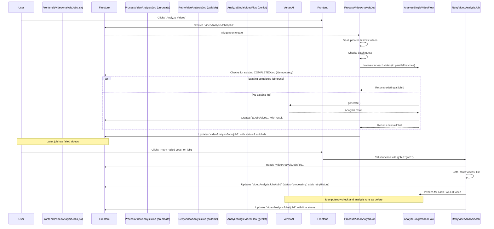

# Video Analysis Workflow

This document provides a detailed explanation of the video analysis workflow, which is powered by Google's Vertex AI. Given that this is the most resource-intensive and expensive feature in the application, several safeguards have been implemented to ensure it runs efficiently and to prevent unnecessary costs from duplicate or runaway jobs.

## Workflow Overview

The process begins when a teacher requests an AI analysis on one or more videos. This request creates a master job that orchestrates individual analysis tasks for each video. The system is designed to be robust, handling everything from quota limits to retries and duplicate requests.

### Data Flow Diagram

This diagram illustrates the entire lifecycle of a video analysis job, from the initial user request to the final result.



---

## 1. Initial Job Creation (`processVideoAnalysisJob`)

When a teacher requests a new analysis, a document is created in the `videoAnalysisJobs` collection. This triggers the `processVideoAnalysisJob` Cloud Function, which orchestrates the entire process.

### Safeguard 1: De-duplication

When an analysis is requested for a time range, the function first queries all `videoJobs` within that range. To prevent analyzing the same video multiple times if there are duplicate records, it de-duplicates the list based on the unique `videoPath`.

**Code Justification (`processVideoAnalysisJob.js`):**
```javascript
      // De-duplicate videos by path to prevent redundant analysis
      const videoMap = new Map();
      querySnapshot.forEach(doc => {
        const video = doc.data();
        if (video.videoPath && !videoMap.has(video.videoPath)) {
          videoMap.set(video.videoPath, { studentUid: video.studentUid, studentEmail: video.studentEmail, videoPath: video.videoPath });
        }
      });
      videosToAnalyze = Array.from(videoMap.values());
```

### Safeguard 2: Job Size Limiting

To prevent a single job from running for too long and timing out (the function limit is 1 hour), we enforce a hard limit on the number of videos that can be processed in one job. If the number of unique videos exceeds this limit, the job is truncated, and a note is added to the job document.

**Code Justification (`processVideoAnalysisJob.js`):**
```javascript
    const MAX_VIDEOS_PER_JOB = 100;
    let jobNotes = jobData.notes || null;

    if (videosToAnalyze.length > MAX_VIDEOS_PER_JOB) {
        videosToAnalyze = videosToAnalyze.slice(0, MAX_VIDEOS_PER_JOB);
        jobNotes = `Job truncated to the first ${MAX_VIDEOS_PER_JOB} unique videos found. Create a new job with a more specific time range to process remaining videos.`;
    }
```

### Safeguard 3: Batch Quota Checking

Instead of checking the AI quota for every single video (which is inefficient), the function groups the videos into batches. It then estimates the total cost for the entire batch and performs a single quota check. If the quota is insufficient, the entire batch is skipped, and each video is logged as `blocked-by-quota`.

**Code Justification (`processVideoAnalysisJob.js`):**
```javascript
      let batchEstimatedCost = 0;
      for (const video of batch) {
          const promptText = promptTemplate(video);
          const media = [{ media: { url: `gs://${bucketName}/${video.videoPath}`, contentType: 'video/mp4' } }];
          batchEstimatedCost += estimateCost(promptText, media);
      }

      const hasQuota = await checkQuota(jobData.classId, batchEstimatedCost);

      if (!hasQuota) {
          // ... log jobs as blocked-by-quota and skip batch
          continue;
      }
```

---

## 2. Preventing Duplicate Analysis (Idempotency)

This is the most critical safeguard against unnecessary costs. Before starting a new analysis on a video, the system checks if that exact same work has already been successfully completed.

### Safeguard 4: Idempotency Check

For each video, before calling the AI model, the system generates a SHA-256 hash of the full prompt text. It then queries the `aiJobs` collection to find a previous job with the **exact same video path** and **prompt hash** that has a status of **`completed`** and contains a **non-empty result**.

If such a job is found, the system reuses the existing result instead of running a new analysis. This prevents duplicate work if the same job is accidentally triggered twice and also makes the retry mechanism more efficient.

**Code Justification (`processVideoAnalysisJob.js`):**
```javascript
            const crypto = await import('crypto');
            const promptHash = crypto.createHash('sha256').update(promptText).digest('hex');

            // Idempotency Check: Reuse existing completed jobs only if they have a valid result.
            // NOTE: This query requires a composite index in Firestore on (promptHash, status).
            const existingJobsQuery = db.collection('aiJobs')
                .where('mediaPaths', 'array-contains', gsUri)
                .where('promptHash', '==', promptHash)
                .where('status', '==', 'completed')
                .limit(1);
            
            const existingJobsSnapshot = await existingJobsQuery.get();

            if (!existingJobsSnapshot.empty) {
                const existingJobDoc = existingJobsSnapshot.docs[0];
                const existingJobData = existingJobDoc.data();
                // Also check that the result is not empty.
                if (existingJobData.result) {
                    console.log(`Reusing completed job '${existingJobDoc.id}' for video '${video.videoPath}'.`);
                    return { status: 'success', jobId: existingJobDoc.id };
                }
            }

            // If no valid existing job, proceed with analysis.
            const result = await analyzeSingleVideoFlow({...});
```

---

## 3. Retry Mechanism

When a job has failures (e.g., due to temporary network issues, quota limits, or model errors), the user can trigger a retry.

### In-Place Retry with History

Instead of creating a new, confusing master job for each retry, the system updates the *existing* job.

1.  **Trigger**: The user clicks the "Retry Failed Jobs" button, which calls the `retryVideoAnalysisJob` callable Cloud Function.
2.  **Identify Failures**: The function identifies which videos to retry, either from the `failedVideos` array on the job document or (for legacy jobs) by querying for associated `aiJobs` with a `failed` status.
3.  **Log History**: The function updates the master job with a `retryHistory` array, creating a log of every retry attempt.
4.  **Re-run**: The function then re-runs the analysis process, but **only for the videos that previously failed**. All the safeguards mentioned above (batch quota check, idempotency) are also applied during the retry.

**Code Justification (`retryVideoAnalysisJob.js`):**
```javascript
    // Find videos to retry
    let videosToAnalyze = jobData.failedVideos || [];

    // Fallback for legacy jobs
    if (videosToAnalyze.length === 0) {
        const aiJobsSnapshot = await db.collection('aiJobs').where('masterJobId', '==', jobId).where('status', '==', 'failed').get();
        // ... logic to reconstruct videosToAnalyze from failed jobs
    }

    // ...

    // Log the retry attempt to the job's history
    await masterJobRef.update({
        status: 'processing',
        failedVideos: [], // Clear the list for the new retry attempt
        retryHistory: FieldValue.arrayUnion({
            retriedAt: FieldValue.serverTimestamp(),
            videoCount: videosToAnalyze.length,
            originalFailures: videosToAnalyze 
        })
    });

    // ... proceed with analysis only on the videosToAnalyze list
```
